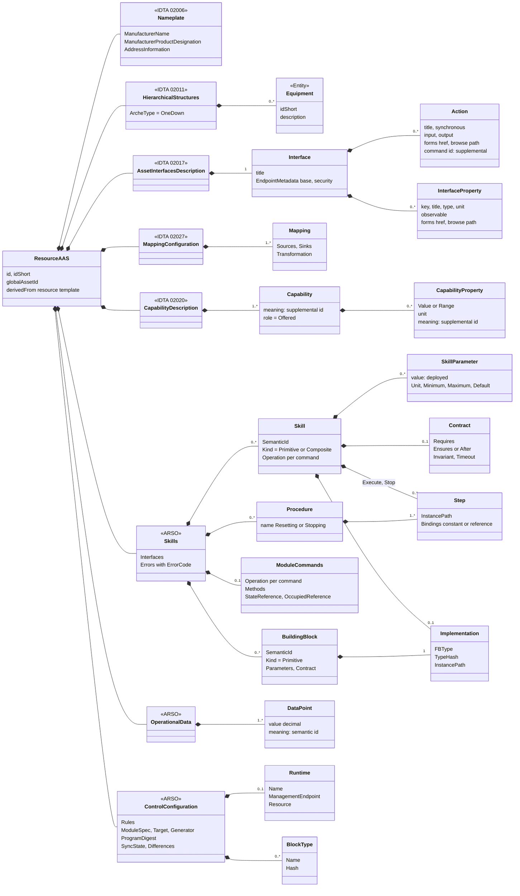
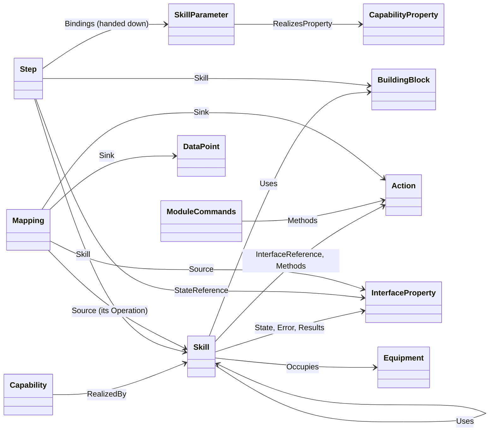
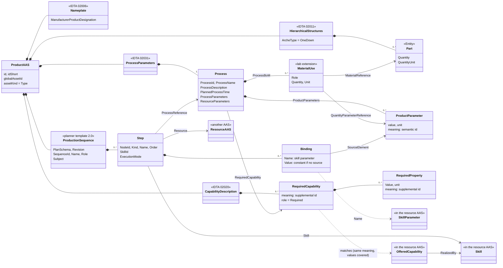
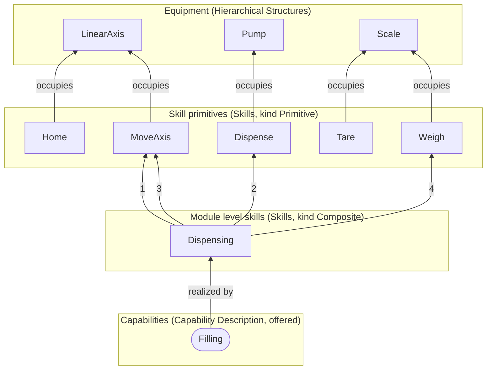
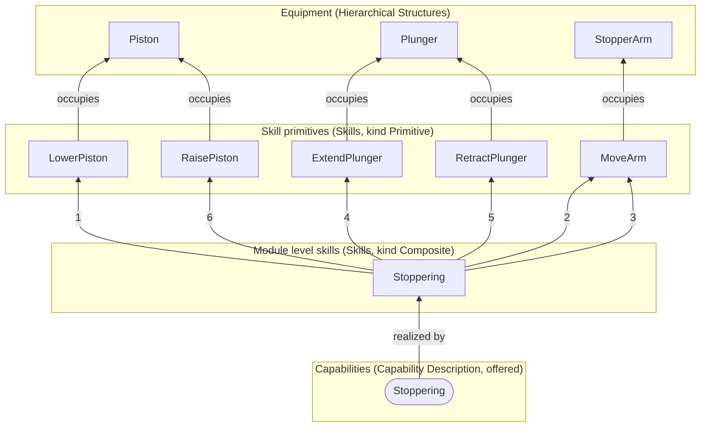
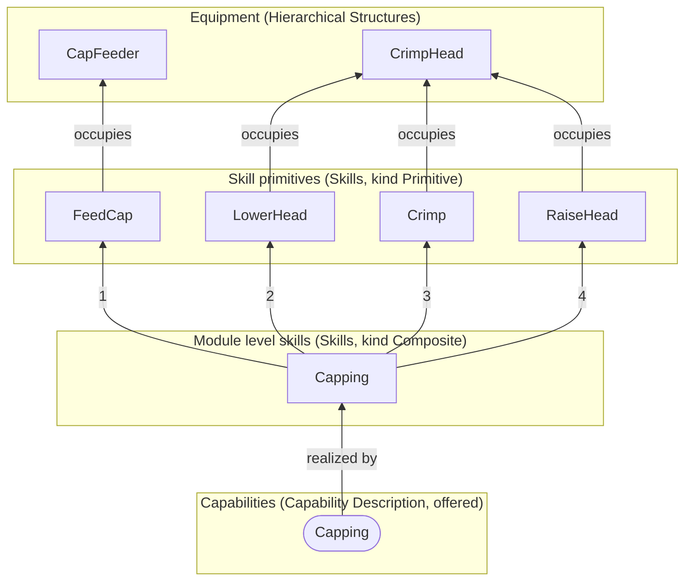
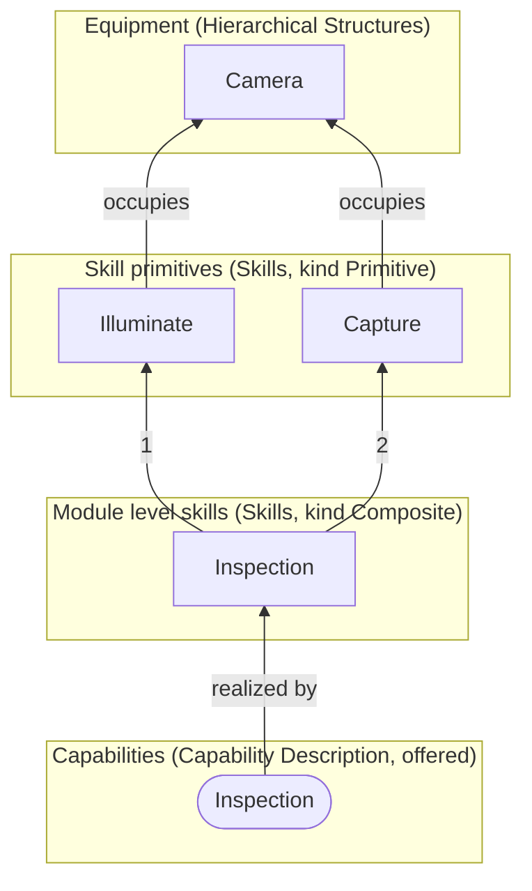
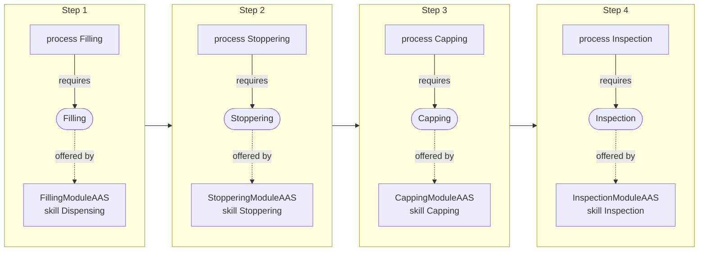

# The example line: its AASs

Five AASs built to the framework: four resources (filling, stoppering, capping, inspection) and
one product planned on them (a 2 mL vial). Each product's plan is followed into the resources when
they are built; a plan that does not fit is refused. What the submodels are and how they link is
in [aas-models.md](aas-models.md).

This file is written by `python cell/examples/describe.py`. Every AAS is built by `modreg` from a
profile, the pydantic dump of its type: a resource's profile is made from its module spec
(`cell/modules`, `cell/modules/planned`), a product's profile is a file (`cell/examples/Vial2mLAAS.json`).
`python cell/examples/example_line.py --out <folder> --publish <server>` builds the AASs and puts
them on an AAS server.

| AAS | Kind | Submodels |
| --- | --- | --- |
| `FillingModuleAAS` | resource | Nameplate, HierarchicalStructures, AssetInterfacesDescription, Skills, OperationalData, AssetInterfacesMappingConfiguration, ControlConfiguration, CapabilityDescription |
| `StopperingModuleAAS` | resource | Nameplate, HierarchicalStructures, AssetInterfacesDescription, Skills, OperationalData, AssetInterfacesMappingConfiguration, ControlConfiguration, CapabilityDescription |
| `CappingModuleAAS` | resource | Nameplate, HierarchicalStructures, AssetInterfacesDescription, Skills, OperationalData, AssetInterfacesMappingConfiguration, ControlConfiguration, CapabilityDescription |
| `InspectionModuleAAS` | resource | Nameplate, HierarchicalStructures, AssetInterfacesDescription, Skills, OperationalData, AssetInterfacesMappingConfiguration, ControlConfiguration, CapabilityDescription |
| `Vial2mLAAS` | product | Nameplate, HierarchicalStructures, ProcessParameters, CapabilityDescription, ProductionSequence |

## Class diagram: a resource AAS

All four resources have this structure. First what the AAS holds: its submodels and their main
elements.

Then how those elements refer to each other. Every arrow is a reference stored in the AAS, named
like the element that carries it.

## Class diagram: a product AAS

The classes marked as another AAS are in the resource AAS above; the dashed arrows are links that
are followed by meaning or by name, not by a stored reference.

## The resources

Read upwards: a primitive occupies equipment, a module level skill runs primitives and building
blocks in order, and a capability is realized by a module level skill.

### FillingModuleAAS

`https://smartproductionlab.aau.dk/aas/FillingModuleAAS`, asset `https://smartproductionlab.aau.dk/assets/FillingModule`. Built: its program is generated and runs on FORTE (against the simulator; the hardware is not wired yet).

| Skill | Kind | Parameters | Equipment | Sequence |
| --- | --- | --- | --- | --- |
| Occupy | access control | – | – | – |
| Release | access control | – | – | – |
| Home | Primitive | – | LinearAxis | – |
| MoveAxis | Primitive | Position = 0.0 mm | LinearAxis | – |
| Dispense | Primitive | Volume = 1.0 mL, FlowRate = 1.0 mL/s | Pump | – |
| Tare | Primitive | – | Scale | – |
| Weigh | Primitive | – | Scale | – |
| Dispensing | Composite | Volume = 1.0 mL | LinearAxis, Pump, Scale | MoveAxis (Position = 40.0) → Dispense (FlowRate = 1.0, Volume ← Volume) → MoveAxis (Position = 0.0) → Weigh |

- **Capability Filling** (`https://smartproductionlab.aau.dk/semantics/Filling`), realized by Dispensing: ContainerType vial; GraspDiameter 6.0 to 30.0 mm; FillVolume 0.5 to 10.0 mL; AbsoluteFillError 0.05 mL.
- **Module:** commands Reset, Start, Stop, Abort, Clear; access control Occupy, Release; procedures: Resetting (Home → Tare), Stopping (Home).
- **Interface:** OPC UA at `opc.tcp://localhost:4840`, 31 actions and 46 properties; 46 data points; 32 mappings.
- **Control Configuration:** rules `https://smartproductionlab.aau.dk/rules/module/1`, spec `cell/modules/filling.yaml`, sync state NotRead.

### StopperingModuleAAS

`https://smartproductionlab.aau.dk/aas/StopperingModuleAAS`, asset `https://smartproductionlab.aau.dk/assets/StopperingModule`. Built: its program is generated and runs on FORTE (against the simulator; the hardware is not wired yet).

| Skill | Kind | Parameters | Equipment | Sequence |
| --- | --- | --- | --- | --- |
| Occupy | access control | – | – | – |
| Release | access control | – | – | – |
| LowerPiston | Primitive | – | Piston | – |
| RaisePiston | Primitive | Duration = 2.0 s | Piston | – |
| ExtendPlunger | Primitive | Duration = 10.0 s | Plunger | – |
| RetractPlunger | Primitive | Duration = 6.5 s | Plunger | – |
| MoveArm | Primitive | Angle = 120.0 deg, Settle = 2.0 s | StopperArm | – |
| Stoppering | Composite | – | Piston, StopperArm, Plunger | LowerPiston → MoveArm (Angle = 1.0) → MoveArm (Angle = 121.0) → ExtendPlunger → RetractPlunger → RaisePiston |

- **Capability Stoppering** (`https://smartproductionlab.aau.dk/semantics/Stoppering`), realized by Stoppering: ContainerType vial; GraspDiameter 6.0 to 30.0 mm; StopperDiameter 6.0 to 20.0 mm.
- **Module:** commands Reset, Start, Stop, Abort, Clear; access control Occupy, Release; procedures: Resetting (MoveArm → MoveArm → RetractPlunger → LowerPiston → RaisePiston).
- **Interface:** OPC UA at `opc.tcp://localhost:4840`, 31 actions and 55 properties; 55 data points; 32 mappings.
- **Control Configuration:** rules `https://smartproductionlab.aau.dk/rules/module/1`, spec `cell/modules/stoppering.yaml`, sync state NotRead.

### CappingModuleAAS

`https://smartproductionlab.aau.dk/aas/CappingModuleAAS`, asset `https://smartproductionlab.aau.dk/assets/CappingModule`. **Planned only:** described from a spec; there is no program and no hardware behind it yet.

| Skill | Kind | Parameters | Equipment | Sequence |
| --- | --- | --- | --- | --- |
| Occupy | access control | – | – | – |
| Release | access control | – | – | – |
| FeedCap | Primitive | – | CapFeeder | – |
| LowerHead | Primitive | – | CrimpHead | – |
| Crimp | Primitive | Duration = 1.5 s | CrimpHead | – |
| RaiseHead | Primitive | – | CrimpHead | – |
| Capping | Composite | – | CapFeeder, CrimpHead | FeedCap → LowerHead → Crimp → RaiseHead |

- **Capability Capping** (`https://smartproductionlab.aau.dk/semantics/Capping`), realized by Capping: ContainerType vial; GraspDiameter 6.0 to 30.0 mm; CapDiameter 13.0 to 20.0 mm.
- **Module:** commands Reset, Start, Stop, Abort, Clear; access control Occupy, Release; procedures: Resetting (RaiseHead), Stopping (RaiseHead).
- **Interface:** OPC UA at `opc.tcp://localhost:4840`, 27 actions and 31 properties; 31 data points; 28 mappings.
- **Control Configuration:** rules `https://smartproductionlab.aau.dk/rules/module/1`, spec `cell/modules/planned/capping.yaml`, sync state NotRead.

### InspectionModuleAAS

`https://smartproductionlab.aau.dk/aas/InspectionModuleAAS`, asset `https://smartproductionlab.aau.dk/assets/InspectionModule`. **Planned only:** described from a spec; there is no program and no hardware behind it yet.

| Skill | Kind | Parameters | Equipment | Sequence |
| --- | --- | --- | --- | --- |
| Occupy | access control | – | – | – |
| Release | access control | – | – | – |
| Illuminate | Primitive | Settle = 0.2 s | Camera | – |
| Capture | Primitive | – | Camera | – |
| Inspection | Composite | – | Camera | Illuminate → Capture |

- **Capability Inspection** (`https://smartproductionlab.aau.dk/semantics/Inspection`), realized by Inspection: ContainerType vial; GraspDiameter 6.0 to 30.0 mm; InspectionMethod vision.
- **Module:** commands Reset, Start, Stop, Abort, Clear; access control Occupy, Release; procedures: none.
- **Interface:** OPC UA at `opc.tcp://localhost:4840`, 19 actions and 19 properties; 19 data points; 20 mappings.
- **Control Configuration:** rules `https://smartproductionlab.aau.dk/rules/module/1`, spec `cell/modules/planned/inspection.yaml`, sync state NotRead.

## The product

### Vial2mLAAS

`https://smartproductionlab.aau.dk/aas/Vial2mLAAS`, asset `https://smartproductionlab.aau.dk/assets/Vial2mL`.

Bill of material (Hierarchical Structures):

| Part | Name | Quantity |
| --- | --- | --- |
| Vial | Glass vial 2R | 1.0 piece |
| Liquid | Demo liquid | 2.0 mL |
| Stopper | Rubber stopper 13 mm | 1.0 piece |
| Cap | Crimp cap 13 mm | 1.0 piece |

Processes (Process Parameters) and what they require (Capability Description):

| Process | Planned time | Product parameters | Materials | Required capability |
| --- | --- | --- | --- | --- |
| Filling | PT10S | ContainerType = vial, GraspDiameter = 16.0 mm, FillVolume = 2.0 mL | Vial (workpiece, 1.0 piece), Liquid (incorporated, FillVolume) | `https://smartproductionlab.aau.dk/semantics/Filling` |
| Stoppering | PT5S | ContainerType = vial, GraspDiameter = 16.0 mm, StopperDiameter = 13.0 mm | Stopper (incorporated, 1.0 piece) | `https://smartproductionlab.aau.dk/semantics/Stoppering` |
| Capping | PT5S | ContainerType = vial, GraspDiameter = 16.0 mm, CapDiameter = 13.0 mm | Cap (incorporated, 1.0 piece) | `https://smartproductionlab.aau.dk/semantics/Capping` |
| Inspection | PT3S | ContainerType = vial, GraspDiameter = 16.0 mm, InspectionMethod = vision | – | `https://smartproductionlab.aau.dk/semantics/Inspection` |

The plan (Production Sequence, `production-sequence/2.0`):

| Order | Step | Resource | Skill | Bound |
| --- | --- | --- | --- | --- |
| 1 | Filling | FillingModuleAAS | Dispensing | Volume ← FillVolume |
| 2 | Stoppering | StopperingModuleAAS | Stoppering | – |
| 3 | Capping | CappingModuleAAS | Capping | – |
| 4 | Inspection | InspectionModuleAAS | Inspection | – |
