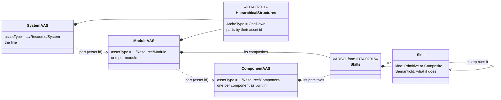
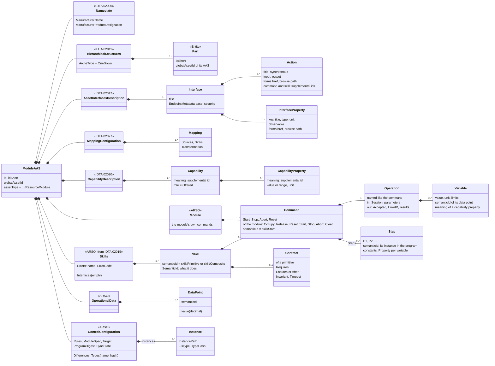
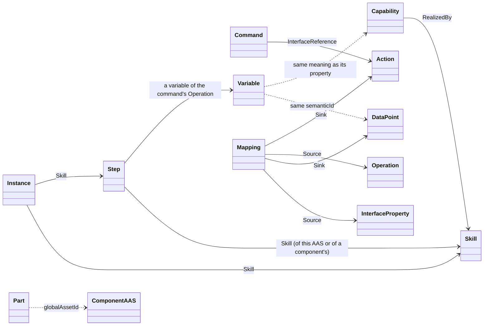
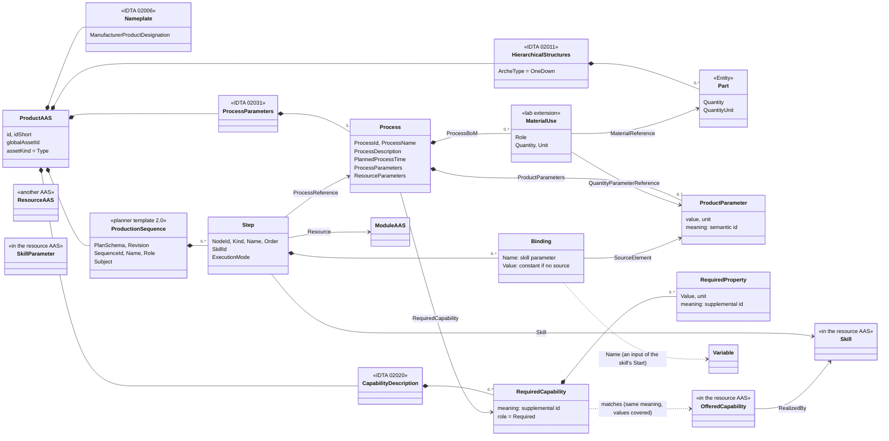
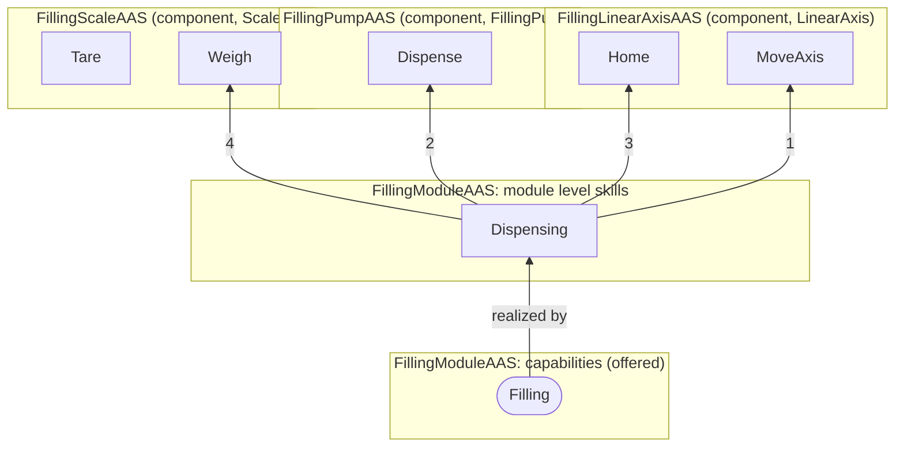
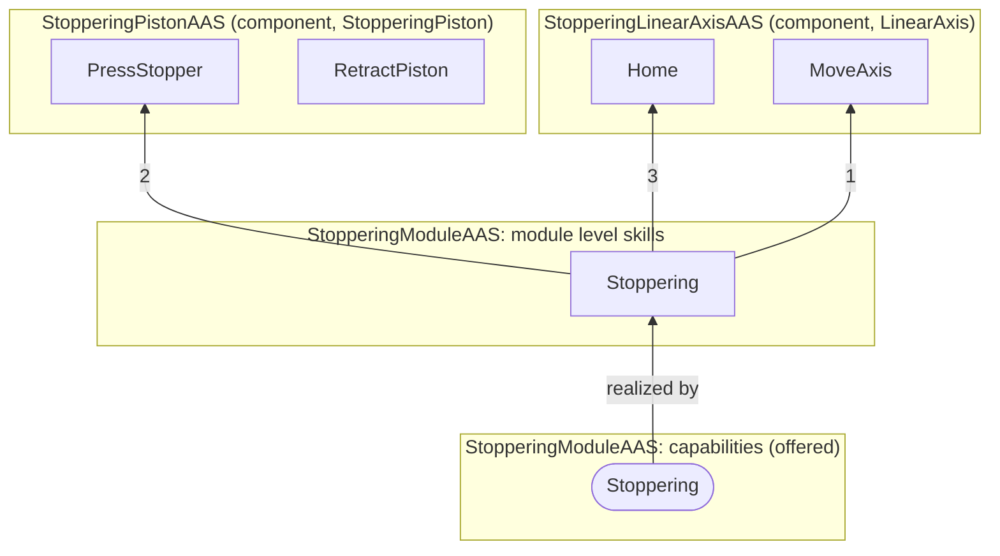
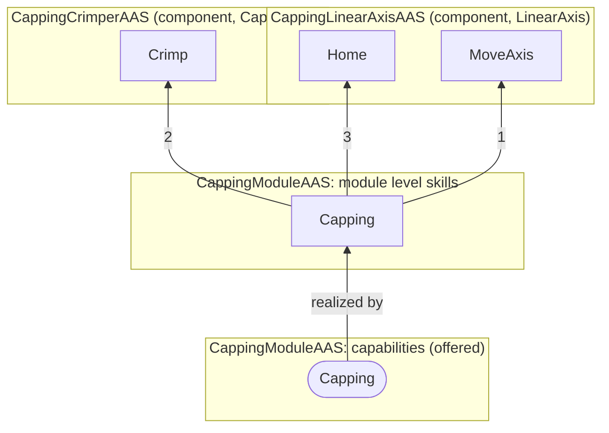
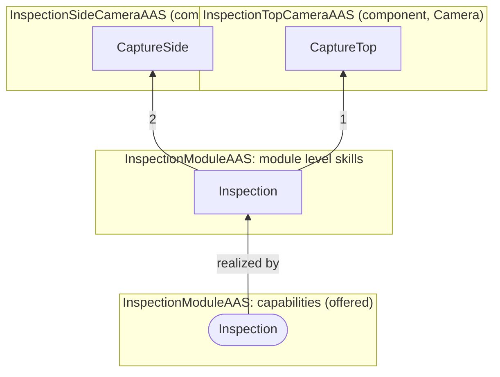

# The example line: its AASs

15 AASs built to the framework: the line, its modules (filling, stoppering, capping, inspection; loading
and unloading are named but not described yet), the components of each module, and one product
planned on them (a 2 mL vial). Each product's plan is followed into the resources when they are
built; a plan that does not fit is refused. What the submodels are and how they link is in
[aas-models.md](aas-models.md).

This file is written by `python cell/examples/describe.py`. Every AAS is built by `modreg` from a
profile, the pydantic dump of its type: the profiles of a module and of its components are made
from the module spec (`cell/modules`, `cell/modules/planned`), a product's profile is a file
(`cell/examples/Vial2mLAAS.json`). `python cell/examples/example_line.py --out <folder> --publish
<server>` builds the AASs and puts them on an AAS server.

## The line: what it is made of

```
FillingLineAAS
  LoadingModule (not described yet)
  FillingModuleAAS
    skill Dispensing(Volume = 1.0 mL) → Weight [g]
    FillingLinearAxisAAS: Home(), MoveAxis(Position = 0.0 mm)
    FillingPumpAAS: Dispense(Volume = 1.0 mL, FlowRate = 1.0 mL/s)
    FillingScaleAAS: Tare(), Weigh() → Weight [g]
  StopperingModuleAAS
    skill Stoppering()
    StopperingLinearAxisAAS: Home(), MoveAxis(Position = 0.0 mm)
    StopperingPistonAAS: PressStopper(), RetractPiston()
  CappingModuleAAS
    skill Capping()
    CappingLinearAxisAAS: Home(), MoveAxis(Position = 0.0 mm)
    CappingCrimperAAS: Crimp(Duration = 1.5 s)
  InspectionModuleAAS
    skill Inspection() → TopPassed, SidePassed
    InspectionTopCameraAAS: CaptureTop() → Passed
    InspectionSideCameraAAS: CaptureSide() → Passed
  UnloadingModule (not described yet)
```

| AAS | Kind | Submodels |
| --- | --- | --- |
| `FillingLineAAS` | system | HierarchicalStructures |
| `FillingModuleAAS` | module | Nameplate, HierarchicalStructures, AssetInterfacesDescription, Module, Skills, OperationalData, AssetInterfacesMappingConfiguration, ControlConfiguration, CapabilityDescription |
| `StopperingModuleAAS` | module | Nameplate, HierarchicalStructures, AssetInterfacesDescription, Module, Skills, OperationalData, AssetInterfacesMappingConfiguration, ControlConfiguration, CapabilityDescription |
| `CappingModuleAAS` | module | Nameplate, HierarchicalStructures, AssetInterfacesDescription, Module, Skills, OperationalData, AssetInterfacesMappingConfiguration, ControlConfiguration, CapabilityDescription |
| `InspectionModuleAAS` | module | Nameplate, HierarchicalStructures, AssetInterfacesDescription, Module, Skills, OperationalData, AssetInterfacesMappingConfiguration, ControlConfiguration, CapabilityDescription |
| `FillingLinearAxisAAS` | component/linearaxis | Skills |
| `FillingPumpAAS` | component/fillingpump | Skills |
| `FillingScaleAAS` | component/scale | Skills |
| `StopperingLinearAxisAAS` | component/linearaxis | Skills |
| `StopperingPistonAAS` | component/stopperingpiston | Skills |
| `CappingLinearAxisAAS` | component/linearaxis | Skills |
| `CappingCrimperAAS` | component/capcrimper | Skills |
| `InspectionTopCameraAAS` | component/camera | Skills |
| `InspectionSideCameraAAS` | component/camera | Skills |
| `Vial2mLAAS` | product | Nameplate, HierarchicalStructures, ProcessParameters, CapabilityDescription, ProductionSequence |

## Class diagram: the resources

A line is made of modules and a module of components. What kind of resource an AAS is, is its
asset type; a component's ends in its kind, which every component like it shares (the three
linear axes). A part is found by its asset id.



## Class diagram: a module AAS

What the AAS holds: its submodels and their main elements. A component's AAS holds only Skills,
with the same Skill, Command, Operation and Contract.



Then how those elements refer to each other. Every solid arrow is a reference stored in the AAS,
named like the element that carries it; a dashed arrow is a link by a shared id.



## Class diagram: a product AAS

The classes marked as another AAS are in the resource AAS above; the dashed arrows are links that
are followed by meaning or by name, not by a stored reference.



## The modules

Read upwards: a module level skill runs skills of the module's components in order, and a
capability is realized by a module level skill.

### FillingModuleAAS

`https://smartproductionlab.aau.dk/aas/FillingModuleAAS`, asset `https://smartproductionlab.aau.dk/assets/FillingModule`. Built: its program is generated and runs on FORTE (against the simulator; the hardware is not wired yet).



| Skill | Held by | Kind | Start runs | Stop runs |
| --- | --- | --- | --- | --- |
| Dispensing(Volume = 1.0 mL) → Weight [g] | the module | Composite | MoveAxis (Position = 40.0) → Dispense (FlowRate = 1.0, Volume ← Volume) → Home → Weigh (Weight → Weight) | Home |
| Home() | FillingLinearAxisAAS | Primitive | – (Ensures AtHome; Timeout 8s) | – |
| MoveAxis(Position = 0.0 mm) | FillingLinearAxisAAS | Primitive | – (Requires Homed; Ensures NOT Moving AND ABS(ActualPosition - Position) < 0.001; Timeout 8s) | – |
| Dispense(Volume = 1.0 mL, FlowRate = 1.0 mL/s) | FillingPumpAAS | Primitive | – (After Volume / FlowRate) | – |
| Tare() | FillingScaleAAS | Primitive | – (After 2.0) | – |
| Weigh() → Weight [g] | FillingScaleAAS | Primitive | – (After 0.2) | – |

- **Capability Filling** (`https://smartproductionlab.aau.dk/semantics/Filling`), realized by Dispensing: ContainerType vial; GraspDiameter 6.0 to 30.0 mm; FillVolume 0.5 to 10.0 mL; AbsoluteFillError 0.05 mL.
- **Module commands:** Occupy, Release, Reset (Home → Tare), Start, Stop (Home), Abort, Clear.
- **Components:** LinearAxis → `FillingLinearAxisAAS`, Pump → `FillingPumpAAS`, Scale → `FillingScaleAAS`.
- **Interface:** OPC UA at `opc.tcp://localhost:4840`, 31 actions and 45 properties; 45 data points; 32 mappings.
- **Control Configuration:** rules `https://smartproductionlab.aau.dk/rules/module/1`, spec `cell/modules/filling.yaml`, sync state NotRead, 14 blocks named as skills and steps.

### StopperingModuleAAS

`https://smartproductionlab.aau.dk/aas/StopperingModuleAAS`, asset `https://smartproductionlab.aau.dk/assets/StopperingModule`. Built: its program is generated and runs on FORTE (against the simulator; the hardware is not wired yet).



| Skill | Held by | Kind | Start runs | Stop runs |
| --- | --- | --- | --- | --- |
| Stoppering() | the module | Composite | MoveAxis (Position = 40.0) → PressStopper → Home | Home |
| Home() | StopperingLinearAxisAAS | Primitive | – (Ensures AtHome; Timeout 8s) | – |
| MoveAxis(Position = 0.0 mm) | StopperingLinearAxisAAS | Primitive | – (Requires Homed; Ensures NOT Moving AND ABS(ActualPosition - Position) < 0.001; Timeout 8s) | – |
| PressStopper() | StopperingPistonAAS | Primitive | – (After 3.0) | – |
| RetractPiston() | StopperingPistonAAS | Primitive | – (After 3.0) | – |

- **Capability Stoppering** (`https://smartproductionlab.aau.dk/semantics/Stoppering`), realized by Stoppering: ContainerType vial; GraspDiameter 6.0 to 30.0 mm; StopperDiameter 6.0 to 20.0 mm.
- **Module commands:** Occupy, Release, Reset (RetractPiston → Home), Start, Stop (Home), Abort, Clear.
- **Components:** LinearAxis → `StopperingLinearAxisAAS`, Piston → `StopperingPistonAAS`.
- **Interface:** OPC UA at `opc.tcp://localhost:4840`, 27 actions and 32 properties; 32 data points; 28 mappings.
- **Control Configuration:** rules `https://smartproductionlab.aau.dk/rules/module/1`, spec `cell/modules/stoppering.yaml`, sync state NotRead, 12 blocks named as skills and steps.

### CappingModuleAAS

`https://smartproductionlab.aau.dk/aas/CappingModuleAAS`, asset `https://smartproductionlab.aau.dk/assets/CappingModule`. **Planned only:** described from a spec; there is no program and no hardware behind it yet.



| Skill | Held by | Kind | Start runs | Stop runs |
| --- | --- | --- | --- | --- |
| Capping() | the module | Composite | MoveAxis (Position = 40.0) → Crimp → Home | Home |
| Home() | CappingLinearAxisAAS | Primitive | – (Ensures AtHome; Timeout 8s) | – |
| MoveAxis(Position = 0.0 mm) | CappingLinearAxisAAS | Primitive | – (Requires Homed; Ensures NOT Moving AND ABS(ActualPosition - Position) < 0.001; Timeout 8s) | – |
| Crimp(Duration = 1.5 s) | CappingCrimperAAS | Primitive | – (After Duration) | – |

- **Capability Capping** (`https://smartproductionlab.aau.dk/semantics/Capping`), realized by Capping: ContainerType vial; GraspDiameter 6.0 to 30.0 mm; CapDiameter 13.0 to 20.0 mm.
- **Module commands:** Occupy, Release, Reset (Home), Start, Stop (Home), Abort, Clear.
- **Components:** LinearAxis → `CappingLinearAxisAAS`, Crimper → `CappingCrimperAAS`.
- **Interface:** OPC UA at `opc.tcp://localhost:4840`, 23 actions and 30 properties; 30 data points; 24 mappings.
- **Control Configuration:** rules `https://smartproductionlab.aau.dk/rules/module/1`, spec `cell/modules/planned/capping.yaml`, sync state NotRead, 10 blocks named as skills and steps.

### InspectionModuleAAS

`https://smartproductionlab.aau.dk/aas/InspectionModuleAAS`, asset `https://smartproductionlab.aau.dk/assets/InspectionModule`. **Planned only:** described from a spec; there is no program and no hardware behind it yet.



| Skill | Held by | Kind | Start runs | Stop runs |
| --- | --- | --- | --- | --- |
| Inspection() → TopPassed, SidePassed | the module | Composite | CaptureTop (Passed → TopPassed) → CaptureSide (Passed → SidePassed) | – |
| CaptureTop() → Passed | InspectionTopCameraAAS | Primitive | – (Ensures Done; Timeout 3s) | – |
| CaptureSide() → Passed | InspectionSideCameraAAS | Primitive | – (Ensures Done; Timeout 3s) | – |

- **Capability Inspection** (`https://smartproductionlab.aau.dk/semantics/Inspection`), realized by Inspection: ContainerType vial; GraspDiameter 6.0 to 30.0 mm; InspectionMethod vision.
- **Module commands:** Occupy, Release, Reset, Start, Stop, Abort, Clear.
- **Components:** TopCamera → `InspectionTopCameraAAS`, SideCamera → `InspectionSideCameraAAS`.
- **Interface:** OPC UA at `opc.tcp://localhost:4840`, 19 actions and 22 properties; 22 data points; 20 mappings.
- **Control Configuration:** rules `https://smartproductionlab.aau.dk/rules/module/1`, spec `cell/modules/planned/inspection.yaml`, sync state NotRead, 5 blocks named as skills and steps.

## The product

### Vial2mLAAS

`https://smartproductionlab.aau.dk/aas/Vial2mLAAS`, asset `https://smartproductionlab.aau.dk/assets/Vial2mL`.


Bill of material (Hierarchical Structures):

| Part | Name | Quantity |
| --- | --- | --- |
| Vial | Glass vial 2R | 1.0 piece |
| Liquid | Demo liquid | 2.0 mL |
| Stopper | Rubber stopper 13 mm | 1.0 piece |
| Cap | Crimp cap 13 mm | 1.0 piece |

Processes (Process Parameters) and what they require (Capability Description):

| Process | Planned time | Product parameters | Materials | Required capability |
| --- | --- | --- | --- | --- |
| Filling | PT10S | ContainerType = vial, GraspDiameter = 16.0 mm, FillVolume = 2.0 mL | Vial (workpiece, 1.0 piece), Liquid (incorporated, FillVolume) | `https://smartproductionlab.aau.dk/semantics/Filling` |
| Stoppering | PT5S | ContainerType = vial, GraspDiameter = 16.0 mm, StopperDiameter = 13.0 mm | Stopper (incorporated, 1.0 piece) | `https://smartproductionlab.aau.dk/semantics/Stoppering` |
| Capping | PT5S | ContainerType = vial, GraspDiameter = 16.0 mm, CapDiameter = 13.0 mm | Cap (incorporated, 1.0 piece) | `https://smartproductionlab.aau.dk/semantics/Capping` |
| Inspection | PT3S | ContainerType = vial, GraspDiameter = 16.0 mm, InspectionMethod = vision | – | `https://smartproductionlab.aau.dk/semantics/Inspection` |

The plan (Production Sequence, `production-sequence/2.0`):

| Order | Step | Resource | Skill | Bound |
| --- | --- | --- | --- | --- |
| 1 | Filling | FillingModuleAAS | Dispensing | Volume ← FillVolume |
| 2 | Stoppering | StopperingModuleAAS | Stoppering | – |
| 3 | Capping | CappingModuleAAS | Capping | – |
| 4 | Inspection | InspectionModuleAAS | Inspection | – |
