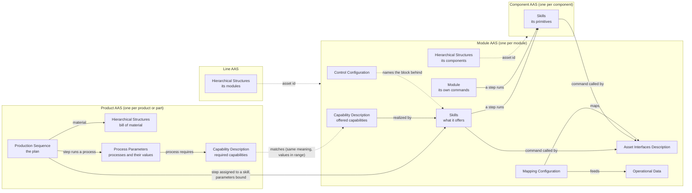

# The AAS models: product, plan and resource

What each AAS holds, which submodel templates it uses, what we changed in them, and how the
submodels connect inside one AAS and across AASs. Written on 7 Oct 2026 so that the planner, the
modules, the HMI and the AAS generator are described in one place; the resource side was rewritten
on 8 Oct 2026 (a skill as its commands; components and the line as AASs of their own).

It describes what is **built**, and says where a model exists only on paper. Sources:

| What | Where it was read from |
| --- | --- |
| Resource AASs: line, module, component | `modreg` in this repository and the AASs it builds for the example line; ARSO 0.7 (`ontology/ARSO`) |
| Product AAS, plan, stations of the planner | the demo data on the local AAS server (37 AASs, 31 sequences), which a newer planner than the pushed one wrote; and the planner's process sequence module (fork `basyx-aas-web-ui`, branch `feat/process-sequence-pharma`, commit `058a03e`) for its README and readers |
| Product AAS and plan as built here | `modreg` (`product.py`), the templates in `aas61499-tools/modreg/templates`, and the vial of the example line |
| Intended product and process models | APSO 0.2, AProSO 0.1 and PPRL 0.1 (`ontology/`), [aas-implementation-plan.md](../ontology/aas-implementation-plan.md) |
| Deviations of the generator's resource AAS from IDTA | [IDTA_CONFORMANCE.md](../ontology/ARSO/IDTA_CONFORMANCE.md) |

Not seen: AASs on the lab's server, and the source of the planner version that is running locally.

The example line built this way (the line, four modules, nine components and a product), with
class diagrams, is in [aas-examples.md](aas-examples.md).

## 1. The three at a glance



| AAS | One per | Built by | Checked against |
| --- | --- | --- | --- |
| Module, component | module; component as built into one | `modreg` from the module spec or the running module | ARSO 0.7: `modreg check` (the generator's closed SHACL validation still has ARSO 0.6) |
| Line | line | `modreg` from a profile (`cell/examples/example_line.py`) | ARSO 0.7: `modreg check` |
| Product | product, and each part that has its own plan | the planner (demo data), and `modreg` from the product's profile | its pydantic type (`ProductTypeAAS`); no ontology (APSO is not applied to it) |
| Plan | product (a submodel of the product AAS, not an AAS of its own) | the planner, and `modreg` as part of the product | its pydantic class; against the resources by following its links (`cell/examples/plan_check.py`); AProSO is not applied to it |

All three are built the same way: an AAS type on the lab's shared pydantic model (aas-model), a
profile that is the dump of that type without what the type says anyway, and `modreg build` to
make the AAS from it. `ModuleTypeAAS`, `ComponentTypeAAS` and `SystemTypeAAS` are the resources,
`ProductTypeAAS` the product with its plan.

There is no process AAS today. The ontologies describe one (AProSO); the planner keeps the plan
as the Production Sequence submodel of the product it is for. Section 7 lists this and the other
places where two descriptions of the same thing differ.

## 2. Resource AASs: line, module, component

A line is made of modules, a module of components. Each is an AAS. What kind of resource an AAS
is, is its asset type; ARSO asks different things of each:

| Kind | Asset type | Example | Has to hold |
| --- | --- | --- | --- |
| System | `.../Resource/System` | `FillingLineAAS` | Hierarchical Structures: its modules |
| Module | `.../Resource/Module` | `FillingModuleAAS` | Nameplate and Hierarchical Structures; an interface description whenever there are skills, data or a mapping |
| Component | `.../Resource/Component/<Kind>` | `FillingLinearAxisAAS` (kind `LinearAxis`) | Skills |

A component is a part of a module that acts: an axis, a pump, a piston. It exists once per module
it is built into (three linear axes, three AASs), and all of one kind share the end of their asset
type and so the same skills. A part is found from its parent by its asset id.

### The module

Shell `FillingModuleAAS`, asset `https://smartproductionlab.aau.dk/assets/FillingModule`. Nine
submodels:

| Submodel | Template | What it holds | Status |
| --- | --- | --- | --- |
| Nameplate | IDTA 02006-3-0 | Manufacturer, designation, address, year, country | Unchanged |
| Hierarchical Structures | IDTA 02011-1-1 | The module as entry node and its components as parts (`LinearAxis`, `Pump`, `Scale`), each with the asset id of its AAS; archetype OneDown | Unchanged |
| Asset Interfaces Description | IDTA 02017-1-1 with W3C WoT terms | One OPC UA interface: every method as an action (arguments in call order), every published variable as a property, each with its browse path | Extended |
| Asset Interfaces Mapping Configuration | IDTA 02027 (2/0) | Which interface property feeds which data point, and which action each command's Operation calls | Extended |
| Capability Description | IDTA 02020 | The capabilities the module offers, with values or ranges and units, each realized by a skill | One change |
| Module | ours (ARSO 0.7) | The module's own commands: Occupy, Release, Reset, Start, Stop, Abort, Clear | Custom |
| Skills | ours (ARSO), from IDTA 02015 Control Component Type | The skills the module composes, each as its commands; error codes | Custom |
| Operational Data | ours (ARSO) | One decimal data point per published variable: states, error ids, parameters and results of the last run, equipment inputs | Custom |
| Control Configuration | ours (ARSO) | Runtime and endpoint, the rule set the program follows, what it was generated from, whether the running program still matches, type hashes, and which block of the program each skill and step is | Custom |

A component's AAS holds one submodel, Skills, with its primitives. Its interface is the module's:
the module carries the skills out.

Known to ARSO but not written for a module: **Parameters** (ours; optional, and what it is for is
open) and **Technical Data** (IDTA 02003; the generator writes it).

### 2.1 What a skill is

A skill is its commands, and nothing else. The filling module's `Dispensing`:

```
Dispensing                      semanticId .../skill/Composite        (what kind of element it is)
├─ SemanticId                   .../skills/Dispensing                 (what it does)
├─ Start                        semanticId .../skill/Start
│   ├─ InterfaceReference       → the action Dispensing_Start of the interface
│   ├─ Start  (Operation)       in: Session, Volume [mL, 0.5..10]   out: Accepted, ErrorID, Weight [g]
│   └─ Steps
│       ├─ P1   Skill → MoveAxis  (FillingLinearAxisAAS)    Position = 40.0
│       ├─ P2   Skill → Dispense  (FillingPumpAAS)          FlowRate = 1.0, Volume → Start/Volume
│       ├─ P3   Skill → Home      (FillingLinearAxisAAS)
│       └─ P4   Skill → Weigh     (FillingScaleAAS)         Weight → Start/Weight
├─ Stop                         InterfaceReference, Stop (Operation), Steps: P1 Skill → Home
├─ Abort                        InterfaceReference, Abort (Operation)
└─ Reset                        InterfaceReference, Reset (Operation)
```

- A **command** (Start, Stop, Abort, Reset; the same four on every skill, with a generic semantic
  id) holds the action that calls it, an Operation named like it, and the steps it runs.
- **Parameters, results and the answer are the variables of the Operation.** A variable carries
  its value (the default, or what the module runs with), its unit and its limits. There is no
  separate list of parameters.
- A **step** refers to the skill it runs, the whole of it: running it is its Start. Every other
  element of a step is named like a variable of that Start and says what is connected to it: a
  Property is a constant of the step, a reference points at a variable of the command's own
  Operation (an input that is handed down, or the output a result becomes).
- A **primitive** runs nothing: its commands have no steps, and it states what starts, ends and
  bounds it (`Contract`: Requires, Ensures or After, Invariant, Timeout). It is in the AAS of the
  component it moves. A **composite** is in the AAS of the module that composes it. The same shape
  would describe a skill of the line made of skills of its modules.
- The module's own commands (the **Module** submodel) have the same shape. What the module runs
  itself while resetting and stopping are the steps of `Reset` and `Stop`.
- A module level skill is only instances and connections in the program, so it can be created
  online; a primitive is a block type, and a new one needs a new program. The rules for all of this
  in the program are in [module-rules.md](module-rules.md).

What is deliberately not in Skills:

| Not there | Where it is instead |
| --- | --- |
| The skill's state, why it failed, its results as they are now | Operational Data: data points, fed from the interface by the mapping. A data point carries the semantic id of the Operation variable it shows |
| Which block of the program a skill or a step is | Control Configuration, `Instances`: instance path, block type, type hash, and a reference to the skill or the step |
| What a primitive occupies | The component whose AAS it is described in |
| Which capability it realizes | The capability says which skill realizes it; a skill never refers back |
| A list of the skills a composite uses | Its steps refer to them |

### 2.2 Links inside and between the resource AASs

| From | Element | To | Says |
| --- | --- | --- | --- |
| Capability | `CapabilityRelations/RealizedBy` | the skill in Skills | Which skill carries out the capability |
| Command | `InterfaceReference` | an action of the module's interface | Where to call it |
| Step | `Skill` | a skill, in this AAS or in a component's | What the step runs |
| Step | an element named like a variable | a variable of the command's Operation | What is handed down, or which result it becomes |
| Hierarchical Structures | a part's `globalAssetId` | the AAS of the component (or, for a line, of the module) | What it is made of |
| Control Configuration | `Instances/<block>/Skill` | a skill or a step | Which block of the program it is |
| Mapping Configuration | source → sink | interface property → data point | Where a published value lands in the AAS |
| Mapping Configuration | source → sink | Operation of a command → interface action | Which call an invoked Operation becomes |

Two links are by a shared semantic id, not by a reference: a data point and the Operation variable
it shows; and a parameter of a skill and the capability property it sets (the `Volume` of
Dispensing carries `.../semantics/FillVolume`, as the capability's `FillVolume` and the product's
parameter do). That is how a product's value finds the parameter it belongs to.

The interface description holds only how to reach things. The Skills submodel holds what they
mean. The mapping joins the two.

### 2.3 What we changed in the templates

| Submodel | Change | Why |
| --- | --- | --- |
| Asset Interfaces Description | OPC UA binding terms on forms (`uav_browsePath`, `uav_componentOf`); the owning object is named by its browse path, not a NodeId | FORTE gives its nodes new ids at every start |
| | Actions with `input` and `output` schemas and `synchronous` (WoT terms; the IDTA template details only properties) | A caller needs the arguments in call order |
| | Each action carries the command it carries out and the skill as supplemental semantic ids | Finding an action by meaning |
| Mapping Configuration | A source may be the Operation of a command, with an interface action as sink; the command has to reference that action itself | The template only maps interface elements onto submodel elements; invoking needs the other direction |
| Capability Description | `CapabilityRealizedBy.second` is a model reference to the skill (the template has an external reference) | So the link can be followed and checked |
| Skills, Module | The whole submodels, see 2.1 | No template describes skills with parameters and composition |
| Hierarchical Structures, Nameplate | None. ARSO makes both mandatory for a module and asks for the nameplate's address fields | Every resource has to say what it is and what it consists of |

Skills, against IDTA 02015 Control Component Type:

- Kept: the `Interfaces`, `Skills` and `Errors` containers; per skill a `SemanticId`.
- Dropped: the per-skill Modes, Disabled and Errors structure and the device-level interface entries.
- Ours (ARSO 0.7): the commands with their `InterfaceReference`, Operation and `Steps`; `Contract`.
  Everything `modreg` writes in Skills, Module and Control Configuration is declared in ARSO.
- Still valid, for the AAS generator's MQTT stations: the short form of a skill (`SemanticId`, one
  Operation and one `InterfaceReference` directly in the skill).
- Gone with 0.7: `Kind`, `Parameters`, `RealizesProperty`, `Uses`, `Execute` and `Stop` lists,
  `Occupies`, `StateReference`, `Implementation`, `BuildingBlocks`, and the unofficial `Methods`,
  `ErrorReference`, `Results`, `Module` and `Procedures`. The Skills submodel of the filling module
  went from 268 elements to 49.

### 2.4 Four descriptions of a resource

| | Modules here | Planner's stations | Generator's resource AAS | Lab's MQTT stations |
| --- | --- | --- | --- | --- |
| Built with | `modreg` on aas-model | demo data in the planner | the AAS generator's builder | aas-model |
| Interface | OPC UA | none | MQTT, OPC UA, Modbus | MQTT |
| Skills | ARSO Skills 0.7 (commands and steps) | "Application Skills 1.0" (the planner's own template) | ARSO Skills, short form (no parameters or composition) | IDTA 02015 Control Component Instance |
| Capabilities | IDTA 02020, meaning as supplemental id | IDTA 02020, meaning as supplemental id | IDTA 02020, meaning as the main id | none |
| Live values | Operational Data | none | Operational Data | Variables |

The first two agree on capabilities down to the semantic ids, the role qualifier and the shape of
`RealizedBy` (compared element by element against the planner's reader; not run in the planner), so
a module should already show as a station there. They differ on skills (section 7).

## 3. Product AAS

As the planner builds it, and as `modreg` builds it from a profile (`ProductTypeAAS`). A product (a
recipe) and each part with a plan of its own are AASs.

| Submodel | Template | What it holds | Changed |
| --- | --- | --- | --- |
| Nameplate | IDTA 02006-3-0 | What the product is. Written by `modreg`; the planner's demo products have none | No |
| Hierarchical Structures | IDTA 02011 | The product and its parts (container, liquid, stopper, cap), each with `Quantity` and `QuantityUnit`; a part points to its own AAS by its global asset id | Quantity as two Properties (the template only counts: `BulkCount`) |
| Process Parameters | IDTA 02031-1 | The processes the product needs, each with its id, name, description, planned time, product, process and resource parameters, and the materials it uses (`ProcessBoM`) | Extended |
| Capability Description | IDTA 02020 | The capabilities the product requires (role Required), with the values or acceptable ranges | No |
| Production Sequence | ours (the planner's) | The plan, section 4 | Custom |

- **The extension of Process Parameters** (it adds to the template and redefines nothing):
  - a process may carry a `RequiredCapability` reference
    (`https://smartproductionlab.aau.dk/ProcessParameters/RequiredCapability/1/0`) to a Required
    capability in the product's Capability Description;
  - a material in `ProcessBoM` is a `MaterialUse`: `MaterialReference` to the part in the bill of
    material, `Role` (workpiece, incorporated, output), and `Quantity` with `Unit` or a
    `QuantityParameterReference` to the parameter that gives the amount;
  - the three parameter collections hold one Property per parameter, named by its idShort.
- **Where the classes come from:** two submodel templates in `aas61499-tools/modreg/templates`:
  `ProcessParameters.json` is IDTA's published template with the extension above;
  `ProductionSequence.json` is written from the plans the planner saves. aas-model's generator makes
  the pydantic classes from them (`modreg generate`), as it does for ARSO's own submodels.
- **Checked against the planner's data (7 Oct):** all 31 Production Sequences on the local server
  read into the class without losing an element, and 26 of the 29 Process Parameters submodels once
  their durations are taken as text. The other three are older demo data that names a material by a
  bare reference instead of a `MaterialUse`.
- **Reading an AAS back into its type is not ready:** aas-model cannot read an `xs:duration`
  (`PlannedProcessTime`) from an AAS. Building one, the direction used here, works.
- **Not covered yet:** the sequences a plan calls (further submodels of the product) are not part
  of the type; a Property with an empty value is written without a value (aas-model's rule; the
  planner reads a missing value as empty).
- **Meanings:** capabilities and their properties are named by supplemental semantic ids in the
  shared vocabulary (`https://smartproductionlab.aau.dk/semantics/<Name>`, kept in
  `ontology/Vocabulary`), as the modules do.
- The Process Parameters semantic id is written `https://admin-shell-io/...` on purpose: that is
  the template's own spelling.

APSO describes a product AAS differently. Neither is wrong; only one is built:

| APSO 0.2 (on paper) | Planner (built) |
| --- | --- |
| BoM | Hierarchical Structures |
| Bill of Process: a tree of processes with parameters, order, consumed and produced parts | Process Parameters: a flat list of processes; the order is in the plan |
| Required capability inside each process (a 02020 container) | Required capabilities in one Capability Description, referenced from the process |
| Requirements, Batch Information | not there |

## 4. The plan: Production Sequence

Semantic id `https://smartproductionlab.aau.dk/SubmodelTemplate/ProductionSequence/2/0`, schema
`production-sequence/2.0`, as the planner on the local server writes it (the pushed branch still
has 1.0, with scopes). One submodel per sequence, in the AAS of the product it plans: the
product's own sequence (`Role` Primary, identifier
`https://smartproductionlab.aau.dk/sm/process-plan/{base64url(AAS id)}`) and one more for every
sequence it calls (`Role` Subprocess).

```
ProductionSequence
├─ PlanSchema, Revision, SequenceId, Name, Role
├─ Subject                     the product (→ product AAS)
├─ Subprocesses                the sequences this one calls
└─ Steps
     └─ Step                   Kind = step | call | parallel | conditional; NodeId, Name, Order
          ├─ ProcessOwner, ProcessReference   the process it runs (→ Process Parameters)
          ├─ RequiredCapabilities             only if they differ from the process's own
          ├─ Resource                         the station (→ resource AAS)
          ├─ SkillId, Skill                   the skill that runs it (→ the resource's skills)
          ├─ ExecutionMode                    station or manual
          └─ Bindings
               └─ Binding                     Name, Value, and the process parameter it comes
                                              from (SourceAas, SourceElement)
          call:        SequenceReference to another sequence
          parallel:    Branches, each with its own Steps
          conditional: Condition and the Steps it guards
```

- A **call** runs another sequence, a **parallel** step several branches that all join, a
  **conditional** step its body every nth product.
- A **binding** gives one skill parameter its value: a constant, or a process parameter of the
  product (no source means the constant).
- It is an editable plan. It has no approval, no check result and no execution history.

AProSO describes a process AAS of its own. The mapping:

| AProSO 0.1 (on paper) | Production Sequence (built) |
| --- | --- |
| Process AAS, one per product and line | a submodel of the product AAS |
| Process Information (status, approval, product and line) | `Product`, `Revision`; no status or approval |
| Process Structure (nodes, precedes, conditions) | Steps with Order, calls of other sequences, branches, conditions |
| Capability Bindings (required capability, candidates, chosen offer, skill, parameter mappings) | per step: RequiredCapabilities, Resource, Skill, Bindings |
| Validation | not there |
| Policy (the executable form, e.g. a behaviour tree) | not there |

## 5. Links across AASs

| # | Link | From | To | Status |
| --- | --- | --- | --- | --- |
| 1 | Part of a product | product BoM entity (global asset id); a call step names the part's sequence | the part's AAS | Built in the planner |
| 2 | Process needs a capability | process in Process Parameters (`RequiredCapability`) | Required capability in the product's Capability Description | Built in the planner |
| 3 | Required matches offered | Required capability of the product | Offered capability of a resource | Built in the planner and in `modlink` as code: same meaning, values within range, same unit. As an ontology check: planned |
| 4 | Step assigned to a station | step `Resource` | resource AAS | Built in the planner |
| 5 | Step assigned to a skill | step `Skill`, found through the capability's `RealizedBy` | skill of the resource | Built for the planner's stations. For a module `RealizedBy` leads to an ARSO skill, which the planner cannot read |
| 6 | Value handed to the skill | step `Binding` (source: a process parameter) | an input variable of the skill's Start | Built in the planner's model; nothing executes it yet |
| 7 | Line consists of modules | line's Hierarchical Structures (asset ids) | module AASs | Built for the example line (`FillingLineAAS`) |
| 8 | Module consists of components | module's Hierarchical Structures (asset ids) | component AASs | Built |
| 9 | A module's skill runs a component's | step `Skill` | skill in the component's AAS | Built |

Inside the resource the chain continues with section 2.2: capability → skill → interface → program.

## 6. One value from product to motor: the fill volume

| Step | Where | Status |
| --- | --- | --- |
| 1. The product asks for 2 mL | product, Process Parameters: process Filling, product parameter `FillVolume` | Built |
| 2. Filling needs the capability Filling with that volume | product, Capability Description (Required), referenced from the process | Built |
| 3. The filling module offers Filling for 0.5 to 10 mL | module, Capability Description (Offered) | Built |
| 4. 2 mL lies in the range, the meanings are the same | matching | Built (planner, `modlink`) |
| 5. Filling is realized by the skill Dispensing | module, `RealizedBy` | Built |
| 6. Its parameter Volume sets FillVolume | module: the input `Volume` of Dispensing's Start carries the meaning `.../semantics/FillVolume` | Built |
| 7. The plan's step is assigned to Dispensing, and Volume is bound to the product's FillVolume | plan, step `Resource`, `Skill`, `Bindings` | **Missing:** the planner cannot read a module's skills |
| 8. Someone runs the step: occupies the module, invokes Dispensing with Volume = 2 | executor (agents) | **Missing** |
| 9. The Operation becomes the OPC UA call `Skills/Dispensing/Start(Session, 2.0)` | module, Mapping Configuration and interface description | Built (`modlink` runs a capability of one module with given values; the HMI uses it) |
| 10. Dispensing hands Volume to its Dispense step; the flow rate is a constant of that step | module program; described by the step (`Volume` → the command's variable, `FlowRate` = 1.0) | Built |
| 11. Dispense waits Volume / FlowRate, the needle homes, the scale is read | module program | Built (no pump yet: a time stands in) |
| 12. State and result show as variables and as data points | interface, Mapping Configuration, Operational Data | Variables: built. Data points: modelled, nothing executes the mapping |

## 7. Where two descriptions differ

1. **Skills of a resource.** The planner reads its own skill catalog (`SkillId`, `Parameters` with
   `ParameterId`, `DataType`, `Unit`, `MinValue`, `MaxValue`, `DefaultValue`); the modules publish
   ARSO Skills (the skill's idShort; its parameters as the input variables of its Start, with unit
   and limits on them). Same content, different shape. **Decided 7 Oct:** the resource's skill definition
   (ARSO Skills) is the one that holds; the web UI and the planner are adjusted to read it (plan
   step 2.2). Until then steps 7 and 8 above cannot be done for a module in the planner. The vial of
   the example line already refers to the modules' ARSO skills.
2. **Process AAS or submodel.** AProSO: an AAS per product and line. Planner: a submodel of the
   product. Consequence of the planner's way: one plan per product, so the same product on two
   lines needs something more.
3. **Product processes.** APSO's Bill of Process (a tree, with order) against IDTA 02031 Process
   Parameters (a list) plus the plan (the order).
4. **Nothing checks a product AAS or a plan against an ontology.** APSO and AProSO exist but
   describe structures that are not the ones built. The pydantic type checks the structure, and
   `plan_check` the links into the resources.
5. **Capability element in the generator.** It writes the meaning as the main semantic id; the
   modules and the planner follow IDTA 02020 (decided 6 Oct). Both are accepted by the validator.
6. **The interface terms aas-model writes that ARSO does not declare** (key, type, title,
   operation type, browse path). Skills, Module and Control Configuration are declared in full.
7. **Two versions of ARSO.** This repository has 0.7; the AAS generation project still has 0.6 and
   builds and validates the short form of a skill. And two readers still expect the 0.6 shape:
   `modlink` and the HMI's AAS reader, both in the HMI repository.
8. **Live values.** The mapping into Operational Data is described but nothing runs it, so the
   data points in the AAS hold no values.

## 8. What would complete this

- The source of the planner that writes Production Sequence 2.0, so that its rules can be read and
  not only its data; and how real products (not the demo recipes) are meant to look.
- Where the plan belongs when there are two lines (the line has an AAS now).
- The lab's own resource AASs on the server, to compare with section 2.4.
