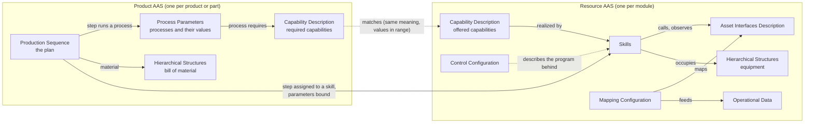

# The AAS models: product, plan and resource

What each AAS holds, which submodel templates it uses, what we changed in them, and how the
submodels connect inside one AAS and across AASs. Written on 7 Oct 2026 so that the planner, the
modules, the HMI and the AAS generator are described in one place.

It describes what is **built**, and says where a model exists only on paper. Sources:

| What | Where it was read from |
| --- | --- |
| Resource AAS of a module | `modreg` in this repository and the AAS it builds for the filling module; ARSO 0.6 (`ontology/ARSO`) |
| Product AAS, plan, stations of the planner | the demo data on the local AAS server (37 AASs, 31 sequences), which a newer planner than the pushed one wrote; and the planner's process sequence module (fork `basyx-aas-web-ui`, branch `feat/process-sequence-pharma`, commit `058a03e`) for its README and readers |
| Product AAS and plan as built here | `modreg` (`product.py`), the templates in `aas61499-tools/modreg/templates`, and the vial of the example line |
| Intended product and process models | APSO 0.2, AProSO 0.1 and PPRL 0.1 (`ontology/`), [aas-implementation-plan.md](../ontology/aas-implementation-plan.md) |
| Deviations of the generator's resource AAS from IDTA | [IDTA_CONFORMANCE.md](../ontology/ARSO/IDTA_CONFORMANCE.md) |

Not seen: AASs on the lab's server, and the source of the planner version that is running locally.

Five example AASs built this way, with class diagrams, are in [aas-examples.md](aas-examples.md).

## 1. The three at a glance



| AAS | One per | Built by | Checked against |
| --- | --- | --- | --- |
| Resource | module | `modreg` from the module spec or the running module | ARSO 0.6: `modreg check`, and the closed SHACL validation of the generator |
| Product | product, and each part that has its own plan | the planner (demo data), and `modreg` from the product's profile | its pydantic type (`ProductTypeAAS`); no ontology (APSO is not applied to it) |
| Plan | product (a submodel of the product AAS, not an AAS of its own) | the planner, and `modreg` as part of the product | its pydantic class; against the resources by following its links (`cell/examples/plan_check.py`); AProSO is not applied to it |

All three are built the same way: an AAS type on the lab's shared pydantic model (aas-model), a
profile that is the dump of that type without what the type says anyway, and `modreg build` to
make the AAS from it. `ModuleTypeAAS` is the resource, `ProductTypeAAS` the product with its plan.

There is no process AAS today. The ontologies describe one (AProSO); the planner keeps the plan
as the Production Sequence submodel of the product it is for. Section 7 lists this and the other
places where two descriptions of the same thing differ.

## 2. Resource AAS: a module

Shell `FillingModuleAAS`, asset `https://smartproductionlab.aau.dk/assets/FillingModule`,
`derivedFrom` the lab's resource template. Eight submodels:

| Submodel | Template | What it holds | Status |
| --- | --- | --- | --- |
| Nameplate | IDTA 02006-3-0 | Manufacturer, designation, address, year, country | Unchanged |
| Hierarchical Structures | IDTA 02011-1-1 | The module as entry node and its equipment items as parts (`NeedleAxis`, `Scale`), archetype OneDown | Unchanged |
| Asset Interfaces Description | IDTA 02017-1-1 with W3C WoT terms | One OPC UA interface: every method as an action (arguments in call order), every published variable as a property, each with its browse path | Extended |
| Asset Interfaces Mapping Configuration | IDTA 02027 (2/0) | Which interface property feeds which data point, and which action each Operation of a skill calls | Extended |
| Capability Description | IDTA 02020 | The capabilities the module offers, with values or ranges and units, each realized by a skill | One change |
| Skills | ours (ARSO), from IDTA 02015 Control Component Type | Skills, building blocks, the module's own commands and procedures, error codes | Custom |
| Operational Data | ours (ARSO) | One decimal data point per published variable: states, error ids, parameters and results of the last run, equipment inputs | Custom |
| Control Configuration | ours (ARSO) | Runtime and endpoint, the rule set the program follows, what it was generated from, whether the running program still matches, type hashes | Custom |

Known to ARSO but not written for a module: **Parameters** (ours; optional, and what it is for is
open) and **Technical Data** (IDTA 02003; the generator writes it).

ARSO requires exactly one Nameplate and one Hierarchical Structures, an interface description
whenever there are skills, operational data or a mapping, and skills and capabilities together.

### 2.1 What a module is made of

The same four layers in every module, each described in a different submodel:

```
equipment          NeedleAxis, Scale                         Hierarchical Structures (parts of the module)
   ▲ occupies
skill primitives   MoveNeedleUp, MoveNeedleDown,             Skills/Skills (kind Primitive): offered, own
                   AttachNeedle, Dispense, Tare, Weigh        Operation and actions, contract, equipment
                   (none since 8 Oct)                        Skills/BuildingBlocks: not offered, only steps
   ▲ uses, in sequence
module level       Dispensing(Volume) =                      Skills/Skills (kind Composite): Execute and
skill              MoveNeedleDown → Dispense(Volume,          Stop sequences of steps, each with what is
                   FlowRate 1.0) → MoveNeedleUp → Weigh       bound to its parameters
   ▲ realized by
capability         Filling: FillVolume 0.5–10 mL,            Capability Description (role Offered)
                   ContainerType vial, GraspDiameter,
                   AbsoluteFillError
```

- A **primitive** is one command on one equipment item until a sensor or a time ends it. It is a
  block type in the program; a new one needs a new program.
- A **module level skill** is only instances and connections, so it can be created online. It needs
  a capability; a primitive does not (it is a building block), and Occupy and Release do not (they
  are access control).
- Beside the skills, `Skills/Module` holds the module's own commands (Reset, Start, Stop, Abort,
  Clear) and `Skills/Procedures` the sequences it runs itself while resetting and stopping.
- The rules for all of this in the program are in [module-rules.md](module-rules.md).

One level up, a line is a resource whose parts are modules, described the same way (Hierarchical
Structures; a skill of the line may use skills of its parts). ARSO and PPRL allow it; no line AAS
is built.

### 2.2 Links inside the resource AAS

| From | Element | To | Says |
| --- | --- | --- | --- |
| Capability | `CapabilityRelations/RealizedBy` | the skill in Skills | Which skill carries out the capability |
| Skill | `RealizesProperty` | a property of that capability | Which skill parameter sets the capability's value (FillVolume ← Volume) |
| Skill | `InterfaceReference`, `Methods` | actions of the interface | Where to call Start, Stop, Abort, Reset |
| Skill, step | `StateReference`, `ErrorReference`, `Results` | properties of the interface | Where state, error and results show |
| Skill | `Occupies` | equipment nodes in Hierarchical Structures | What the skill locks while it runs |
| Module level skill | `Uses` | skills and building blocks | What it is made of |
| Step | `Skill` | a skill or building block | What the step runs |
| Step | `Bindings` | a constant, or a parameter of its skill | Where each of the step's values comes from |
| Skill, building block | `Implementation` | the program | Block type, instance, type hash |
| Mapping Configuration | source → sink | interface property → data point | Where a published value lands in the AAS |
| Mapping Configuration | source → sink | Operation of a skill → interface action | Which call an invoked Operation becomes |

The interface description holds only how to reach things. The Skills submodel holds what they
mean. The mapping joins the two.

### 2.3 What we changed in the templates

| Submodel | Change | Why |
| --- | --- | --- |
| Asset Interfaces Description | OPC UA binding terms on forms (`uav_browsePath`, `uav_componentOf`); the owning object is named by its browse path, not a NodeId | FORTE gives its nodes new ids at every start |
| | Actions with `input` and `output` schemas and `synchronous` (WoT terms; the IDTA template details only properties) | A caller needs the arguments in call order |
| | Each action carries the command it carries out as a supplemental semantic id | Finding an action by meaning (7 Oct; whether it becomes the main id is open) |
| Mapping Configuration | A source may be an Operation of a skill, with an interface action as sink; the skill has to reference that action itself | The template only maps interface elements onto submodel elements; invoking needs the other direction |
| Capability Description | `CapabilityRealizedBy.second` is a model reference to the skill in the same AAS (the template has an external reference) | So the link can be followed and checked |
| Skills | The whole submodel, see below | No template describes skills with parameters, composition and implementation |
| Hierarchical Structures, Nameplate | None. ARSO makes both mandatory and asks for the nameplate's address fields | Every resource has to say what it is and what it consists of |

Skills, against IDTA 02015 Control Component Type:

- Kept: the `Interfaces`, `Skills` and `Errors` containers; per skill a `SemanticId`, an Operation
  and the reference to its interface action.
- Dropped: the per-skill Modes, Disabled and Errors structure and the device-level interface entries.
- Added per skill (ARSO 0.5 and 0.6): `Kind`, `Parameters` (unit, limits, default as qualifiers),
  `RealizesProperty`, `Contract`, `Uses`, `Execute` and `Stop` sequences of steps, `Occupies`,
  `StateReference`, `Implementation`; and `BuildingBlocks` beside the skills.
- Written by `modreg` but not yet declared in ARSO: `Methods`, `ErrorReference`, `Results`, the
  module's commands (`Module`), `Procedures`, and what a step holds (`InstancePath`, `Bindings`,
  `StateReference`). Validators let them pass unchecked.

### 2.4 Four descriptions of a resource

| | Modules here | Planner's stations | Generator's resource AAS | Lab's MQTT stations |
| --- | --- | --- | --- | --- |
| Built with | `modreg` on aas-model | demo data in the planner | the AAS generator's builder | aas-model |
| Interface | OPC UA | none | MQTT, OPC UA, Modbus | MQTT |
| Skills | ARSO Skills | "Application Skills 1.0" (the planner's own template) | ARSO Skills, flat (no parameters or composition) | IDTA 02015 Control Component Instance |
| Capabilities | IDTA 02020, meaning as supplemental id | IDTA 02020, meaning as supplemental id | IDTA 02020, meaning as the main id | none |
| Live values | Operational Data | none | Operational Data | Variables |

The first two agree on capabilities down to the semantic ids, the role qualifier and the shape of
`RealizedBy` (compared element by element against the planner's reader; not run in the planner), so
a module should already show as a station there. They differ on skills (section 7).

## 3. Product AAS

As the planner builds it, and as `modreg` builds it from a profile (`ProductTypeAAS`). A product (a
recipe) and each part with a plan of its own are AASs.

| Submodel | Template | What it holds | Changed |
| --- | --- | --- | --- |
| Nameplate | IDTA 02006-3-0 | What the product is. Written by `modreg`; the planner's demo products have none | No |
| Hierarchical Structures | IDTA 02011 | The product and its parts (container, liquid, stopper, cap), each with `Quantity` and `QuantityUnit`; a part points to its own AAS by its global asset id | Quantity as two Properties (the template only counts: `BulkCount`) |
| Process Parameters | IDTA 02031-1 | The processes the product needs, each with its id, name, description, planned time, product, process and resource parameters, and the materials it uses (`ProcessBoM`) | Extended |
| Capability Description | IDTA 02020 | The capabilities the product requires (role Required), with the values or acceptable ranges | No |
| Production Sequence | ours (the planner's) | The plan, section 4 | Custom |

- **The extension of Process Parameters** (it adds to the template and redefines nothing):
  - a process may carry a `RequiredCapability` reference
    (`https://smartproductionlab.aau.dk/ProcessParameters/RequiredCapability/1/0`) to a Required
    capability in the product's Capability Description;
  - a material in `ProcessBoM` is a `MaterialUse`: `MaterialReference` to the part in the bill of
    material, `Role` (workpiece, incorporated, output), and `Quantity` with `Unit` or a
    `QuantityParameterReference` to the parameter that gives the amount;
  - the three parameter collections hold one Property per parameter, named by its idShort.
- **Where the classes come from:** two submodel templates in `aas61499-tools/modreg/templates`:
  `ProcessParameters.json` is IDTA's published template with the extension above;
  `ProductionSequence.json` is written from the plans the planner saves. aas-model's generator makes
  the pydantic classes from them (`modreg generate`), as it does for ARSO's own submodels.
- **Checked against the planner's data (7 Oct):** all 31 Production Sequences on the local server
  read into the class without losing an element, and 26 of the 29 Process Parameters submodels once
  their durations are taken as text. The other three are older demo data that names a material by a
  bare reference instead of a `MaterialUse`.
- **Reading an AAS back into its type is not ready:** aas-model cannot read an `xs:duration`
  (`PlannedProcessTime`) from an AAS. Building one, the direction used here, works.
- **Not covered yet:** the sequences a plan calls (further submodels of the product) are not part
  of the type; a Property with an empty value is written without a value (aas-model's rule; the
  planner reads a missing value as empty).
- **Meanings:** capabilities and their properties are named by supplemental semantic ids in the
  shared vocabulary (`https://smartproductionlab.aau.dk/semantics/<Name>`, kept in
  `ontology/Vocabulary`), as the modules do.
- The Process Parameters semantic id is written `https://admin-shell-io/...` on purpose: that is
  the template's own spelling.

APSO describes a product AAS differently. Neither is wrong; only one is built:

| APSO 0.2 (on paper) | Planner (built) |
| --- | --- |
| BoM | Hierarchical Structures |
| Bill of Process: a tree of processes with parameters, order, consumed and produced parts | Process Parameters: a flat list of processes; the order is in the plan |
| Required capability inside each process (a 02020 container) | Required capabilities in one Capability Description, referenced from the process |
| Requirements, Batch Information | not there |

## 4. The plan: Production Sequence

Semantic id `https://smartproductionlab.aau.dk/SubmodelTemplate/ProductionSequence/2/0`, schema
`production-sequence/2.0`, as the planner on the local server writes it (the pushed branch still
has 1.0, with scopes). One submodel per sequence, in the AAS of the product it plans: the
product's own sequence (`Role` Primary, identifier
`https://smartproductionlab.aau.dk/sm/process-plan/{base64url(AAS id)}`) and one more for every
sequence it calls (`Role` Subprocess).

```
ProductionSequence
├─ PlanSchema, Revision, SequenceId, Name, Role
├─ Subject                     the product (→ product AAS)
├─ Subprocesses                the sequences this one calls
└─ Steps
     └─ Step                   Kind = step | call | parallel | conditional; NodeId, Name, Order
          ├─ ProcessOwner, ProcessReference   the process it runs (→ Process Parameters)
          ├─ RequiredCapabilities             only if they differ from the process's own
          ├─ Resource                         the station (→ resource AAS)
          ├─ SkillId, Skill                   the skill that runs it (→ the resource's skills)
          ├─ ExecutionMode                    station or manual
          └─ Bindings
               └─ Binding                     Name, Value, and the process parameter it comes
                                              from (SourceAas, SourceElement)
          call:        SequenceReference to another sequence
          parallel:    Branches, each with its own Steps
          conditional: Condition and the Steps it guards
```

- A **call** runs another sequence, a **parallel** step several branches that all join, a
  **conditional** step its body every nth product.
- A **binding** gives one skill parameter its value: a constant, or a process parameter of the
  product (no source means the constant).
- It is an editable plan. It has no approval, no check result and no execution history.

AProSO describes a process AAS of its own. The mapping:

| AProSO 0.1 (on paper) | Production Sequence (built) |
| --- | --- |
| Process AAS, one per product and line | a submodel of the product AAS |
| Process Information (status, approval, product and line) | `Product`, `Revision`; no status or approval |
| Process Structure (nodes, precedes, conditions) | Steps with Order, calls of other sequences, branches, conditions |
| Capability Bindings (required capability, candidates, chosen offer, skill, parameter mappings) | per step: RequiredCapabilities, Resource, Skill, Bindings |
| Validation | not there |
| Policy (the executable form, e.g. a behaviour tree) | not there |

## 5. Links across AASs

| # | Link | From | To | Status |
| --- | --- | --- | --- | --- |
| 1 | Part of a product | product BoM entity (global asset id); a call step names the part's sequence | the part's AAS | Built in the planner |
| 2 | Process needs a capability | process in Process Parameters (`RequiredCapability`) | Required capability in the product's Capability Description | Built in the planner |
| 3 | Required matches offered | Required capability of the product | Offered capability of a resource | Built in the planner and in `modlink` as code: same meaning, values within range, same unit. As an ontology check: planned |
| 4 | Step assigned to a station | step `Resource` | resource AAS | Built in the planner |
| 5 | Step assigned to a skill | step `Skill`, found through the capability's `RealizedBy` | skill of the resource | Built for the planner's stations. For a module `RealizedBy` leads to an ARSO skill, which the planner cannot read |
| 6 | Value handed to the skill | step `Binding` (source: a process parameter) | parameter of the skill | Built in the planner's model; nothing executes it yet |
| 7 | Line consists of modules | line's Hierarchical Structures | module AASs | Modelled, not built |

Inside the resource the chain continues with section 2.2: capability → skill → interface → program.

## 6. One value from product to motor: the fill volume

| Step | Where | Status |
| --- | --- | --- |
| 1. The product asks for 2 mL | product, Process Parameters: process Filling, product parameter `FillVolume` | Built |
| 2. Filling needs the capability Filling with that volume | product, Capability Description (Required), referenced from the process | Built |
| 3. The filling module offers Filling for 0.5 to 10 mL | module, Capability Description (Offered) | Built |
| 4. 2 mL lies in the range, the meanings are the same | matching | Built (planner, `modlink`) |
| 5. Filling is realized by the skill Dispensing | module, `RealizedBy` | Built |
| 6. Its parameter Volume sets FillVolume | module, Dispensing `RealizesProperty` | Built |
| 7. The plan's step is assigned to Dispensing, and Volume is bound to the product's FillVolume | plan, step `Resource`, `Skill`, `Bindings` | **Missing:** the planner cannot read a module's skills |
| 8. Someone runs the step: occupies the module, invokes Dispensing with Volume = 2 | executor (agents) | **Missing** |
| 9. The Operation becomes the OPC UA call `Skills/Dispensing/Start(Session, 2.0)` | module, Mapping Configuration and interface description | Built (`modlink` runs a capability of one module with given values; the HMI uses it) |
| 10. Dispensing hands Volume to its Dispense step; the flow rate is a constant of that step | module program; described by the step's `Bindings` | Built |
| 11. Dispense waits Volume / FlowRate, the needle goes up, the scale is read | module program | Built (no pump yet: a time stands in) |
| 12. State and result show as variables and as data points | interface, Mapping Configuration, Operational Data | Variables: built. Data points: modelled, nothing executes the mapping |

## 7. Where two descriptions differ

1. **Skills of a resource.** The planner reads its own skill catalog (`SkillId`, `Parameters` with
   `ParameterId`, `DataType`, `Unit`, `MinValue`, `MaxValue`, `DefaultValue`); the modules publish
   ARSO Skills (the skill's idShort, `Parameters` properties with unit, limits and default as
   qualifiers). Same content, different shape. **Decided 7 Oct:** the resource's skill definition
   (ARSO Skills) is the one that holds; the web UI and the planner are adjusted to read it (plan
   step 2.2). Until then steps 7 and 8 above cannot be done for a module in the planner. The vial of
   the example line already refers to the modules' ARSO skills.
2. **Process AAS or submodel.** AProSO: an AAS per product and line. Planner: a submodel of the
   product. Consequence of the planner's way: one plan per product, so the same product on two
   lines needs something more.
3. **Product processes.** APSO's Bill of Process (a tree, with order) against IDTA 02031 Process
   Parameters (a list) plus the plan (the order).
4. **Nothing checks a product AAS or a plan against an ontology.** APSO and AProSO exist but
   describe structures that are not the ones built. The pydantic type checks the structure, and
   `plan_check` the links into the resources.
5. **Capability element in the generator.** It writes the meaning as the main semantic id; the
   modules and the planner follow IDTA 02020 (decided 6 Oct). Both are accepted by the validator.
6. **Elements `modreg` writes that ARSO does not declare** (section 2.3), and the interface terms
   aas-model writes that ARSO does not declare (key, type, title, operation type, browse path).
7. **Live values.** The mapping into Operational Data is described but nothing runs it, so the
   data points in the AAS hold no values.

## 8. What would complete this

- The source of the planner that writes Production Sequence 2.0, so that its rules can be read and
  not only its data; and how real products (not the demo recipes) are meant to look.
- Whether a line gets its own AAS, and where the plan belongs when there are two lines.
- The lab's own resource AASs on the server, to compare with section 2.4.
