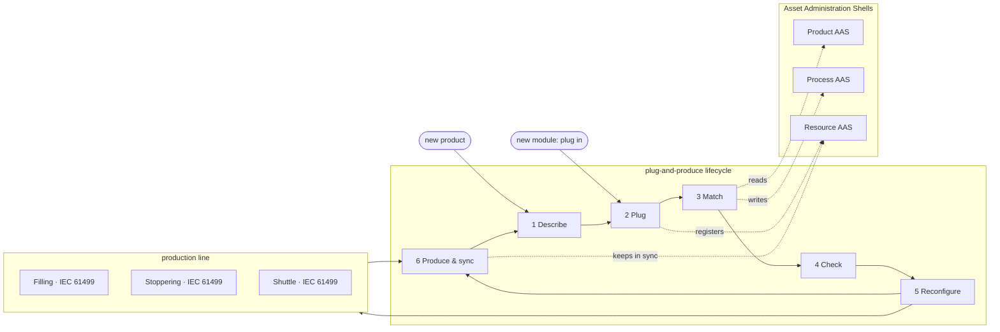
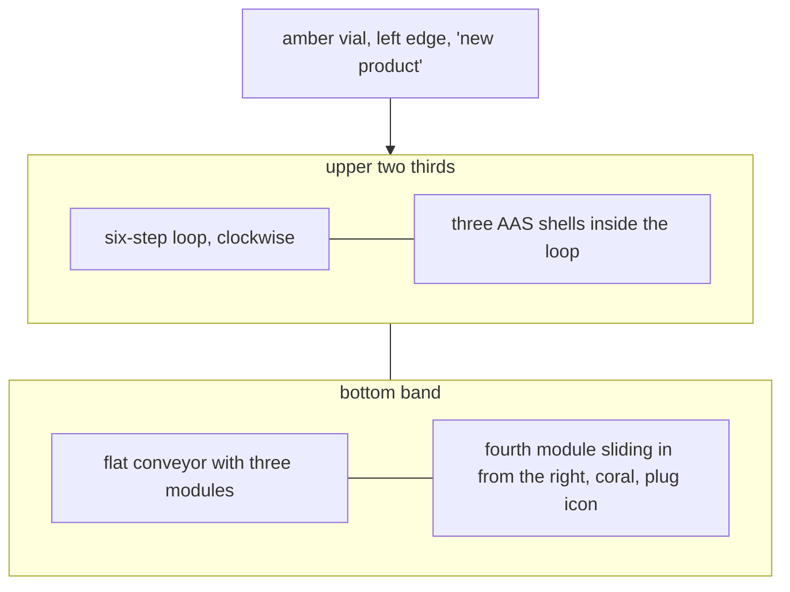

# Image prompt: the plug-and-produce framework at a glance

Paste the **compact prompt** into an image generator with a short input limit; paste the whole
file into one that accepts long, structured prompts. The mermaid charts describe *content and
arrangement only*: do not draw them literally as mermaid diagrams.

---

## Compact prompt

A clean, minimalist, flat-design concept figure for a scientific paper, 16:9, white-ish background
(#F7F7F4), no gradients, no shadows, no 3D, no photorealism. It explains the lifecycle of a
plug-and-produce framework for modular pharmaceutical production. Centre: a large circular loop
of six numbered steps connected by one continuous rounded arrow ring (dark navy #1D3557):
1 "Describe", 2 "Plug", 3 "Match", 4 "Check", 5 "Reconfigure", 6 "Produce & sync". Inside the
ring: three simple document-shell icons side by side labelled "Product AAS", "Process AAS",
"Resource AAS" (teal #2A9D8F outlines, light teal fill #E3F2EF), under the heading "Asset
Administration Shells". Bottom band: a flat conveyor line with three production modules drawn as
rounded boxes (filling with a needle, stoppering with a stopper, a transport shuttle), each with a
tiny circuit-board badge labelled "IEC 61499". One module slides in from the right with a plug
icon and a coral (#E76F51) arrow "plug in". Left: a small vial icon with the input arrow "new
product". Thin navy lines, generous white space, sans-serif labels (Inter or Helvetica), few words,
all text horizontal and legible.

---

## Full specification

### Purpose and message

The figure shows the **working principle** of the framework, not its data models: a production
module is plugged into a line, **describes itself**, is **matched** to what the products need, the
line's control is **checked and reconfigured online**, production runs, and the digital twin
stays **in sync**; any new product or new module starts the loop again. The viewer should
understand in five seconds: *"plug in a module or bring a new product, and the system
reconfigures itself safely, without stopping everything."*

### Style (the most important part)

- **Flat and minimalist.** Solid colour fills, no gradients, no drop shadows, no glow, no bevels,
  no textures, no 3D or isometric rendering, no photorealism, no stock-photo robots or people.
- **Few elements, lots of white space.** Every element must earn its place; when in doubt, leave
  it out.
- **Thin, even strokes** (about 2 px at 1600 px width), rounded corners (radius about 12 px),
  rounded arrow heads.
- **Simple line icons** in one consistent style (like Material Symbols Outlined or Lucide), same
  stroke width as the lines.
- **Typography:** one clean sans-serif (Inter, Helvetica or Source Sans), dark navy text, bold
  for the six step names, regular for the short captions. All text horizontal, left-aligned or
  centred, and spelled exactly as given below. No other text, no lorem ipsum, no pseudo-text.
- **Aspect ratio 16:9** (for example 1600 × 900 px), suitable for a two-column paper figure;
  it must stay readable when printed about 17 cm wide, also in greyscale.

### Colour palette (use only these)

| Role | Colour | Use |
| --- | --- | --- |
| Background | `#F7F7F4` warm off-white | whole canvas |
| Primary | `#1D3557` dark navy | lifecycle ring, step numbers, text, outlines of modules |
| Information | `#2A9D8F` teal, fill `#E3F2EF` | the three Asset Administration Shells and the data arrows to and from them |
| Physical | `#8D99AE` slate grey, fill `#E9ECEF` | conveyor, module bodies, circuit-board badges |
| Accent | `#E76F51` coral | only for "change" moments: the module being plugged in, the "Reconfigure" step, the new-product arrow |
| Highlight (optional, sparingly) | `#E9C46A` soft amber | the product vial only |

Three main colours (navy, teal, coral) plus neutrals; coral appears at most three times.

### Layout

```
+--------------------------------------------------------------------------------------+
|  new product (vial) -->                                                               |
|                          ( 1 Describe )  ->  ( 2 Plug )  ->  ( 3 Match )              |
|                       ^                                              |                |
|                       |      [ Product AAS ] [ Process AAS ] [ Resource AAS ]         |
|                       |           Asset Administration Shells                         |
|                       |                                              v                |
|                          ( 6 Produce & sync ) <- ( 5 Reconfigure ) <- ( 4 Check )     |
|                                                                                      |
|  ====[ Filling ]======[ Stoppering ]======[ Shuttle ]=======   <-- [ new module ] plug in |
|        IEC 61499        IEC 61499          IEC 61499                                  |
+--------------------------------------------------------------------------------------+
```

- **Centre (upper two thirds):** the lifecycle as a rounded loop (a circle or a rounded rectangle
  track) running clockwise, with six evenly spaced step nodes. Each node: a small navy circle with
  the step number, an icon above or beside it, the bold step name and a caption of at most five
  words below.
- **Inside the loop:** three document-like "shell" icons (a rounded rectangle with a small tab on
  top and three short lines inside), teal outline and light teal fill, labelled "Product AAS",
  "Process AAS", "Resource AAS", with the caption "Asset Administration Shells" underneath.
  Thin teal dashed arrows connect the shells to steps 2, 3 and 6 (information in and out).
- **Bottom band:** a flat horizontal conveyor line in slate grey. On it three modules as rounded
  rectangles with a simple pictogram each: a dispensing needle over a vial ("Filling"), a stopper
  pressed onto a vial ("Stoppering"), a flat puck on a track ("Shuttle"). Each module carries a
  tiny badge (a small square chip with pins) labelled "IEC 61499". Thin navy connectors run up
  from the modules to steps 5 and 6.
- **Right edge:** a fourth module, outlined in coral, sliding in from the right towards the
  conveyor, with a plug icon and the label "plug in"; a coral arrow from it points to step 2.
- **Left edge:** a small vial in soft amber with the label "new product" and a coral arrow into
  step 1 or 3.

### The six steps (exact texts)

| # | Step name | Caption (exact) | Icon idea |
| --- | --- | --- | --- |
| 1 | Describe | "spec → program + AAS" | a document with a small gear |
| 2 | Plug | "module registers itself" | a plug with a small check mark |
| 3 | Match | "required ↔ offered capabilities" | two puzzle pieces fitting |
| 4 | Check | "contracts before change" | a shield with a check mark |
| 5 | Reconfigure | "online, while running" | two circular arrows around a small chip (coral) |
| 6 | Produce & sync | "skills run, twin stays in sync" | a play symbol next to two mirrored squares |

### What each step means (for the generator's understanding; do not write this text into the image)

1. **Describe:** each module's specification generates both its IEC 61499 control program and
   its Asset Administration Shell (a compact manifest).
2. **Plug:** a module is connected to the line; it identifies itself over OPC UA and its shell is
   registered with its capabilities and skills.
3. **Match:** a product's required capabilities (from its process) are matched against the
   capabilities the modules offer; each process step is bound to a module's skill.
4. **Check:** the planned change is checked against the skills' contracts and classified
   (parameter, flow or composition change).
5. **Reconfigure:** the change is applied online to the running IEC 61499 runtime, only where
   needed, while the rest keeps running.
6. **Produce & sync:** the orchestrator calls the skills; the modules report back, and the shells
   are kept in sync with what really runs. A new product or a new module starts the loop again.

### Content reference (do not draw as a chart)





### Avoid

Gradients, shadows, 3D, isometric views, glossy or metallic effects, photographs, realistic
robots or people, busy backgrounds, more than the listed colours, more than the listed labels,
misspelled or invented words, tiny unreadable text, decorative clutter, logos or brand marks,
clip-art factory buildings, lightning bolts, circuit-board background patterns.

### Checklist for the result

- [ ] Six numbered steps on one closed loop, readable names and captions
- [ ] Three AAS shells inside the loop, teal
- [ ] Three modules on a conveyor with "IEC 61499" badges, and one plugging in (coral)
- [ ] A "new product" vial entering on the left
- [ ] Only the palette colours; coral used for change only
- [ ] Flat, minimalist, plenty of white space, 16:9
