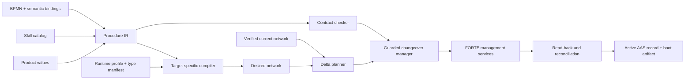

# From BPMN intent to FORTE reconfiguration

This design interprets the supplied September 2026 build plan. It separates the
work that can be implemented in this repository from the runtime and AAS work
that must accompany it. The code is a first executable slice, not the full
changeover manager described in that plan.

## What “adding a skill” means

There are three different operations:

1. **Publish an atomic skill description.** Describe an existing `SK_*` FB's
   parameters, execution profile, equipment ownership, contract and bindings in
   the resource AAS. This does not install executable behaviour.
2. **Add a call to an existing skill.** Instantiate a compiled `P_Call` in `PROC`,
   select a dispatcher target, bind its parameters, and wire its execution flow.
   This is the online operation supported by the plan.
3. **Introduce a new atomic implementation or pattern type.** With the pinned,
   compiled-type approach in the plan, update and deploy the FORTE build and its
   type manifest first. An AAS entry or a JSON model cannot create the missing
   executable implementation.

A procedure becomes a **composite skill** through an existing, stable facade.
BPMN describes the procedure; the compiler produces an implementation network
and a draft description of that composite. Neither automatically proves a
contract nor makes the recipe approved.

## Four contracts, each with one owner

| Contract | Owner | Contains | Must not contain |
| --- | --- | --- | --- |
| Procedure intent | Process engineer | Stable task IDs, semantic skill references, order, named parameters, product references, explicit conditions | FB names, hashes, XML management commands, dispatcher indexes |
| Skill catalog | Controls/domain engineer | Semantic parameter IDs, IEC types, units, ranges, defaults, state permissions, conditions/effects, equipment claims | BPMN diagram coordinates or per-recipe physical addresses |
| Target profile | Runtime integrator | Actual types and hashes, ports, adapter types, dispatcher routes, facade endpoints, parameter-to-port mapping | Product-specific values or process order |
| Expected network | Compiler / deployment library | Owned instances, typed initial values, connections, provenance | Approval decisions, AAS transport details, hidden expression execution |

The present code uses `RecipeBindings`, `TargetProfile`, `Procedure`, `Network`
and `NetworkPatch`. The skill catalog is nested in the example target file for
convenience; it is logically independent and should be read through `ppr_aas`
when that repository exists. `skill_compiler` is deliberately separate from
`iec61499_mgmt`, ready to move into `aas61499-tools` as the plan proposes.

The diagram includes planned stages. Contract checking, guarded application,
reconciliation and AAS/boot publication are **not implemented** in this slice.

## What the BPMN author does

The author selects a skill from a palette, gives each task a meaningful label,
connects tasks, and supplies business values such as `volume <- FillVolume`.
The editor can generate the companion bindings JSON. Stable BPMN IDs are machine
identity; changing a task label must not recreate its FB.

The author should see units, allowed ranges, missing bindings, resource conflicts
and contract failures attached to the relevant task. Equipment conflicts should
be explained as “these branches both use the dosing pump”, not port errors.

Hide these details in the catalog/profile or generator:

- FORTE host/resource, scope, qualified FB types, type hashes and adapter names.
- Dispatcher routing and call-site IDs; parameter port names and slot numbers.
- State/error wiring, facade wiring, reset/hold/abort propagation and lifecycle.
- Boot-file syntax, AAS semantic IDs, reference serialization and management XML.
- Generated names, command order, observed network hashes and change logging.

Do **not** hide process decisions: whether to inspect, how often to repeat, what
to wait for, which error recovery action is appropriate, or which product value
is intended. Defaults must come from an explicit, versioned skill declaration.

## Representation choices

**Semantic identity is not physical addressing.** `urn:example:skill:dose` can
bind to `Unit.Dose`; a separate mapping assigns `volume` to `P1`. Parameter order
in an AAS list must never decide this mapping. Reordering the AAS list would
otherwise silently change physical meaning.

**Keep types until the protocol boundary.** A JSON value is `{"type":"LREAL",
"value":0.5}` or `{"type":"TIME","value":500}` (milliseconds), not an arbitrary
IEC expression string. BOOL is not interchangeable with integer 0/1. Ranges and
units belong to semantic parameters. The initial compiler requires the declared
unit convention and performs no unit conversion; a production product resolver
must validate source units and convert explicitly before creating these values.

The planned universal `P1..P4: LREAL` interface is convenient but cannot encode
every BOOL, string, time, integer or structured parameter without conventions or
loss. Prefer typed call patterns or a versioned parameter record. If four LREAL
slots remain the experimental interface, restrict supported skills accordingly
and declare each conversion in the target profile. The code rejects mismatched
types instead of inventing a conversion.

**Use tagged structured values, not formulas.** Parameter sources initially are
`constant` or `product`. Extend later with `procedure_input` and a deliberately
small typed expression AST if needed. Do not run Python, FEEL, JavaScript or
arbitrary text from BPMN. Contracts should use typed variable/parameter
references, comparison operators and assignment/addition effects as in the plan.
Keep runtime guards distinct from conditions proven statically.

**Use a structured control-flow IR for the full subset.** The implemented
`sequence-v1` IR is an ordered list of skill calls. The next version should add
tagged `Sequence`, `Call`, `Repeat`, `Choice`, `Parallel` and `Wait` nodes. Each
control node keeps its BPMN ID. Only structured single-entry/single-exit regions
are accepted, with paired splits/joins and a bounded concurrency limit. This
makes a forward contract check tractable; a bag of arbitrary BPMN edges does not.

Loops require a precise profile decision: BPMN `loopCardinality` belongs to
multi-instance characteristics. A sequential multi-instance task with a bounded
cardinality can mean Repeat; parallel multi-instance semantics must not silently
become a sequential loop. Repeat count 1 -> 2 is a parameter change only when the
loop block already exists. Turning an ordinary task into a loop is structural.

**Desired state is canonical; patches are convenience input.** Both produce a
complete `Network` before validation and diff. A patch has a required `base_hash`.
Its operations are domain actions, not list-index JSON edits. Removing an instance
also removes its incident connections. Resetting a removed parameter requires an
explicit value; omission is never interpreted as a runtime reset.

The network includes only procedure-owned FBs and connections touching them.
Allowed fixed endpoints come from the trusted profile. A full resource QUERY
must be projected onto this ownership boundary for comparison. Unknown
connections into `PROC` must be treated as drift, not filtered away.

## Requirements for the Python management library

| Capability | Implemented here | Remaining for a production manager |
| --- | --- | --- |
| Pydantic models / JSON Schema | Network, patch, typed values, ports, type library, command plan | Observed runtime snapshot with explicit unknown/unreadable values |
| Protocol client | Framing, partial reads, size limit, UTF-8, escaped XML, response ID checking, parsed errors, single-command execution; actual FORTE 3.0 READ/QUERY fixtures | Qualify additional builds and adapter QUERY shapes |
| Management operations | CREATE/DELETE FB and connection, WRITE/READ, per-FB START/STOP, QUERY FB/Connection/FBType; boot files for the fixed application plus `PROC` (`bootfile`), restored live | Atomic boot-file replacement on the device |
| Type compatibility | Offline manifest hash/type/port/direction checks; executable SHA-256 fallback for empty type hashes; `types.json` from the live build (`typelib`); FORTE refuses CREATE with a wrong hash | Remote build attestation |
| Delta | Deterministic parameter/flow/structural classification, replacement rewiring, dependency order | More selective stopping after pattern lifecycle guarantees are tested |
| Fixed-part isolation | Owned-scope instances and trusted boundary ports | Live boundary ownership/drift reconciliation under occupation |
| Read-back | `verify()` compares instances, types, running state, connections and typed parameter values in the owned scope | Drift repair |
| Failure handling | Management errors raise; transport errors close socket, no automatic retries | Durable command journal, ambiguous-outcome reconciliation, tested recovery |
| Activation | Reviewable plan with quiescence requirement | Occupation acquisition, guards, command execution, verification and release |

Management `STOP` is not PackML Stop; management `START` is not skill Start.
Quiescence and occupation cannot be implemented by merely stopping a procedure
FB. They must inhibit new process requests through the fixed unit coordinator.

For graph changes, this first planner stops every existing owned procedure FB,
disconnects obsolete or replaced edges, deletes retired/replaced FBs, creates
new ones, writes parameters, connects edges, then starts the desired procedure
FBs. This is deliberately conservative. Flow changes alter only connections as
network content but include STOP/START lifecycle commands. Parameter changes
produce WRITE only, assuming the live guard and `ChangeableIn` checks passed.

There is no atomic multi-command transaction. After occupation is acquired,
re-read live quiescence, assumptions, skill identities/types and the old network
before the first mutation. A base hash from a file is not proof of runtime state.
On a timeout the last mutation may already have succeeded: query/reconcile before
retrying. Keep the unit inhibited on partial application or failed verification.
Do not claim rollback by simply reversing commands—FB internal state and runtime
side effects are not captured by a network snapshot.

Only after verification should the manager publish the active AAS record and
persist a full boot artifact containing the fixed application plus `PROC`. Runtime
activation, AAS publication and file persistence are separate commit points;
journal them and define restart recovery. The current code does not write a
misleading procedure-only device boot file.

## Runtime ABI

The skill side of the ABI is now defined by the generated 4diac types. The central
dispatcher is replaced by a gate inside every skill composite; see
[skill-blocks.md](skill-blocks.md). Status of the original open points:

1. Settled: `CALL(P1..P4)` → `DONE` or `FAILED(CallError)` on the skill composite.
2. Settled: there are no channels. A call targets the skill instance
   (`EM_Filler.<Skill>.CALL`); the skill's identity is its instance.
3. Settled: the gate accepts one call at a time (`Busy` otherwise). `DONE`/`FAILED`
   are emitted only for a pending call, so a stale completion cannot complete the
   next task.
4. Settled: P1..P4 `WITH CALL`, latched on entry to Starting (`SL_*.LATCH`).
5. Settled: unit control (`UNIT_CTL`) reaches every skill unconditionally. A
   pending call fails with `Interrupted` on Stop/Abort.
6. Open (`P_Call` side): one data writer per skill input. Several call sites for
   the same skill need a small per-skill call mux in `PROC`, or the
   translator's single call-site rule. Parallel branches rely on disjoint skills;
   the gate enforces nothing across skills yet, beyond the unit's `Busy`.
7. Settled: OPC UA manual commands require occupation owner, non-Production mode
   and, for Start, a quiescent unit. Procedure calls require the unit in Execute.

The example target profile is **illustrative**, with fabricated hashes and port
names. It is not a statement about the user's compiled runtime. Its data-output
to dispatcher-input wiring permits one writer per input. Reusing the same binding
at multiple call sites therefore fails the multiple-driver check. The general
solution needs dedicated call-site endpoints, explicit multiplexing/arbitration,
or a verified adapter protocol—not multiple data outputs tied to one input.
Allocate routes in the compiler/integrator layer, never in operator BPMN.

Adapters are represented, but rejected unless the target manifest explicitly
records that runtime adapter connection creation has been verified. The profile
does not yet model WITH associations or prove request/response behaviour.

## BPMN/compiler acceptance boundaries

Implemented (`sequence-v2`):
- one process with one plain start and end, and a nonempty acyclic sequence of tasks;
- sequential multi-instance tasks (`isSequential="true"`), compiled to a `P_Loop` around the
  `P_Call`. The count comes from the task binding's `repeat` source (product value or constant);
  a literal `loopCardinality` is only a default;
- semantic JSON bindings, constants and product parameters, defaults and ranges;
- stable instance naming, facade start, complete, error and reset wiring;
- a draft composite descriptor and the network hash.

A task becoming a loop is structural. Changing the count of an existing loop is a parameter
change. Layout and lane metadata do not influence execution, and unexpected task or flow
semantics are rejected.

Rejected for now: gateways, parallel multi-instance, standard loops, timers, boundary or error
events, subprocesses, messages, compensation, expressions and executable vendor extensions.
The pattern FBs for choice, fork/join and wait exist, but the compiler does not yet emit them.

The cell target (`examples/cell/target-template.json`, bound to `types.json` with
`skill_compiler.targets.bind_library`) connects one `P_Call` per skill directly to the
skill's `CALL`/`DONE`/`FAILED` port. The illustrative `examples/target.json` keeps the old
selector-based profile for the offline tests.

## Contract check (`skill_compiler.contracts`)

Skills carry structured contracts: `Requires` and `Invariant` are Conditions, `Ensures` are
Effects (`:=`/`+=` a constant or a skill parameter). The recipe bindings carry `Assumes`. The
forward check walks the compiled calls, repeating looped ones. It reports each violated
condition with task, iteration and actual value, and derives the changed variables (`ensures`).
Optional goals, conditions on the final state taken from the product (fill volume,
inspection), catch edits that keep every step valid. Of the 44 single edits of v3, step
contracts reject 39; the goals reject the remaining five (extra dose, no inspection, needle
left down).

## Guarded changeover (`iec61499_mgmt.changeover`)

`changeover(client, unit, current, desired, library)`:
1. plans the change;
2. occupies the unit (`OpcUaUnit` over the facade);
3. requires the unit and all skills to be quiescent, plus any extra guards;
4. checks that the runtime still equals `current`, rejecting on drift;
5. applies the plan and reads it back.

It releases the occupation on success or rejection. It keeps the occupation when an apply
fails or the read-back differs.

## Recommended next implementation order

1. Done: protocol, pattern FBs, `types.json`, boot files, read-back, the retargeted compiler
   with loops, the contract check and the guarded changeover. The plan's scenarios A → B
   (parameter), B → C (loop count), C → D (structural) and the guard rejections run live
   (`tests/test_changeover_live.py`).
2. Emit `P_Choice`, `P_Fork`/`P_Join` and `P_Wait` from exclusive and parallel gateways and
   timer events; extend the check to branch joins and equipment conflicts.
3. The manager: AAS access (BaSyx), triggers, recording `ActiveProcedure`/`ChangeLog` and
   rewriting the boot file after each verified change.

## Primary references checked

- [OMG BPMN 2.0.2 specification](https://www.omg.org/spec/BPMN/2.0.2/PDF):
  reference for the BPMN namespace and control-flow semantics; this project
  deliberately supports a small profile, not arbitrary BPMN execution.
- [Pydantic discriminated unions](https://docs.pydantic.dev/latest/concepts/unions/):
  tagged patch actions and parameter sources make JSON validation predictable.
- [Eclipse 4diac deployment tutorial](https://eclipse.dev/4diac/doc/tutorials/use4diaclocally.html):
  management endpoint/deployment context. Wire-format and runtime assumptions in
  this implementation began with the supplied client/test; standard event-block
  deployment is now tested against the supplied local FORTE 3.0 executable.

## Local runtime qualification

`tests/test_skill_blocks_live.py` runs against the FORTE 3.3 build produced by
`4diac/tools/build-runtime.ps1`. Each test starts its own FORTE process on free
loopback ports. The tests cover the filling-cell types, the whole cell over OPC UA,
an online change of the equipment module, and the Modbus simulator; see
[skill-blocks.md](skill-blocks.md).

Two protocol compatibility findings from FORTE 3 are represented in the library:

- Standard FBs report `Name="qualified::Type#"`, with an empty hash.
  Empty hashes require `runtime_binary_sha256`; plans preserve that precondition.
  `verify_executable` checks a local statically linked runtime, not DLLs, dynamic
  types or a remote running process.
- READ of `PROC.Parameter.PV` returns `Source="PROC.Parameter.PV.PV"`.
  `Response.read_value()` accepts the exact requested name or this precise
  duplicated-leaf form. Raw XML remains unchanged and unrelated sources fail.
