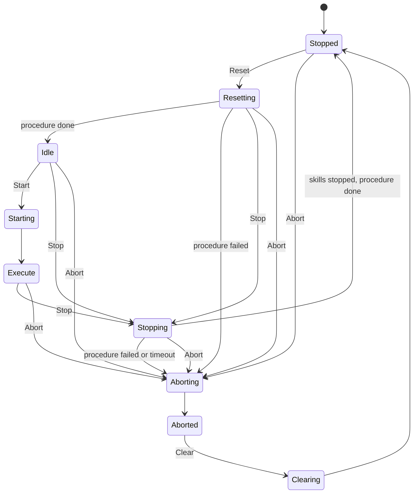
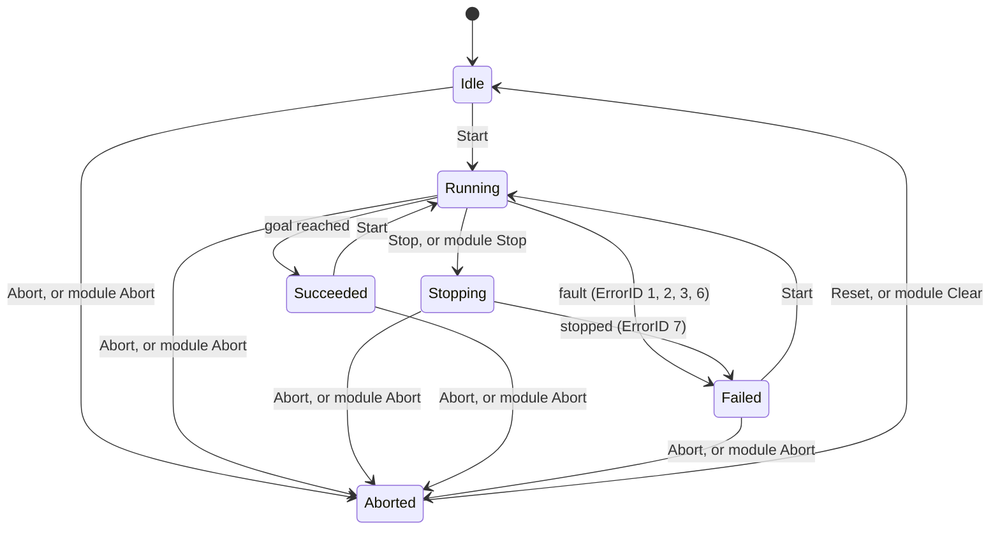

# Stoppering module: OPC UA interface for an HMI

This document describes everything an HMI needs to show and operate the **Stoppering module** over OPC UA: the address space, the two state machines (module and skill), every method with its arguments and answers, the error codes, and the rules for when a command is accepted. It is complete on its own.

Generated from the module specification and checked against the address space of the running controller (Eclipse 4diac FORTE 3.3, IEC 61499). If the module changes, regenerate this file.

## 1. Connection

| | |
| --- | --- |
| Endpoint on the machine | `opc.tcp://not assigned yet (second Pi):4840` |
| Endpoint of the simulated module (development) | `opc.tcp://localhost:4841` |
| Security | None (security policy `None`, anonymous). There is no user authentication. |
| Root object | `/Objects/Stoppering` (browse path `0:Objects / 1:Stoppering`) |
| Namespace | Every node of the module is in namespace **index 1**. Its URI is `org.eclipse.4diac.forte_<number>` and the number differs between installations, so select the namespace by index 1, not by URI. |
| Node ids | Numeric (`ns=1;i=...`) and **different after every restart of the controller**. Never store them. Resolve each node by its browse path at connect time (TranslateBrowsePathsToNodeIds or browsing), and resolve again after a reconnect. |
| Access | Variables are read-only. Everything is changed through methods. |
| Updates | Use a subscription with data-change monitored items (sampling 100 to 250 ms). Do not poll with method calls. |

To develop without the machine, the simulated module runs on a PC: `python cell/sim/run_module.py cell/modules/stoppering.yaml --opcua-port 4841`. It serves the same address space with simulated equipment (motion takes realistic time).

In this document a node is written as its path below the root, e.g. `Module/State` means `/Objects/Stoppering/Module/State`, browse path `0:Objects / 1:Stoppering / 1:Module / 1:State`.

## 2. Rules that apply to every method

- **Signature.** Every method takes the caller's session id as its first argument (String). `Start` of a skill takes the skill's parameters after it, in the order listed for that skill (each a Double unless stated). The server names the arguments generically (`RD_1`, `RD_2`, ... in; `SD_1`, `SD_2` out); only the position matters.
- **Answer.** Every method returns two values: `Accepted` (Boolean) and `ErrorID` (UInt16). `Accepted = true` comes with `ErrorID = 0`. `Accepted = false` means nothing happened, and `ErrorID` says why (section 6).
- **A method only accepts or refuses.** It answers at once. It does not wait for the action to finish. Progress and the result are read from the `State` and `ErrorID` variables.
- **The OPC UA status of the call is `Good` also when the command is refused.** Always evaluate `Accepted`.
- The controller handles one method call at a time. Do not send calls in parallel; wait for each answer.

## 3. Occupation: who may operate the module

A module is operated by one client at a time, its **occupant**. The HMI must occupy the module before any other command is accepted.

| Node | Kind | Type / arguments | Meaning |
| --- | --- | --- | --- |
| `Occupation/Occupy` | Method | `(Session: String)` -> `[Accepted, ErrorID]` | Take the module. Accepted when it is free, or when the same session already holds it. Refused with 5 when another session holds it, or when `Session` is empty. |
| `Occupation/Release` | Method | `(Session: String)` -> `[Accepted, ErrorID]` | Give the module up. Accepted only from the occupant; otherwise 5. |
| `Occupation/Occupied` | Variable | Boolean | True while some session holds the module. The session id itself is never published. |

Rules for the HMI:

- Create one session id when the HMI starts (a UUID string) and send it with every method call.
- **Keep the session id across page reloads and restarts** (for example in local storage). The occupation has no timeout: if the HMI loses its id while occupying, nobody can release the module until the controller is restarted.
- `Occupied = true` does not tell whether *this* HMI is the occupant. The HMI knows it from its own last accepted `Occupy` or `Release`. After a reconnect, call `Occupy` again with the stored id: `Accepted` means it is (still or again) the occupant; 5 means someone else is.
- Without the occupation the HMI can still read everything (monitoring only); all commands are refused with 5.
- Releasing does not stop anything. A running skill keeps running. Stop the module before releasing.

## 4. Module state machine (PackML)

`Module/State` (Byte) is the state of the whole module. It is the governing state: skills can only be started while the module is in Execute.

| Value | State | Kind | Meaning |
| --- | --- | --- | --- |
| 2 | Stopped | waits | Initial state after power-up. Nothing runs. |
| 15 | Resetting | acts | The Resetting procedure runs (homing, section 9). Ends in Idle, or Aborted if it fails. |
| 4 | Idle | waits | Homed and ready to be started. |
| 3 | Starting | acts | Passes at once to Execute (too short to be seen reliably). |
| 6 | Execute | waits | The occupant may start skills. The module stays here while skills run, succeed or fail. |
| 7 | Stopping | acts | Running skills are stopping; then the Stopping procedure runs (section 9). Ends in Stopped. |
| 8 | Aborting | acts | All skills abort and all outputs switch off. Passes at once to Aborted. |
| 9 | Aborted | waits | Everything is off. Only Clear is possible. |
| 1 | Clearing | acts | Passes at once to Stopped; aborted skills return to Idle. |

Commands (all `Module/<Command>(Session: String)` -> `[Accepted, ErrorID]`):

| Method | Accepted in state | Leads to | Refused |
| --- | --- | --- | --- |
| `Module/Reset` | Stopped | Resetting, then Idle | 4 in any other state |
| `Module/Start` | Idle | Execute | 4 in any other state |
| `Module/Stop` | Resetting, Idle, Execute | Stopping, then Stopped | 4 in Stopped, Stopping, Aborted |
| `Module/Abort` | Stopped, Resetting, Idle, Execute, Stopping | Aborted | 4 in Aborted |
| `Module/Clear` | Aborted | Stopped | 4 in any other state |

Every command is refused with 5 when the caller is not the occupant (checked first).

What the states do to the skills:

- **Stop**: every skill the occupant started is halted and ends as Failed with ErrorID 7 (after its stop sequence, if it has one). When no skill is active any more, the Stopping procedure runs. If the skills do not end within 10s, the module aborts.
- **Abort**: every skill goes to Aborted and every output is switched off at once. Nothing is moved to a safe position.
- **Clear**: aborted skills return to Idle.
- A skill that fails does **not** change the module state; the module stays in Execute.
- This is a software stop, not a safety function. The emergency stop is hardware.

The usual way to bring the module into operation: `Occupy`, `Reset` (wait for Idle), `Start` (Execute). To shut down: `Stop` (wait for Stopped), `Release`. After a fault that ended in Aborted: `Clear`, `Reset`, `Start`.

## 5. Skill state machine

Every skill has the same nodes and the same state machine. `<Skill>` stands for the skill's name (section 8).

| Node | Kind | Type / arguments | Meaning |
| --- | --- | --- | --- |
| `Skills/<Skill>/Start` | Method | `(Session: String, <parameters>)` -> `[Accepted, ErrorID]` | Start one run with these parameter values. |
| `Skills/<Skill>/Stop` | Method | `(Session: String)` -> `[Accepted, ErrorID]` | Stop a running skill in an orderly way. |
| `Skills/<Skill>/Abort` | Method | `(Session: String)` -> `[Accepted, ErrorID]` | Switch the skill's outputs off at once. |
| `Skills/<Skill>/Reset` | Method | `(Session: String)` -> `[Accepted, ErrorID]` | Bring an aborted skill back to Idle. |
| `Skills/<Skill>/State` | Variable | Byte | The skill's state (table below). |
| `Skills/<Skill>/ErrorID` | Variable | UInt16 | Why the skill last failed (section 6); 0 while running and after a success. |
| `Skills/<Skill>/Parameters/<Name>` | Variable | see the skill | The value used by the current or last run. Before the first run: the default. |
| `Skills/<Skill>/Results/<Name>` | Variable | see the skill | A value the skill produced, updated when it succeeds. |

| Value | State | Meaning |
| --- | --- | --- |
| 0 | Idle | Never run, or reset. |
| 1 | Running | The run is in progress. |
| 2 | Stopping | Stop was requested; the equipment is being stopped and the stop sequence (if any) runs. Often too short to be seen. |
| 3 | Succeeded | The last run reached its goal. Shown for 1.5 s, then the skill returns to Idle by itself (a new Start is accepted in both). |
| 4 | Failed | The last run failed or was stopped; `ErrorID` says why. |
| 5 | Aborted | Aborted; outputs are off. Needs `Reset` (or the module's `Clear`) before it can start again. |

| Method | Accepted when | Leads to | Refused with |
| --- | --- | --- | --- |
| `Start` | the skill is Idle, Succeeded or Failed **and** the module is in Execute **and** the arguments are in range **and** the skill's equipment is free | Running, then Succeeded or Failed | see the order below |
| `Stop` | the skill is Running | Stopping, then Failed with ErrorID 7 | 4 otherwise |
| `Abort` | the skill is in any state except Aborted | Aborted | 4 when already Aborted |
| `Reset` | the skill is Aborted | Idle | 4 otherwise |

`Start` is checked in this order; the first failing check gives the ErrorID:

1. The caller is not the occupant -> 5 (NotPermitted).
2. The module is not in Execute -> 4 (NotReady).
3. The skill is Running or Stopping -> 6 (Busy).
4. The skill is Aborted -> 4 (NotReady).
5. An argument is out of range -> 8 (OutOfRange).
6. The skill's equipment is held by another skill -> 6 (Busy).

Notes:

- A skill can be started again directly from Succeeded or Failed; no Reset is needed.
- A skill that is already at its goal (for example the axis is already at the end switch) succeeds at once without moving anything.
- Skills that use different equipment can run at the same time. Two skills on the same equipment cannot: the second is refused with 6.
- A *module level skill* runs several steps in sequence and holds its equipment from the first step that uses it until the end.

## 6. Error codes (`ErrorID`)

The same codes are used in method answers and in the `ErrorID` variable of a skill.

| Code | Name | Meaning |
| --- | --- | --- |
| 0 | None | No error. |
| 1 | PreconditionViolated | The skill's start condition does not hold (its `requires`). |
| 2 | InvariantViolated | A condition that must hold during the run was broken; the equipment was switched off. |
| 3 | Timeout | The end condition (a sensor) was not reached in time; the equipment was switched off. |
| 4 | NotReady | The command is not valid in the current state (module not in Execute, skill Aborted, ...). |
| 5 | NotPermitted | The caller's session does not occupy the module. |
| 6 | Busy | The skill is already running, or its equipment is held by another skill. |
| 7 | Interrupted | The skill was stopped (Stop, module Stop) or aborted while running. |
| 8 | OutOfRange | A Start argument is outside the parameter's range. |

## 7. Equipment: sensor values

Only the sensors (inputs) are published. The actuator outputs are not: show activity from the state of the skills.

| Node | Type | Unit | Equipment | Meaning |
| --- | --- | --- | --- | --- |
| `Equipment/Piston/AtLimit` | Boolean | - | Piston, DC motor through an L298N (IN3 up, IN4 down, ENB speed) with a limit switch at the working position | True when the switch is reached |

Equipment without sensors (nothing published): Plunger, StopperArm. Plunger: Linear actuator through an L298N (IN1 retract, IN2 extend); no sensors. ENA (200/255 on the ESP32) is tied to 3.3 V on the Pi, which has only two hardware PWM channels, so it runs at full speed; StopperArm: Servo that places the stopper; 0..180 degrees (outer home 120, inner 1), no feedback

Values are published when they change (and repeated about once per second).

## 8. Skills

### 8.1 Skill primitives (one motion each)

#### `LowerPiston`

Piston down to the limit switch (working position).

- **Start:** `Skills/LowerPiston/Start(Session: String)`
- **Uses equipment:** Piston
- **Ends:** sensor condition `AtLimit`; fails with Timeout (3) after 10s

#### `RaisePiston`

Piston up for Duration (open loop, no top sensor).

- **Start:** `Skills/RaisePiston/Start(Session: String, Duration: Double)`
- **Uses equipment:** Piston
- **Ends:** after `Duration` seconds (its parameter)

| Parameter (argument order) | Type | Unit | Range | Default | Node with the value |
| --- | --- | --- | --- | --- | --- |
| Duration | Double | s | 0 .. 10 | 2 | `Skills/RaisePiston/Parameters/Duration` |

#### `ExtendPlunger`

Plunger down for Duration (open loop).

- **Start:** `Skills/ExtendPlunger/Start(Session: String, Duration: Double)`
- **Uses equipment:** Plunger
- **Ends:** after `Duration` seconds (its parameter)

| Parameter (argument order) | Type | Unit | Range | Default | Node with the value |
| --- | --- | --- | --- | --- | --- |
| Duration | Double | s | 0 .. 20 | 10 | `Skills/ExtendPlunger/Parameters/Duration` |

#### `RetractPlunger`

Plunger up for Duration (open loop).

- **Start:** `Skills/RetractPlunger/Start(Session: String, Duration: Double)`
- **Uses equipment:** Plunger
- **Ends:** after `Duration` seconds (its parameter)

| Parameter (argument order) | Type | Unit | Range | Default | Node with the value |
| --- | --- | --- | --- | --- | --- |
| Duration | Double | s | 0 .. 20 | 6.5 | `Skills/RetractPlunger/Parameters/Duration` |

#### `MoveArm`

Servo to Angle and wait Settle seconds (no feedback).

- **Start:** `Skills/MoveArm/Start(Session: String, Angle: Double, Settle: Double)`
- **Uses equipment:** StopperArm
- **Ends:** after `Settle` seconds (its parameter)

| Parameter (argument order) | Type | Unit | Range | Default | Node with the value |
| --- | --- | --- | --- | --- | --- |
| Angle | Double | deg | 0 .. 180 | 120 | `Skills/MoveArm/Parameters/Angle` |
| Settle | Double | s | 0 .. 5 | 2 | `Skills/MoveArm/Parameters/Settle` |

### 8.2 Module level skills (a sequence of steps)

#### `Stoppering`

Piston to the working position, place the stopper with the servo, plunge, piston up (runStopperingCycle).

- **Start:** `Skills/Stoppering/Start(Session: String)`
- **Uses equipment:** Piston, StopperArm, Plunger
- **Fails** with the ErrorID of the step that failed; the remaining steps do not run.

Steps, in order. Each step publishes its own `State` and `ErrorID` (read-only; steps have no methods), which lets the HMI show the progress through the sequence:

| # | Step | What it does | State node |
| --- | --- | --- | --- |
| 1 | `LowerPiston`: LowerPiston | Piston down to the limit switch (working position) | `Skills/Stoppering/Execute/LowerPiston/State` |
| 2 | `ArmIn`: MoveArm with Angle=1.0 | Servo to Angle and wait Settle seconds (no feedback) | `Skills/Stoppering/Execute/ArmIn/State` |
| 3 | `ArmOut`: MoveArm with Angle=121.0 | Servo to Angle and wait Settle seconds (no feedback) | `Skills/Stoppering/Execute/ArmOut/State` |
| 4 | `ExtendPlunger`: ExtendPlunger | Plunger down for Duration (open loop) | `Skills/Stoppering/Execute/ExtendPlunger/State` |
| 5 | `RetractPlunger`: RetractPlunger | Plunger up for Duration (open loop) | `Skills/Stoppering/Execute/RetractPlunger/State` |
| 6 | `RaisePiston`: RaisePiston | Piston up for Duration (open loop, no top sensor) | `Skills/Stoppering/Execute/RaisePiston/State` |

This skill has no stop sequence: on Stop the running step is halted and the skill ends as Failed (7) at once.

A step's state stays at its last value until the skill runs again (a step that was not reached stays Idle or shows the previous run).

## 9. Procedures of the module state machine

These run by themselves in the acting states of section 4. Their steps publish `State` and `ErrorID` like the steps of a module level skill.

**Resetting** (while `Module/State` = 15):

| # | Step | What it does | State node |
| --- | --- | --- | --- |
| 1 | `ArmMiddle`: MoveArm with Angle=90.0 | Servo to Angle and wait Settle seconds (no feedback) | `Procedures/Resetting/ArmMiddle/State` |
| 2 | `ArmHome`: MoveArm with Angle=120.0 | Servo to Angle and wait Settle seconds (no feedback) | `Procedures/Resetting/ArmHome/State` |
| 3 | `RetractPlunger`: RetractPlunger | Plunger up for Duration (open loop) | `Procedures/Resetting/RetractPlunger/State` |
| 4 | `LowerPiston`: LowerPiston | Piston down to the limit switch (working position) | `Procedures/Resetting/LowerPiston/State` |
| 5 | `RaisePiston`: RaisePiston with Duration=1.5 | Piston up for Duration (open loop, no top sensor) | `Procedures/Resetting/RaisePiston/State` |

**Stopping**: this module has no Stopping procedure; the state passes at once.

## 10. What the HMI should offer

Suggested content; the layout is free.

- **Connection and occupation bar:** connected or not; `Occupation/Occupied`; whether this HMI is the occupant; buttons Occupy and Release.
- **Module state view:** the state machine of section 4 as a diagram with the current state highlighted, and the five command buttons.
- **Skill panel:** one card per skill of section 8 with its state (name and colour), ErrorID as text, parameter inputs with unit, range and default, results, and the buttons Start, Stop, Abort, Reset.
- **Sequence progress:** for a module level skill and for the procedures, the steps in order with each step's state.
- **Equipment view:** the sensor values of section 7 as indicators.
- **Message log:** every refused command with the method, the ErrorID and its text; every skill that ends as Failed with its ErrorID.

When a button should be enabled (the controller checks the same and refuses otherwise, so a disabled button is a convenience, not a safeguard):

| Button | Enabled when |
| --- | --- |
| Occupy | connected and this HMI is not the occupant |
| Release | this HMI is the occupant |
| Module Reset | occupant and `Module/State` = 2 |
| Module Start | occupant and `Module/State` = 4 |
| Module Stop | occupant and `Module/State` in 15, 4, 6 |
| Module Abort | occupant and `Module/State` not 9 (keep it reachable at all times) |
| Module Clear | occupant and `Module/State` = 9 |
| Skill Start | occupant, `Module/State` = 6, skill state in 0, 3, 4, all inputs within range |
| Skill Stop | occupant and skill state = 1 |
| Skill Abort | occupant and skill state not 5 |
| Skill Reset | occupant and skill state = 5 |

Behaviour to handle:

- After a call, do not assume the new state: wait for the `State` variable to change. Show the refusal reason when `Accepted` is false.
- States that pass at once (Starting, Aborting, Clearing, and often Resetting, Stopping and a skill's Stopping) may never arrive in a subscription. Do not wait for them.
- On connection loss, mark all values as stale, reconnect, resolve the node ids again, and call `Occupy` with the stored session id.
- If the controller restarted, the module is in Stopped, nobody occupies it, and all skills are Idle.
- There are no OPC UA alarms or events and no heartbeat variable; a lost connection is detected by the client session.

## 11. Complete node list

Every node of the module as browsed from the running controller (initial values after start-up). Paths are below `/Objects`.

| Path | Class | Type or arguments | Initial value |
| --- | --- | --- | --- |
| `/Stoppering/Occupation` | Object | | |
| `/Stoppering/Occupation/Occupy` | Method | (String) -> (Boolean, UInt16) | |
| `/Stoppering/Occupation/Release` | Method | (String) -> (Boolean, UInt16) | |
| `/Stoppering/Occupation/Occupied` | Variable | Boolean | False |
| `/Stoppering/Module` | Object | | |
| `/Stoppering/Module/Reset` | Method | (String) -> (Boolean, UInt16) | |
| `/Stoppering/Module/Start` | Method | (String) -> (Boolean, UInt16) | |
| `/Stoppering/Module/Stop` | Method | (String) -> (Boolean, UInt16) | |
| `/Stoppering/Module/Abort` | Method | (String) -> (Boolean, UInt16) | |
| `/Stoppering/Module/Clear` | Method | (String) -> (Boolean, UInt16) | |
| `/Stoppering/Module/State` | Variable | Byte | 2 |
| `/Stoppering/Equipment` | Object | | |
| `/Stoppering/Equipment/Piston` | Object | | |
| `/Stoppering/Equipment/Piston/AtLimit` | Variable | Boolean | False |
| `/Stoppering/Skills` | Object | | |
| `/Stoppering/Skills/LowerPiston` | Object | | |
| `/Stoppering/Skills/LowerPiston/Stop` | Method | (String) -> (Boolean, UInt16) | |
| `/Stoppering/Skills/LowerPiston/Abort` | Method | (String) -> (Boolean, UInt16) | |
| `/Stoppering/Skills/LowerPiston/Reset` | Method | (String) -> (Boolean, UInt16) | |
| `/Stoppering/Skills/LowerPiston/State` | Variable | Byte | 0 |
| `/Stoppering/Skills/LowerPiston/ErrorID` | Variable | UInt16 | 0 |
| `/Stoppering/Skills/LowerPiston/Start` | Method | (String) -> (Boolean, UInt16) | |
| `/Stoppering/Skills/RaisePiston` | Object | | |
| `/Stoppering/Skills/RaisePiston/Stop` | Method | (String) -> (Boolean, UInt16) | |
| `/Stoppering/Skills/RaisePiston/Abort` | Method | (String) -> (Boolean, UInt16) | |
| `/Stoppering/Skills/RaisePiston/Reset` | Method | (String) -> (Boolean, UInt16) | |
| `/Stoppering/Skills/RaisePiston/State` | Variable | Byte | 0 |
| `/Stoppering/Skills/RaisePiston/ErrorID` | Variable | UInt16 | 0 |
| `/Stoppering/Skills/RaisePiston/Start` | Method | (String, Double) -> (Boolean, UInt16) | |
| `/Stoppering/Skills/RaisePiston/Parameters` | Object | | |
| `/Stoppering/Skills/RaisePiston/Parameters/Duration` | Variable | Double | 2.0 |
| `/Stoppering/Skills/ExtendPlunger` | Object | | |
| `/Stoppering/Skills/ExtendPlunger/Stop` | Method | (String) -> (Boolean, UInt16) | |
| `/Stoppering/Skills/ExtendPlunger/Abort` | Method | (String) -> (Boolean, UInt16) | |
| `/Stoppering/Skills/ExtendPlunger/Reset` | Method | (String) -> (Boolean, UInt16) | |
| `/Stoppering/Skills/ExtendPlunger/State` | Variable | Byte | 0 |
| `/Stoppering/Skills/ExtendPlunger/ErrorID` | Variable | UInt16 | 0 |
| `/Stoppering/Skills/ExtendPlunger/Start` | Method | (String, Double) -> (Boolean, UInt16) | |
| `/Stoppering/Skills/ExtendPlunger/Parameters` | Object | | |
| `/Stoppering/Skills/ExtendPlunger/Parameters/Duration` | Variable | Double | 10.0 |
| `/Stoppering/Skills/RetractPlunger` | Object | | |
| `/Stoppering/Skills/RetractPlunger/Stop` | Method | (String) -> (Boolean, UInt16) | |
| `/Stoppering/Skills/RetractPlunger/Abort` | Method | (String) -> (Boolean, UInt16) | |
| `/Stoppering/Skills/RetractPlunger/Reset` | Method | (String) -> (Boolean, UInt16) | |
| `/Stoppering/Skills/RetractPlunger/State` | Variable | Byte | 0 |
| `/Stoppering/Skills/RetractPlunger/ErrorID` | Variable | UInt16 | 0 |
| `/Stoppering/Skills/RetractPlunger/Start` | Method | (String, Double) -> (Boolean, UInt16) | |
| `/Stoppering/Skills/RetractPlunger/Parameters` | Object | | |
| `/Stoppering/Skills/RetractPlunger/Parameters/Duration` | Variable | Double | 6.5 |
| `/Stoppering/Skills/MoveArm` | Object | | |
| `/Stoppering/Skills/MoveArm/Stop` | Method | (String) -> (Boolean, UInt16) | |
| `/Stoppering/Skills/MoveArm/Abort` | Method | (String) -> (Boolean, UInt16) | |
| `/Stoppering/Skills/MoveArm/Reset` | Method | (String) -> (Boolean, UInt16) | |
| `/Stoppering/Skills/MoveArm/State` | Variable | Byte | 0 |
| `/Stoppering/Skills/MoveArm/ErrorID` | Variable | UInt16 | 0 |
| `/Stoppering/Skills/MoveArm/Start` | Method | (String, Double, Double) -> (Boolean, UInt16) | |
| `/Stoppering/Skills/MoveArm/Parameters` | Object | | |
| `/Stoppering/Skills/MoveArm/Parameters/Angle` | Variable | Double | 120.0 |
| `/Stoppering/Skills/MoveArm/Parameters/Settle` | Variable | Double | 2.0 |
| `/Stoppering/Skills/Stoppering` | Object | | |
| `/Stoppering/Skills/Stoppering/Stop` | Method | (String) -> (Boolean, UInt16) | |
| `/Stoppering/Skills/Stoppering/Abort` | Method | (String) -> (Boolean, UInt16) | |
| `/Stoppering/Skills/Stoppering/Reset` | Method | (String) -> (Boolean, UInt16) | |
| `/Stoppering/Skills/Stoppering/State` | Variable | Byte | 0 |
| `/Stoppering/Skills/Stoppering/ErrorID` | Variable | UInt16 | 0 |
| `/Stoppering/Skills/Stoppering/Start` | Method | (String) -> (Boolean, UInt16) | |
| `/Stoppering/Skills/Stoppering/Execute` | Object | | |
| `/Stoppering/Skills/Stoppering/Execute/LowerPiston` | Object | | |
| `/Stoppering/Skills/Stoppering/Execute/LowerPiston/State` | Variable | Byte | 0 |
| `/Stoppering/Skills/Stoppering/Execute/LowerPiston/ErrorID` | Variable | UInt16 | 0 |
| `/Stoppering/Skills/Stoppering/Execute/ArmIn` | Object | | |
| `/Stoppering/Skills/Stoppering/Execute/ArmIn/State` | Variable | Byte | 0 |
| `/Stoppering/Skills/Stoppering/Execute/ArmIn/ErrorID` | Variable | UInt16 | 0 |
| `/Stoppering/Skills/Stoppering/Execute/ArmIn/Parameters` | Object | | |
| `/Stoppering/Skills/Stoppering/Execute/ArmIn/Parameters/Angle` | Variable | Double | 1.0 |
| `/Stoppering/Skills/Stoppering/Execute/ArmIn/Parameters/Settle` | Variable | Double | 2.0 |
| `/Stoppering/Skills/Stoppering/Execute/ArmOut` | Object | | |
| `/Stoppering/Skills/Stoppering/Execute/ArmOut/State` | Variable | Byte | 0 |
| `/Stoppering/Skills/Stoppering/Execute/ArmOut/ErrorID` | Variable | UInt16 | 0 |
| `/Stoppering/Skills/Stoppering/Execute/ArmOut/Parameters` | Object | | |
| `/Stoppering/Skills/Stoppering/Execute/ArmOut/Parameters/Angle` | Variable | Double | 121.0 |
| `/Stoppering/Skills/Stoppering/Execute/ArmOut/Parameters/Settle` | Variable | Double | 2.0 |
| `/Stoppering/Skills/Stoppering/Execute/ExtendPlunger` | Object | | |
| `/Stoppering/Skills/Stoppering/Execute/ExtendPlunger/State` | Variable | Byte | 0 |
| `/Stoppering/Skills/Stoppering/Execute/ExtendPlunger/ErrorID` | Variable | UInt16 | 0 |
| `/Stoppering/Skills/Stoppering/Execute/ExtendPlunger/Parameters` | Object | | |
| `/Stoppering/Skills/Stoppering/Execute/ExtendPlunger/Parameters/Duration` | Variable | Double | 10.0 |
| `/Stoppering/Skills/Stoppering/Execute/RetractPlunger` | Object | | |
| `/Stoppering/Skills/Stoppering/Execute/RetractPlunger/State` | Variable | Byte | 0 |
| `/Stoppering/Skills/Stoppering/Execute/RetractPlunger/ErrorID` | Variable | UInt16 | 0 |
| `/Stoppering/Skills/Stoppering/Execute/RetractPlunger/Parameters` | Object | | |
| `/Stoppering/Skills/Stoppering/Execute/RetractPlunger/Parameters/Duration` | Variable | Double | 6.5 |
| `/Stoppering/Skills/Stoppering/Execute/RaisePiston` | Object | | |
| `/Stoppering/Skills/Stoppering/Execute/RaisePiston/State` | Variable | Byte | 0 |
| `/Stoppering/Skills/Stoppering/Execute/RaisePiston/ErrorID` | Variable | UInt16 | 0 |
| `/Stoppering/Skills/Stoppering/Execute/RaisePiston/Parameters` | Object | | |
| `/Stoppering/Skills/Stoppering/Execute/RaisePiston/Parameters/Duration` | Variable | Double | 2.0 |
| `/Stoppering/Procedures` | Object | | |
| `/Stoppering/Procedures/Resetting` | Object | | |
| `/Stoppering/Procedures/Resetting/ArmMiddle` | Object | | |
| `/Stoppering/Procedures/Resetting/ArmMiddle/State` | Variable | Byte | 0 |
| `/Stoppering/Procedures/Resetting/ArmMiddle/ErrorID` | Variable | UInt16 | 0 |
| `/Stoppering/Procedures/Resetting/ArmMiddle/Parameters` | Object | | |
| `/Stoppering/Procedures/Resetting/ArmMiddle/Parameters/Angle` | Variable | Double | 90.0 |
| `/Stoppering/Procedures/Resetting/ArmMiddle/Parameters/Settle` | Variable | Double | 2.0 |
| `/Stoppering/Procedures/Resetting/ArmHome` | Object | | |
| `/Stoppering/Procedures/Resetting/ArmHome/State` | Variable | Byte | 0 |
| `/Stoppering/Procedures/Resetting/ArmHome/ErrorID` | Variable | UInt16 | 0 |
| `/Stoppering/Procedures/Resetting/ArmHome/Parameters` | Object | | |
| `/Stoppering/Procedures/Resetting/ArmHome/Parameters/Angle` | Variable | Double | 120.0 |
| `/Stoppering/Procedures/Resetting/ArmHome/Parameters/Settle` | Variable | Double | 2.0 |
| `/Stoppering/Procedures/Resetting/RetractPlunger` | Object | | |
| `/Stoppering/Procedures/Resetting/RetractPlunger/State` | Variable | Byte | 0 |
| `/Stoppering/Procedures/Resetting/RetractPlunger/ErrorID` | Variable | UInt16 | 0 |
| `/Stoppering/Procedures/Resetting/RetractPlunger/Parameters` | Object | | |
| `/Stoppering/Procedures/Resetting/RetractPlunger/Parameters/Duration` | Variable | Double | 6.5 |
| `/Stoppering/Procedures/Resetting/LowerPiston` | Object | | |
| `/Stoppering/Procedures/Resetting/LowerPiston/State` | Variable | Byte | 0 |
| `/Stoppering/Procedures/Resetting/LowerPiston/ErrorID` | Variable | UInt16 | 0 |
| `/Stoppering/Procedures/Resetting/RaisePiston` | Object | | |
| `/Stoppering/Procedures/Resetting/RaisePiston/State` | Variable | Byte | 0 |
| `/Stoppering/Procedures/Resetting/RaisePiston/ErrorID` | Variable | UInt16 | 0 |
| `/Stoppering/Procedures/Resetting/RaisePiston/Parameters` | Object | | |
| `/Stoppering/Procedures/Resetting/RaisePiston/Parameters/Duration` | Variable | Double | 1.5 |
