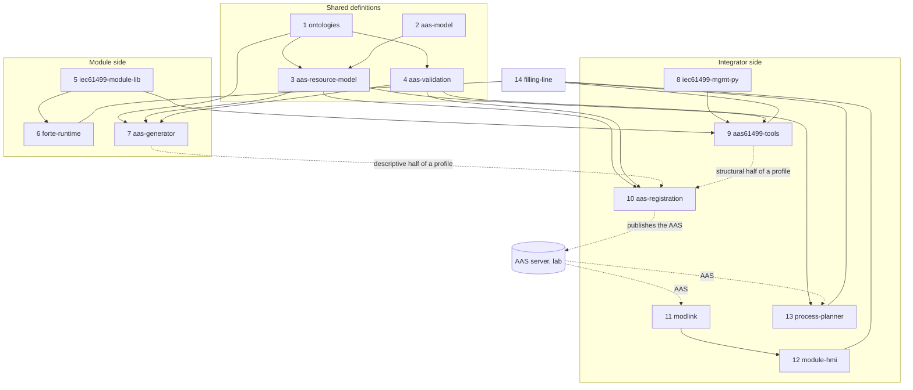

# Repositories: how the work divides

Proposal of 6 Oct 2026; nothing is split yet. Everything built so far sits in four places:

| Where | What |
| --- | --- |
| [iec61499-mgmt-py](https://github.com/AAUSmartProductionLab/iec61499-mgmt-py) (this repository) | Runtime, module library and generator, management client, `modsync`, `modreg`, the ontologies, the two modules |
| [iec61499-opcua-hmi](https://github.com/AAUSmartProductionLab/iec61499-opcua-hmi) | `modlink`, the HMI, an OPC UA stand-in for a module (`sim/`), the Linux FORTE build (`tools/forte`), the end-to-end test |
| [ARSO_Ontology_AAS_Generation](https://github.com/MartinJensen37/ARSO_Ontology_AAS_Generation) | The LLM generator with its editor, an AAS builder, AAS → RDF, SHACL validation, a copy of ARSO |
| [basyx-aas-web-ui](https://github.com/MartinJensen37/basyx-aas-web-ui), branch `feat/process-sequence-pharma` | The process sequence planner: one module folder (`aas-web-ui/src/pages/modules/ProcessSequence`) in a fork of the BaSyx web UI |
 Several parts
exist twice (the ontology, the AAS validation, the AAS builder) and several are bundled with
something they do not depend on (`modlink` inside the HMI, the registration service inside the
IEC 61499 tools).

The work specifies how a module is built, what its AAS holds and how the AAS is used to control
and reconfigure it. The parts follow that: what a **vendor** needs to build and describe a
module, what an **integrator** needs to take it in, operate it and change it, and the shared
definitions both rely on.

## How far to split: recommendation

The fourteen parts listed below are the finest sensible grain. **Fourteen repositories would be
too many** for one developer and a moving design; aim for six, and split late.

Why not fourteen:

- **A change rarely stays in one part.** Adding capabilities touched the module spec, the
  generator, the profile and the tests in one sitting. Across repositories that is four commits,
  four version pins and a period in which the parts do not fit.
- **The interfaces are still moving.** The profile changed shape three times in a week. A split
  freezes an interface; splitting before it is stable means paying for that every time it moves.
- **Every repository needs its own tests, CI, releases and README**, and the end-to-end test
  needs all of them anyway.
- **Nobody else consumes most parts yet.** A separate repository earns its keep when someone
  uses the part without the rest.

When a split is worth it:

- the part exists in two places and the copies drift (the ontologies, today);
- it has another owner or audience (aas-model is the lab's; the generator is a vendor's tool);
- it produces another kind of artefact on another rhythm (FORTE binaries);
- a second project needs it without the rest.

The target, in six repositories of ours (numbers refer to the parts below):

| Repository | Parts | Why one repository |
| --- | --- | --- |
| **ontologies** | 1 | The single source of truth, pulled into the others; pure data with its shapes |
| **aas-resource-tools** | 3, 4, 10 | Protocol-neutral AAS work on one model: build, validate, register (and match). Changes together |
| **iec61499-modules** | 5, 6, 8, 9 | Everything IEC 61499: library and shell, generator, management client, sync and reconfiguration, runtime builds and Pi deployment. Binaries are released from it |
| **module-clients** | 11, 12 | `modlink`, the HMI and later the plan executor: one OPC UA client code base. This is iec61499-opcua-hmi as it is |
| **aas-generator** | 7 | Already separate; a vendor's tool with its own user interface |
| **filling-line** | 14 | The concrete line, its tests and experiments; pulls the others in |

Beside them: the lab's **aas-model** (2) and the **process-planner** (13), which are already
separate. The planner is a module folder on a branch of a fork whose `main` follows upstream
BaSyx; it stays there (rebased on upstream), since it cannot run without the web UI around it.

Inside each repository the parts stay separate folders and packages with one-way dependencies,
as the top-level folders are here. That keeps a later split cheap (`git filter-repo --path`).

### When to split (not now)

Nothing is split until one product runs end to end on two modules. Then, in this order, each
step only when its trigger holds:

| Step | Split | Trigger |
| --- | --- | --- |
| 1 | **ontologies** out of this repository and the generation project | First of all, because the two copies of ARSO already differ. Until then: this repository's copy is the one that is edited, and the generation project's is updated from it by hand |
| 2 | **aas-resource-tools** out of `modreg` | The generator switches to the pydantic profile, so two projects need the model and the validator |
| 3 | **module-clients**: nothing to do | It is the HMI repository; split `modlink` out of it only when a project outside needs it |
| 4 | **iec61499-modules** and **filling-line** | A second line, or a vendor, uses the module library without our two modules. What remains here is the line |
| 5 | Finer splits (runtime, management client) | Only on demand |

## The parts

Each could be a repository of its own; the recommendation above groups them.

### Shared definitions

| # | Part | Holds | Comes from | Depends on |
| --- | --- | --- | --- | --- |
| 1 | **ontologies** | ARSO, APSO, AProSO, PPRL; the copies of the AAS and CSS ontologies they import; the SHACL shapes generated from them and the hand-written rules; the capability vocabulary (proposed); the consistency checks | `ontology/` here and `Ontology/` in the generation project (two diverged copies of ARSO) | – |
| 2 | **aas-model** (the lab's) | The pydantic base classes, the classes of the IDTA templates, the template-to-class generator | Lab repository, a submodule here | – |
| 3 | **aas-resource-model** | The resource AAS as pydantic models in ARSO's structure: the templates and classes of ARSO's own submodels generated from the ontology, the resource type, profile ⇄ model ⇄ AAS | `modreg/model.py`, `templates.py`, `templates/`, `generated/` here; replaces `Transformation/AAS_Builder` of the generation project | 1, 2 |
| 4 | **aas-validation** | AAS → RDF projection, SHACL validation against the ontologies, the quick structural check; later the capability matcher (required against offered) on the same projection | `Transformation/AAS_to_RDF`, `Validation/` of the generation project; `modreg/ontology.py` here | 1 |

### Module side (what a vendor works with)

| # | Part | Holds | Comes from | Depends on |
| --- | --- | --- | --- | --- |
| 5 | **iec61499-module-lib** | ModLib (occupation, module state machine, skill state machine, parameters, IO blocks), the declarations of the standard blocks, the module shell a vendor fills in (to be built), the rules a conforming module follows, and `modgen` (module spec → 4diac project) | `iec61499-skill-lib/` here | – |
| 6 | **forte-runtime** | FORTE builds for Windows, Raspberry Pi and Linux, the FORTE patches (sysfs PWM, IO handle fix), IDE validation and export, the Docker image and install scripts for a Pi, released binaries | `runtime/` and `deploy/` here; `tools/forte` of the HMI repository | 5 (the library is compiled in) |
| 7 | **aas-generator** | The LLM pipeline from spec sheets to a profile, its API and the editor in which a profile is finalised by hand | `Generation/`, `api/`, `ui/` of the generation project | 1, 3, 4 |

### Integrator side (taking a module in, operating and changing it)

| # | Part | Holds | Comes from | Depends on |
| --- | --- | --- | --- | --- |
| 8 | **iec61499-mgmt-py** | The FORTE management protocol client: typed commands, networks and plans, boot files, type library, read-back | `iec61499-mgmt-py/` here | – |
| 9 | **aas61499-tools** | `modsync` (read a running module, compare, push changes, create skills online, watch) and the IEC 61499 side of the AAS: the profile from a module spec and a running program; later the module's identity and the reconfiguration manager | `aas61499-tools/modsync`, `modreg/profile.py` here | 3, 5, 8 |
| 10 | **aas-registration** | The registration service: read a profile, build the AAS, validate it, publish it to the AAS server | `modreg/service.py` and its command line here | 3, 4 |
| 11 | **modlink** | The OPC UA client library every client shares: link, module client, AAS reader that follows capability → skill → interface, `run_capability`; later the plan executor | `modlink/` of iec61499-opcua-hmi | – (only `asyncua`; reads the AAS as plain JSON) |
| 12 | **module-hmi** | The operator pages built from the AAS (FastAPI); an OPC UA stand-in for a module | `hmi/`, `sim/` of iec61499-opcua-hmi | 11 |
| 13 | **process-planner** | Products, production sequences, required capabilities, binding of steps to skills; its own Production Sequence and Skills templates and a matcher in TypeScript | The ProcessSequence module of the basyx-aas-web-ui fork | The AAS server; later 4 (matcher) and 1 (vocabulary) |

### The line itself

| # | Part | Holds | Comes from | Depends on |
| --- | --- | --- | --- | --- |
| 14 | **filling-line** | The two modules (specs and their 4diac projects), the equipment simulator, the live and end-to-end tests, the experiment runner, the working notes and the plan | `cell/`, `docs/` and the plan here; the end-to-end test of the HMI repository | all of the above |

Outside, owned by the lab: the AAS server (BaSyx), the lab's registration for MQTT stations
(AP2030-UNS), the data mapping node (aas-camel-dmp).

## What feeds what

An arrow reads "is used by".

Solid arrows are code or data pulled in at build time; dotted arrows are data at run time. At
run time the pieces meet only through three things: a profile, the AAS on the server and the
module's OPC UA address space.

## How one is pulled into another

- **Python libraries** (2, 3, 4, 8, 9, 10, 11) as packages, installed from a tagged Git reference
  until they are published. A consumer pins a tag.
- **The ontologies** as a Git submodule where files are needed (the generator's editor, the
  planner), and installable as a package with the Turtle files as data, so Python tools find them
  without a path argument. One tag per ontology release; generated artefacts (shapes, templates,
  classes) record the tag they were made from.
- **ModLib** as a 4diac library project a module project refers to; the runtime build takes the
  library and the module projects as inputs.
- **The runtime** as released binaries per platform, so a module needs no build environment.
- **The line** pulls the others in as submodules or pinned packages and is the only place that
  knows all of them.

## What this settles and what it does not

Settled by the split:

- One ARSO. The two copies have diverged (this repository has the reconfiguration elements of a
  skill, Control Configuration and the parameter additions; the generation project has none).
- One validator. A module AAS built here does not pass the generation project's SHACL
  validation today (its shapes are closed and older); with one repository there is one answer.
- One profile format: the pydantic dump, written partly by the generator (from spec sheets) and
  partly from the program.
- The registration service and the resource model are independent of IEC 61499, so the lab's
  MQTT stations and a vendor's module go the same way.

Duplicates between the repositories that sharing has to remove (found 6 Oct):

- **State and error numbers**: `modlink/codes.py` repeats the tables of ModLib; a test in the HMI
  repository compares them with a checkout of this one.
- **Module descriptions**: `hmi/profiles.py` holds built-in descriptions of both modules beside
  the ones read from the AAS; its AAS test data are written from this repository.
- **The Linux FORTE build** (`tools/forte` of the HMI repository) beside the Windows and Pi
  builds here.
- **Capability vocabulary**: the planner's demo uses `.../demo/pharma/semantics/<Name>`, the
  module specs `.../semantics/<Name>`, so required and offered capabilities do not meet yet.
- **Skills template**: the planner reads its own Application Skills 1.0, the modules publish
  ARSO's Skills submodel.
- **Matching**: in the planner (TypeScript) and in `modlink`; the ontology matcher is proposed
  as the authority.

Still to decide:

- Whether the shared validator is closed (refuses what the ontology does not describe) or open
  (reports it). It decides how much of aas-model's output ARSO has to describe.
- Whether the matcher is part of **aas-validation** or a repository of its own.
- Where `modgen` belongs once vendors author in the IDE: with the library (as here), or with the
  line as our own way of producing module projects.
- Whether **aas-resource-model** stays ours or becomes part of the lab's aas-model.
