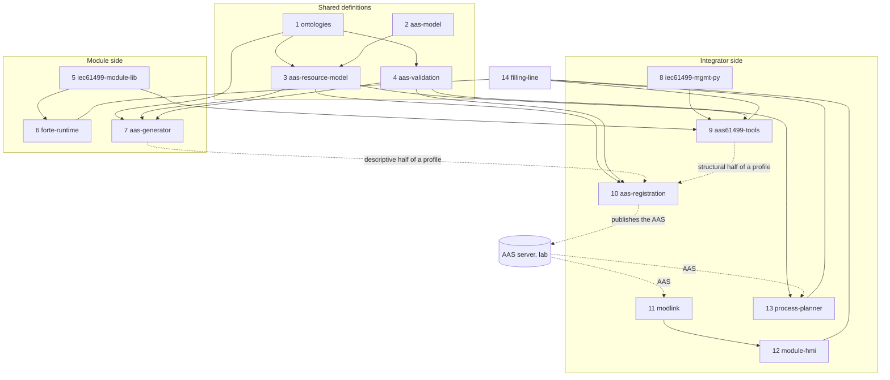

# Repositories: how the work divides

Proposal of 6 Oct 2026. Everything built so far sits in four places: this repository, the HMI
repository (with `modlink`), the AAS generation project (`ARSO_Ontology_AAS_Generation`) and the
process sequence UI (a BaSyx web UI fork). Several parts exist twice (the ontology, the AAS
validation, the AAS builder) and several are bundled with something they do not depend on
(`modlink` inside the HMI, the registration service inside the IEC 61499 tools). The split below
gives every part one home. Names are suggestions.

The work specifies how a module is built, what its AAS holds and how the AAS is used to control
and reconfigure it. The repositories follow that: what a **vendor** needs to build and describe a
module, what an **integrator** needs to take it in, operate it and change it, and the shared
definitions both rely on.

## The repositories

### Shared definitions

| # | Repository | Holds | Comes from | Depends on |
| --- | --- | --- | --- | --- |
| 1 | **ontologies** | ARSO, APSO, AProSO, PPRL; the copies of the AAS and CSS ontologies they import; the SHACL shapes generated from them and the hand-written rules; the capability vocabulary (proposed); the consistency checks | `ontology/` here and `Ontology/` in the generation project (two diverged copies of ARSO) | – |
| 2 | **aas-model** (the lab's) | The pydantic base classes, the classes of the IDTA templates, the template-to-class generator | Lab repository, a submodule here | – |
| 3 | **aas-resource-model** | The resource AAS as pydantic models in ARSO's structure: the templates and classes of ARSO's own submodels generated from the ontology, the resource type, profile ⇄ model ⇄ AAS | `modreg/model.py`, `templates.py`, `templates/`, `generated/` here; replaces `Transformation/AAS_Builder` of the generation project | 1, 2 |
| 4 | **aas-validation** | AAS → RDF projection, SHACL validation against the ontologies, the quick structural check; later the capability matcher (required against offered) on the same projection | `Transformation/AAS_to_RDF`, `Validation/` of the generation project; `modreg/ontology.py` here | 1 |

### Module side (what a vendor works with)

| # | Repository | Holds | Comes from | Depends on |
| --- | --- | --- | --- | --- |
| 5 | **iec61499-module-lib** | ModLib (occupation, module state machine, skill state machine, parameters, IO blocks), the declarations of the standard blocks, the module shell a vendor fills in (to be built), the rules a conforming module follows, and `modgen` (module spec → 4diac project) | `iec61499-skill-lib/` here | – |
| 6 | **forte-runtime** | FORTE builds for Windows, Raspberry Pi and Linux, the FORTE patches (sysfs PWM, IO handle fix), IDE validation and export, the Docker image and install scripts for a Pi, released binaries | `runtime/` and `deploy/` here; `tools/forte` of the HMI repository | 5 (the library is compiled in) |
| 7 | **aas-generator** | The LLM pipeline from spec sheets to a profile, its API and the editor in which a profile is finalised by hand | `Generation/`, `api/`, `ui/` of the generation project | 1, 3, 4 |

### Integrator side (taking a module in, operating and changing it)

| # | Repository | Holds | Comes from | Depends on |
| --- | --- | --- | --- | --- |
| 8 | **iec61499-mgmt-py** | The FORTE management protocol client: typed commands, networks and plans, boot files, type library, read-back | `iec61499-mgmt-py/` here | – |
| 9 | **aas61499-tools** | `modsync` (read a running module, compare, push changes, create skills online, watch) and the IEC 61499 side of the AAS: the profile from a module spec and a running program; later the module's identity and the reconfiguration manager | `aas61499-tools/modsync`, `modreg/profile.py` here | 3, 5, 8 |
| 10 | **aas-registration** | The registration service: read a profile, build the AAS, validate it, publish it to the AAS server | `modreg/service.py` and its command line here | 3, 4 |
| 11 | **modlink** | The OPC UA client library every client shares: link, module client, AAS reader that follows capability → skill → interface, `run_capability`; later the plan executor | The HMI repository | – (reads the AAS as JSON) |
| 12 | **module-hmi** | The operator pages built from the AAS | The HMI repository | 11 |
| 13 | **process-planner** | Products, production sequences, required capabilities, binding of steps to skills | The BaSyx web UI fork | 4 (matcher), the AAS server |

### The line itself

| # | Repository | Holds | Comes from | Depends on |
| --- | --- | --- | --- | --- |
| 14 | **filling-line** | The two modules (specs and their 4diac projects), the equipment simulator, the live and end-to-end tests, the experiment runner, the working notes and the plan | `cell/`, `docs/` and the plan here; the end-to-end test of the HMI repository | all of the above |

Outside, owned by the lab: the AAS server (BaSyx), the lab's registration for MQTT stations
(AP2030-UNS), the data mapping node (aas-camel-dmp).

## What feeds what

An arrow reads "is used by".

Solid arrows are code or data pulled in at build time; dotted arrows are data at run time. At
run time the pieces meet only through three things: a profile, the AAS on the server and the
module's OPC UA address space.

## How one is pulled into another

- **Python libraries** (2, 3, 4, 8, 9, 10, 11) as packages, installed from a tagged Git reference
  until they are published. A consumer pins a tag.
- **The ontologies** as a Git submodule where files are needed (the generator's editor, the
  planner), and installable as a package with the Turtle files as data, so Python tools find them
  without a path argument. One tag per ontology release; generated artefacts (shapes, templates,
  classes) record the tag they were made from.
- **ModLib** as a 4diac library project a module project refers to; the runtime build takes the
  library and the module projects as inputs.
- **The runtime** as released binaries per platform, so a module needs no build environment.
- **The line** pulls the others in as submodules or pinned packages and is the only place that
  knows all of them.

## What this settles and what it does not

Settled by the split:

- One ARSO. The two copies have diverged (this repository has the reconfiguration elements of a
  skill, Control Configuration and the parameter additions; the generation project has none).
- One validator. A module AAS built here does not pass the generation project's SHACL
  validation today (its shapes are closed and older); with one repository there is one answer.
- One profile format: the pydantic dump, written partly by the generator (from spec sheets) and
  partly from the program.
- The registration service and the resource model are independent of IEC 61499, so the lab's
  MQTT stations and a vendor's module go the same way.

Still to decide:

- Whether the shared validator is closed (refuses what the ontology does not describe) or open
  (reports it). It decides how much of aas-model's output ARSO has to describe.
- Whether the matcher is part of **aas-validation** or a repository of its own.
- Where `modgen` belongs once vendors author in the IDE: with the library (as here), or with the
  line as our own way of producing module projects.
- Whether **aas-resource-model** stays ours or becomes part of the lab's aas-model.

## Order of splitting

History can be kept per folder (`git filter-repo --path <folder>`).

1. **ontologies** first: merge the two copies of ARSO, tag it, point both projects at it.
2. **modlink** out of the HMI repository: it has no dependency on the HMI and three clients.
3. **aas-resource-model**, **aas-validation** and **aas-registration** out of `modreg` and the
   generation project; the generator then switches to the pydantic profile.
4. **forte-runtime**: the three builds in one place, with released binaries.
5. **iec61499-mgmt-py**, **iec61499-module-lib** and **aas61499-tools** from their folders here.
6. What remains here is **filling-line**.
