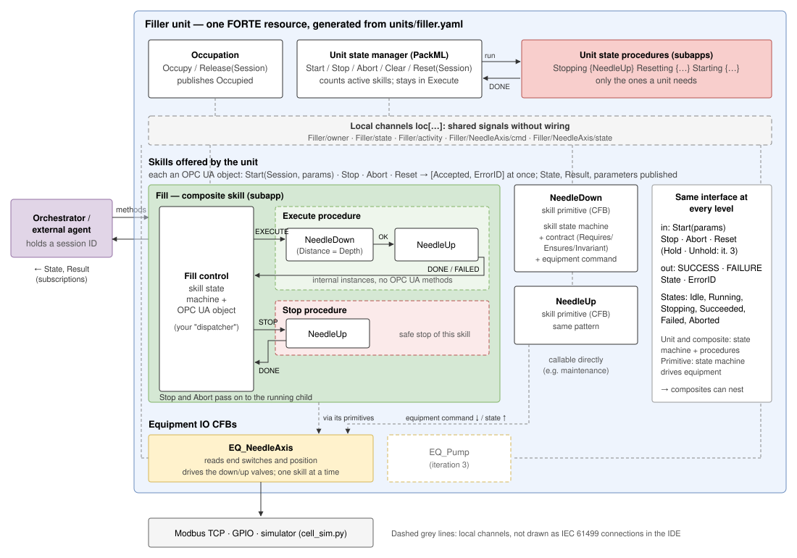
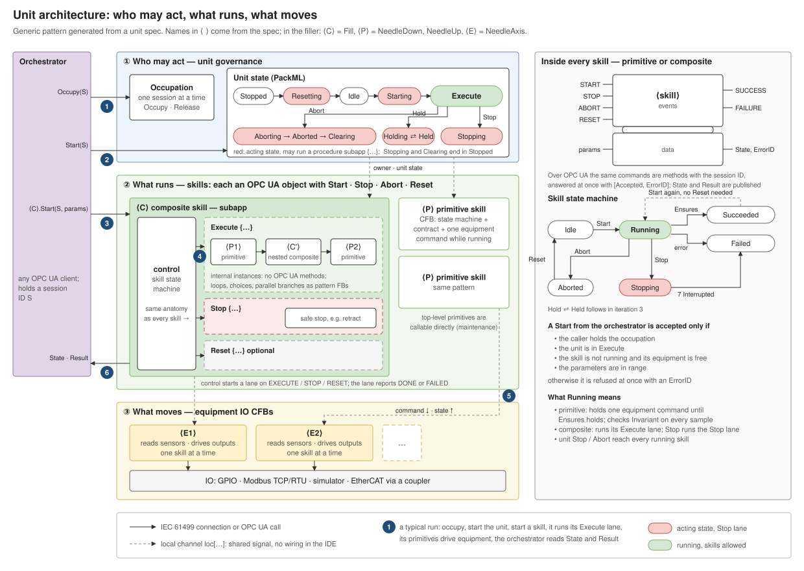

# Status of the IEC 61499 control component

State on 30 Sep 2026, branch `main`. The component is this repository; the repository map is
in the [README](../README.md). Measured against the [build and modelling plan](../AAS-driven%20online%20reconfiguration%20of%20IEC%2061499%20devices%20build%20and%20modelling%20plan.md),
it covers two generations:

- **Current: generated modules** (since 28 Sep): module specs (`modules/`), the generator
  (`modgen`), the module library and projects (`4diac/ModLib`, `4diac/*Module`), FORTE for PC
  and Raspberry Pi incl. sysfs PWM (`4diac/tools`), module ⇄ spec ⇄ AAS sync (`modsync`), the
  ontologies and AAS model plans (`ontology/`).
- **Legacy: the first filling cell**: `SK_*` skill stack (`4diac/FillingCellFixed`), BPMN
  compiler and contract check (`skill_compiler`, `examples/`), kept until the module stack
  reproduces its changeover experiments.
- **Shared**: the management library (`iec61499_mgmt`), the plan's `ext/iec61499-mgmt-py`.

Details of the legacy stack: [skill-blocks.md](skill-blocks.md), [design.md](design.md).
The status review and the next step are at the end of this file.

## Quick start

The full quick start is in the [README](../README.md). The module commands:

```powershell
python -m modgen                                  # regenerate iec61499-skill-lib/ModLib and cell/control/* from cell/modules/*.yaml
runtime/build-modules.ps1                         # IDE check + export of all projects, one FORTE with every module
runtime/build-modules.ps1 -Config pi/modules-pi -SkipValidate   # the same for the Raspberry Pi (aarch64)
python -m pytest -q --module-forte-exe runtime/fbe/build/modules-win/output/bin/forte.exe
python -m pytest deploy/tests/test_pwm_emulated.py --pi-forte-exe runtime/fbe/build/modules-pi/output/bin/forte   # PWM, arm64 in Docker
python cell/sim/run_module.py cell/modules/filling.yaml   # simulator + FORTE + module for UaExpert (opc.tcp://localhost:4840)
python cell/sim/module_sim.py cell/modules/filling.yaml   # only the simulator (deploy from the IDE)
python -m modsync pull --host 192.168.0.191            # what runs on a module, drift from its spec, its AAS (aas/)
python -m modsync push cell/modules/filling.yaml --target pi   # bring the module to its spec
```

In the 4diac IDE, import `cell/control/FillingModule`, `cell/control/StopperingModule` or
`cell/control/FillerModule` (and `iec61499-skill-lib/ModLib` for the shared types alone) without
copying them. Layout since 30 Sep 2026: one top-level folder per future repository (see the
README); the first filling cell was removed.

## Unit architecture v2, built iteratively

Started 28 Sep 2026. It replaces the `SK_*` stack (per-skill PackML machine, gate, status
chain, per-skill OPC UA facade, `P_Call`). The old project stays until the new one covers its
live tests; then `generate_filling_cell.py` and `FillingCellFixed` go.

Target after iteration 2 (agreed 28 Sep 2026):



The pattern for any unit, in three layers (who may act, what runs, what moves), the anatomy every
skill shares, and one numbered run; names in ⟨ ⟩ come from the unit spec:



The filling and stoppering modules (ESP32 code in `arduino_cpp_examples`) mapped onto this
structure, with what the generator still needs: [modules.md](modules.md).

The same, simplified for presentations (module level, module level skills, skill primitives,
equipment IO; short labels, explained in the text):


Edit the figure in draw.io (desktop, app.diagrams.net or the VS Code "Draw.io Integration"
extension): the `.drawio.svg` carries the editable diagram and renders as a normal SVG.

### Structure (as built in iteration 2, 29 Sep 2026)

One application per module and target, laid out in rows as it appears in the IDE:

```
Module (one FORTE resource)                       OPC UA below /Objects/<Module>
├─ Module level
│  ├─ Occupation   MOD_Occupation: Occupy/Release(Session)            /Occupation
│  └─ Module       MOD_StateManager: PackML Stopped -Reset-> Resetting {procedure} -> Idle
│                  -Start-> Execute (stays while the occupant runs skills); Stop -> Stopping
│                  (skills stop themselves, wait until none is active, Stopping procedure) ->
│                  Stopped; Abort -> Aborted (skills and equipment off) -Clear-> Stopped   /Module
├─ Equipment IO    EQ_<Item>: owns its IO points (sim / GPIO / PWM / Modbus); commands as timed
│                  phases (boost, brake) with break before make; one holder at a time; all off
│                  on module Abort                                     /Equipment/<Item>
├─ Skill primitives  SK_<Skill> (offered ones): SKILL_Control + SP_ (parameters) + SL_ (one
│                  command until a sensor or a time); Start(Session, params)/Stop/Abort/Reset
│                                                                      /Skills/<Skill>
├─ Module level skills  subapp <Skill>: Control (SC_<Skill>) + Execute subapp (private skill
│                  instances in sequence) + optional Stop subapp; holds its equipment until done
│                                                                      /Skills/<Skill>
└─ Procedures      subapps Resetting, Stopping: private skill instances in sequence
                                                                       /Procedures/<Proc>
```

Everything is generated by `modgen` from one module specification (`modules/*.yaml`):
equipment (IO points, command table with phases), skill primitives (command, stop command,
argument, parameters with range and default, Requires/Ensures/Invariant or an open-loop time,
results), module level skills (sequences with parameter bindings, stop sequence, results) and
the procedures. Pydantic validates it fail-closed (unknown names in a contract, a command setting
an undeclared output, a default outside its range, a binding to an unknown parameter are all
errors). The shared types (package `modlib`) are generated into every project so the IDE opens
each on its own, and compiled once from the `ModLib` project.

### Decisions and why

| Decision | Why |
| --- | --- |
| **Equipment CFBs own the IO; skills command them** | FORTE binds exactly one FB to an IO point (see learnings). Skills share sensors (MoveNeedleDown and MoveNeedleUp both need the end switches), so pins are grouped by equipment, not by skill. Equipment is fixed; skills are the part that changes online |
| **Skills are behaviour-tree nodes, not PackML machines** | PackML runs once, in the unit. A skill only needs Idle → Running → Succeeded/Failed. A skill already at its goal succeeds without driving |
| **One skill instance per call site** | Each instance has its own parameters and OPC UA object (`/<State>/<Instance>`), so the "one call site per skill" limit (missing item 3) goes away. Not yet generated (iteration 3) |
| **Parameters live in the skill instance, changed by an OPC UA method** | `SetParameters(Session, p1, ...)` answers `[Accepted, ErrorID]`: refused without the occupation (5), out of range (8) or while running (6). No extra FB per parameter in the diagrams. The instance's inputs are its defaults (e.g. `Distance` = 50 mm, all the way down); the reconfiguration may set them, the orchestrator changes them at run time |
| **Not OPC UA variable writes for parameters** | A variable write carries no caller identity and FORTE cannot refuse it: the client sees "Good" even for an out-of-range value |
| **Not Start-method arguments** | Each FORTE method is one SIFB with a fixed argument list; a Start carrying the procedure's parameters would change signature with every reconfiguration |
| **Occupation by session ID** | The client picks a UUID and occupies with it; every command carries it. `Occupied` is published, the session ID never is. This is a cooperative lock, not security: that needs OPC UA user authentication and encryption |
| **Equipment state, commands and the owner travel on FORTE local channels** | `loc[<Unit>/<Equipment>/state]`, `.../cmd`, `loc[<Unit>/owner]`: many publishers and subscribers per channel, so a skill added online needs no wiring to equipment or occupation, only its START/SUCCESS/FAILURE. The price: these links are not drawn in the IDE |
| **"Module" is the one name** (29 Sep 2026) | What the ESP32 code calls a station and this repository so far a unit is a **module** from now on: the filling module, the stoppering module. Docs use it from now; the code rename (`unitgen`, `units/`, `UNIT_*`, `UnitSpec`, OPC UA `/Unit/`) is step M.0. The layers inside keep their names: module level (occupation, module state manager), module level skills, skill primitives, equipment IO |
| **One module per Raspberry Pi** (29 Sep 2026) | Two Pis, one for the filling module and one for the stoppering module. A Pi runs exactly one module; deploying replaces the whole program (boot file + container restart), one module at a time |
| **OPC UA methods and variables only** (29 Sep 2026) | The ESP32 stations spoke MQTT (`NN/Nybrovej/InnoLab/<Module>/CMD/...`); the new modules are orchestrated only through OPC UA as built. MQTT may come back later as an optional second interface (FORTE has MQTT) |
| **PWM through a small FORTE IO module** (29 Sep 2026) | Servo angle and motor speed need PWM, which FORTE 3.3 lacks on Linux. A sysfs PWM module used with the standard `QW` output FB (plan M.2) instead of rewiring to remote IO; it is also meant for upstream |

### Iterations

| # | Scope | Status |
| --- | --- | --- |
| 1 | One equipment item (NeedleAxis), one skill with one parameter (MoveNeedleDown.Distance), session occupation, reduced unit machine (Stopped, Resetting, Idle, Starting, Execute, Completing, Complete, Aborting, Aborted, Clearing) running the Execute subapp | **Done 28 Sep.** 18 generated types, FORTE build `filler-win`. `tests/test_unit_live.py` (3 tests, 5 repeat runs clean): session occupation and hand-over; SetParameters refused for a foreign session (5), out of range (8) and while running (6); needle stops at 20 mm, default goes to the end switch; a skill already at its target succeeds without driving; timeout → skill Failed (3) → unit Aborted → Clear. `tests/test_unitgen.py` (12 offline) |
| 2 | Skills callable directly with their own state machine; unit state manager as the governing layer (stays in Execute, Stop/Abort stop running skills); NeedleUp; equipment locking; Fill composite with Execute and Stop procedures; unit Stopping procedure. Plan below | **Done 29 Sep** (built together with M.0/M.1). `SKILL_Control` for every skill (Idle 0, Running 1, Stopping 2, Succeeded 3, Failed 4, Aborted 5); `MOD_StateManager` with Resetting and Stopping procedures; equipment lock with holder token; module level skills as subapps (Control + Execute + Stop). `tests/test_module_live.py` (8 tests, filler, filling, stoppering against `module_sim.py`): occupation and module commands; every refusal code; parameters; composite holds its equipment; skill Stop runs the stop sequence; module Stop halts skills and runs Stopping; timeout; module Abort switches everything off; Clear resets the skills. `tests/test_modgen.py` (37 offline) |
| Pi | FORTE on a Raspberry Pi 4 driving the equipment IO over GPIO; same unit, same live tests against the Pi. Touches only the equipment IO layer, so it runs alongside iteration 2. Plan below | **Mostly done 29 Sep** (FORTE in Docker on the Pi, blink verified; real pins pending) |
| M | The filling and stoppering modules from the ESP32 code, one per Pi: rename to "module", valued outputs and PWM, open-loop primitives, composites and procedures. Plan: [Modules on the two Pis](#modules-on-the-two-pis-plan) | **M.0, M.1 done; M.3/M.4 done on the PC** (29 Sep): `modules/filling.yaml`, `modules/stoppering.yaml`, 4diac projects `FillingModule`, `StopperingModule` (+ `ModLib`, `FillerModule`), one FORTE with every module. **M.2** (PWM) done off the Pi: FORTE module `pwmsysfs` (forte-patches/0002), `PWMChip` + `QW`, tested on the aarch64 binary under emulation against a fake /sys/class/pwm (`tests/test_pwm_emulated.py`: channel exported, 20 ms period, 50 %/100 %/0 duty exact). **On the lab Pi, 30 Sep**: `dtoverlay=pwm-2chan` enabled (PWM0 on GPIO18, PWM1 on GPIO19, alt5; backup `config.txt.bak-before-pwm`). `tests/test_module_live.py --pi-host 192.168.0.191 --sim-host <laptop>`: the 8 module tests run on the Pi's FORTE (Docker, arm64) with Modbus IO to the simulator on the laptop, 3 runs clean. Real pins, nothing wired: a QX toggles GPIO17 and a QW sets PWM0 (25 % at 1 kHz read back from sysfs); the stoppering module's Pi application runs homing and the stoppering cycle on the header (servo pulses 1.500/1.833/0.511/1.844 ms on PWM0, piston speed 78.4 % on PWM1, GPIO5/6/17 for the times of the ESP32 code, all off at the end, Succeeded after 23 s); the filling module acquires its 4 lines and PWM0. Still to do: wire motors, switches and servo, and the stoppering Pi |
| 3 | Hold/Unhold with resume; EQ_Pump and a Pump skill (analog dosing) in Fill; equipment `Online` signal; OPC UA event on skill completion; instance names in procedures (same skill twice) | |
| 4 | BPMN → a composite's Execute subapp (sequence, loop, choice, parallel), online rewiring of one procedure while the rest keeps running, `ChangeableIn` per parameter | |
| 5 | Skills submodel, AID and nameplate generated from the unit spec (the building block below) | |

### Iteration 2 plan

Every step ends green: generator tests, `validate.ps1` clean, the IDE opens the system, the
FORTE build and the live tests pass (repeat runs), and findings go to Learnings.

**Skill interface (every level: skill primitive, composite skill).**

| | |
| --- | --- |
| OPC UA methods | `Start(Session, <parameters>)`, `Stop(Session)`, `Abort(Session)`, `Reset(Session)`, each answering `[Accepted, ErrorID]` immediately |
| OPC UA variables | `State`, `ErrorID`, `Parameters/<p>` (values of the current or last run), `Parameters/<p>/Default` |
| From a parent | events `START` (parameters as data inputs, latched on START), `HALT`, `ABORT`; to the parent `SUCCESS`, `FAILURE(ErrorID)` |
| States | Idle 0, Running 1, Stopping 2, Succeeded 3, Failed 4, Aborted 5 (Held reserved for iteration 3) |
| Rules | Start from Idle, Succeeded or Failed (no Reset needed); Stop → Stopping → Failed with `Interrupted` (7); Abort → outputs off at once → Aborted; Reset only from Aborted |
| Gate for OPC UA commands | caller holds the occupation (5 NotPermitted), unit is in Execute (4 NotReady), skill not running (6 Busy), parameters in range (8 OutOfRange), equipment free (6 Busy). Commands from a parent are not gated again |

Parameters travel in `Start` instead of a separate `SetParameters`: one call per run, checked
and refused synchronously. An instance's parameter inputs are its defaults (set by the
reconfiguration, e.g. from the AAS) and are published so an orchestrator can read them.

**Step 2.1: shared skill state machine `SKILL_Control` (library BasicFB).**
The table above as one ECC. Inputs: the four OPC UA commands with session and the gate data,
parent `START`/`HALT`/`ABORT`, procedure results `EXEC_DONE`/`EXEC_FAILED`/`STOP_DONE`.
Outputs: `EXECUTE`, `STOP` (run the stop procedure), `HALT` (to whatever is running),
`SUCCESS`/`FAILURE`, `PUB`, and `ACTIVE`/`IDLE` for the unit's activity count.
Test: the full transition table driven over the management protocol on the bare block, as
the old `SKILL_PackML` test did.

**Step 2.2: skill primitives on the pattern; NeedleUp; unit gate.**
`SK_<Skill>` = `SKILL_Control` + generated `SL_<Skill>` (contract and equipment command; runs on
`EXECUTE`, stops the equipment on `HALT`, reports done or failed) + OPC UA object. Skills
subscribe to `loc[<Unit>/state]` for the gate. Spec: `NeedleUp` (command `Up`, ensures
`AtTop`); `MoveNeedleDown` becomes `NeedleDown`. Live test: direct calls while the unit is in
Execute; every refusal code; Stop in mid-move (drive off, Failed 7); Abort; start again after
Succeeded and after Failed without Reset.

**Step 2.3: equipment locking.**
The command channel carries `(Holder, Command)`. A free equipment item is taken by the first
command; commands from anyone else are ignored; the holder releases it with `Release`; the
state channel publishes `Holder`. A skill checks `Holder` on `Start` (6 Busy if taken), and a
skill that loses a simultaneous race fails with 6 on its next sample. Children of a composite
use the composite's lock token (its instance path), so they share one lock. Live test:
NeedleUp refused while NeedleDown runs; NeedleDown refused while Fill runs.

**Step 2.4: unit state manager as the governing layer.**
PackML: Stopped -Reset→ Resetting {procedure} → Idle -Start→ Starting {procedure} → Execute,
where it stays while the occupant runs skills (Complete is not used). Stop → Stopping:
publish Stopping on `loc[<Unit>/state]`, running skills stop themselves, wait for the
activity count 0 (timeout → Aborting), run the unit Stopping procedure → Stopped. Abort →
Aborting: skills abort (outputs off) → Aborted -Clear→ Clearing → Stopped. Unit procedures
are subapps generated from `unit_procedures` in the spec (Stopping: `[NeedleUp]`). The active
skill count comes from `loc[<Unit>/activity]` (+1 on start, −1 on end). Live test: Stop during
a skill → skill stops, the Stopping procedure lifts the needle, unit Stopped; skills refused
while Stopped; Abort switches outputs off without procedures; Clear, Reset, Start again.

**Step 2.5: composite skill Fill.**
Spec: `composites: {Fill: {parameters: {Depth: ...}, execute: [NeedleDown: {Distance: Depth},
NeedleUp], stop: [NeedleUp]}}`. Generated: subapp `Fill` with `Control` (`SKILL_Control` +
OPC UA object with Fill's parameters), an `Execute` and a `Stop` subapp holding private child
instances (state published read-only, no methods). Parent parameters reach children by data
connections latched on the child's `START`. Live test: `Fill.Start(Session, 20.0)` → down to
20 mm → up → Succeeded; Stop mid-way → stop procedure lifts the needle → Failed 7; the private
children have no methods; the unit's Stop reaches Fill.

**Step 2.6: close the iteration.** Remove `SetParameters` and the iteration-1 unit machine,
update `run_unit.py` and the UaExpert notes, record learnings, mark the row Done.

### Review of the block logic and wiring (29 Sep 2026)

Checked against the generator (`unitgen/unit.py`, `unitgen/library.py`) and the FORTE 3.3.0
source. What holds: IO is owned by equipment only; skills reach equipment and the owner through
local channels; every OPC UA command answers at once; contracts are evaluated on equipment
samples; break-before-make in the equipment. What is missing or fragile, and where it is fixed:

| # | Finding | Effect | Fix, where |
| --- | --- | --- | --- |
| R1 | The GPIO backend is not generated: `gpio` in the spec is never read, no `GPIOChip` line configuration is emitted, `IoBackend` is fixed at 2 per equipment item, and `modbus` is mandatory for every point | The unit cannot run on the Pi | Pi.1 |
| R2 | The Pi 4 has no analog inputs; `IW` over `GPIOChip` is meaningless (lines are bits) and FORTE's `i2c_dev` module is not ported to 3.x | `NeedleAxis.Position` cannot come from the Pi's pins | Decision in Pi.4 |
| R3 | `IO_DI` uses only `REQ`/`CNF`; `IX` also has `IND` (edge event from the gpiochip controller), which is not wired | End switches are seen only every `CycleTime` (50 ms) on GPIO | Pi.1: `IND` triggers a sample |
| R4 | Each equipment sample publishes the state to OPC UA and rewrites all outputs, and over Modbus every background poll of every input `CLIENT` starts a full sample (poll CNFs, see learnings) | Hundreds of OPC UA writes and coil writes per second per equipment item | Pi.1: OPC UA publish on change; outputs rewritten on command and at `CycleTime` only |
| R5 | Break-before-make has no dead time and relies on output confirmations arriving synchronously (true for GPIO and for the Modbus confirm-on-send) | An H-bridge or a valve pair may need a dead time; an asynchronous backend (EtherCAT, a Modbus write that waits for its reply) would break the order | Pi.1: optional `interlock` time per equipment |
| R6 | No `Online` signal: before the first sample (Modbus not connected, IO not initialised) skills check `Requires`/`Ensures` against default zeros | A skill may start or succeed on values never read | Pi.1 (moved up from iteration 3): skills refuse with 4 NotReady while the equipment is not online |
| R7 | The occupation has no lease | An orchestrator that crashes leaves the unit occupied for good; only its own session can release | Iteration 2: lease renewed by every accepted command plus `Renew`, expiry frees the unit (and stops it); operator override later (`Prioritize` in the plan) |
| R8 | Release, and a new Occupy after it, do not touch skills that are running | The next occupant finds a skill still driving | Iteration 2, step 2.4: decide release = Stop, or refuse Release while skills run (proposal: refuse with 6 Busy) |
| R9 | The unit's Aborting does not command the equipment | Only the failing skill stops its equipment | Iteration 2, step 2.4 (already planned) |
| R10 | `MGR_ID` is fixed at `localhost:61499` and `run_unit.py` deploys to localhost | No deployment to another host | Pi.3: host per target in the spec |

The hardware E-stop stays outside FORTE (it cuts actuator power); the software Abort is not a
safety function.

### Raspberry Pi 4 plan

Goal: the same FillerUnit, generated from the same spec, runs on a Pi 4; the needle's valves and
end switches are on the Pi's pins; `tests/test_unit_live.py` passes against the Pi from the
laptop. Every step ends with a check on real hardware.

Starting point: a cross build configuration exists (`configurations/pi/fillingcell-pi.txt`,
aarch64-linux-musl, `IO=GPIOCHIP` from the FBE defaults) and the old generator wrote a
`PiIoConfig` application, but neither has run on a Pi.

**Pi.1: IO targets in the spec and generator (on the PC).**
Each IO point gets a backend per target, e.g.
`targets: {pc: {host: localhost, io: modbus}, pi: {host: 192.168.x.y, io: gpio}}` and per point
`gpio: {line: 17, bias: pull_up, active_low: true}`; `modbus` becomes optional (required only
where a target uses it); a point may stay on Modbus on the Pi (analog, R2). The generator:
`IoBackend` per point; for a GPIO target a `PiIo` subapp with one `GPIOChip` per line (handle
name = the point's `IX`/`QX` `PARAMS`), mapped to the resource; `IX.IND` wired (R3); publish on
change and output refresh at `CycleTime` (R4); `interlock` (R5); `Online` (R6). Test offline: the
Pi system has one `GPIOChip` per GPIO point with the right line, mode and bias.

**Pi.2: build.** `configurations/pi/filler-pi.txt` (from `fillingcell-pi.txt`, export of
FillerUnit); `build-runtime.ps1 -Project FillerUnit -Config pi/filler-pi ...`. Check: the binary
is an aarch64 static executable.

**Pi.3: Pi setup and remote deployment.** 64-bit Raspberry Pi OS; user in group `gpio`;
`forte` as a systemd service on port 61499 (OPC UA 4840); `run_unit.py --target pi` deploys over
the network. Check: `python -m iec61499_mgmt types --host <pi>` lists every type with its hash;
UaExpert connects to `opc.tcp://<pi>:4840`.

**Pi.4: bench bring-up.** One output (LED) and one input (button) first, then the needle's IO:
end switches on inputs with pull-up; the down/up valves or motor through a relay or driver board
(the pins give 3.3 V, a few mA; 24 V sensors need opto-couplers or dividers). Decide the position
source (R2): end switches only (the Distance parameter then needs a position), a Modbus IO module
or microcontroller for the analog input, or a hand-written SIFB for an I²C ADC. Check: forcing
the command channel switches the right pins, the inputs arrive in `EQ_NeedleAxis` over OPC UA.

**Pi.5: live tests against the Pi.** `test_unit_live.py` gets `--unit-host`; the simulator is not
started for the Pi target. Check: the three unit tests pass 5 runs in a row on the hardware; stop
accuracy and reaction times recorded (for the paper's localhost vs hardware numbers).

**Pi.6: restart.** A boot file on the Pi so the unit comes back after a power cycle
(WP7 "a restart restores the active procedure").

**Status 29 Sep 2026.** Pi.1 (per-point backends, targets, GPIO lines; not yet R3–R6), Pi.2
(cross build), Pi.3 and Pi.6 (`4diac/tools/pi.py`) are done. On the lab Pi (`iiot_gateway@192.168.0.191`,
Pi 4 Model B 8 GB, Ubuntu 26.04, kernel 7.0): FORTE runs in a Docker container, the green on-board LED
blinks from FORTE, now in Docker (GPIOChip line 42 acquired, `Toggle.Q` alternating), and the unit's PC
application answers over OPC UA (Occupy, Reset Stopped → Idle, SetParameters refused with 8,
Release). Getting there needed an 8 MiB thread stack and a FORTE fix (see learnings).
Not yet done: the unit's Pi application (`Filler_pi`) on real pins. It drives GPIO5/6 as outputs
and reads GPIO17/27, so first check what is wired to the gateway's header (Pi.4).
Cross compiling on the laptop was kept over building on the Pi: the binary is ready in minutes,
comes from the same FORTE checkout and IDE export as the Windows build (same type hashes), and
the Pi needs nothing installed.

### Running on the Raspberry Pi 4

Once per Pi: a 64-bit Linux (Raspberry Pi OS or Ubuntu), SSH with key login from the laptop
(`type $env:USERPROFILE\.ssh\id_ed25519.pub | ssh <user>@<pi> "cat >> ~/.ssh/authorized_keys"`),
and a login with access to `/dev/gpiochip0` (group `gpio` on Raspberry Pi OS, `dialout` on
Ubuntu). Set `targets.pi.host` and `targets.pi.user` in `units/filler.yaml` (or pass
`--host`/`--user`). FORTE runs in Docker (`4diac/tools/pi/Dockerfile` and `compose.yaml`, copied
to `~/forte` on the Pi): the static binary in Alpine, host networking (OPC UA advertises the Pi's
address; 61499 and 4840 need no mapping), `/dev/gpiochip0` passed in, the boot file in
`~/forte/boot`, `restart: unless-stopped`. The login needs group `docker`; deploying needs no
sudo. sudo only frees the on-board LED (asks on the terminal or reads `PI_SUDO_PASSWORD`).
On the Pi: `cd ~/forte && docker compose ps | logs -f | stop | start | restart`.

```powershell
python -m unitgen units/filler.yaml
4diac/tools/build-runtime.ps1 -Project FillerUnit -Config filler-win -Manifest 4diac/tools/manifests/FillerUnit.json -Export 4diac/tools/.cache/export-filler -Module filler
4diac/tools/build-runtime.ps1 -Project FillerUnit -Config pi/filler-pi -SkipValidate -Manifest 4diac/tools/manifests/FillerUnit.json -Export 4diac/tools/.cache/export-filler -Module filler
python 4diac/tools/pi.py install                 # copies FORTE to ~/forte, builds and starts the container
python 4diac/tools/pi.py stop | start | status   # the container
python 4diac/tools/pi.py blink                   # green on-board LED, 0.5 s on / 0.5 s off
python 4diac/tools/pi.py blink --line 17         # or an LED + 330 ohm on pin 11 (GPIO17) to GND (pin 9)
python 4diac/tools/pi.py unit                    # the unit's Pi application (Filler_pi)
python 4diac/tools/pi.py log                     # docker compose logs
```

- **On-board LED**: the green ACT LED is GPIO42 on gpiochip0, but the kernel's LED driver holds
  the line. `blink` without `--line` unbinds that driver (the on-board LEDs stop showing SD
  activity until the next reboot).
- **Pins of the filler unit** (`units/filler.yaml`, target `pi`): switches to GND on pin 11
  (GPIO17, AtTop) and pin 13 (GPIO27, AtBottom), internal pull-up, closed = TRUE; outputs pin 29
  (GPIO5, Down) and pin 31 (GPIO6, Up), 3.3 V: LEDs with resistors for a bench test, a relay or
  driver board for valves. Position has no line and is simulated as 0, so MoveNeedleDown ends
  only when AtBottom closes (or times out after 5 s).
- **Two applications, one spec**: the system has `Filler` on device `FORTE_PC` (Modbus
  simulator) and `Filler_pi` on `FORTE_PI` (GPIO). Both use the same types; only instance
  parameters (`<Point>_Backend`, `_Modbus`, `_Gpio`) and the `GpioLines` subapp differ. The IDE
  can deploy either device.
- **Management port 61499 is open on the network without authentication**: keep the Pi on the
  lab network.

### Modules on the two Pis (plan)

Decided 29 Sep 2026: two Raspberry Pi 4, one per module (filling, stoppering); each runs one
module, generated from its module spec and deployed with `pi.py`; orchestration through OPC UA
methods and variables only. The mapping from the ESP32 code (equipment IO, skill primitives,
module level skills, procedures) is in [modules.md](modules.md). The PackML, occupation and MQTT
code of the ESP32s is not ported: the generic module level replaces it.

**M.0: rename to "module".** `unitgen` → `modgen`, `units/` → `modules/`, `UnitSpec` →
`ModuleSpec`, library types `UNIT_*` → `MOD_*`, OPC UA `/Unit/` → `/Module/`, `run_unit.py` →
`run_module.py`, tests and docs. One mechanical commit with the tests green before and after;
done first so nothing new is written under the old names.

**M.1: generator extensions** (on top of iteration 2 steps 2.1, 2.4, 2.5, which bring the skill
state machine, the module state manager with Stopping/Resetting procedures and composites):
- valued outputs (`LREAL` with range and unit: PWM duty, servo angle) and commands that set
  them (`Up: {Up: true, Speed: 140}`), with an argument from the skill (`MoveTo(Angle)`);
- open-loop primitives: `ends: after Duration` (timer instead of sensor);
- command profiles in the equipment IO CFB: start boost, brake pulse;
- skills without equipment (`Dwell`) and simulated equipment (`Scale`);
- composites with parameters passed to children (`MoveArm(Angle = 1)`), Resetting procedures.
Each with offline tests and the simulator (Modbus holding registers stand in for PWM on the PC).

**M.2: PWM for FORTE on Linux** (the "PWM library"). Effort assessed 29 Sep 2026: small, because
FORTE's modular IO already has everything but the device access.
- What exists: IO FBs for words (`QW`/`IW`, `COutputFB<CIEC_WORD>`), config FBs that register
  named handles (`GPIOChip`: 180 lines of generated FB code plus a 190-line controller), and
  word-sized handles in other modules (RevPi, emBRICK).
- What to write: module `pwmsysfs` with a config FB `PWMChip` (`QI`, `VALUE` handle name,
  `ChipNumber`, `Channel`, `PeriodNs`, `Polarity`), a controller that exports the channel under
  `/sys/class/pwm/pwmchipN`, sets the period and enables it, and a word handle: `QW` value
  0..65535 → `duty_cycle = PeriodNs * value / 65535`. About 400 lines, most of it copied from
  `gpiochip`; plus the interface declaration `PWMChip.fbt` for the IDE.
- Motor speed: `QW` = duty (140/255 → 35980). Servo: period 20 ms, pulse 0.5–2.5 ms, so the
  equipment IO CFB converts the angle in ST (`value := 1638 + angle * 6553 / 180`); no servo FB
  in FORTE needed.
- Pi side: `dtoverlay=pwm-2chan` (PWM0/PWM1 on GPIO12/13 or 18/19) in `/boot/firmware/config.txt`
  and a reboot (sudo, once per Pi). In Docker, `/sys` is read-only: mount `/sys/class/pwm` and
  `/sys/devices/platform` read-write for the container, or export the channels on the host at
  boot and mount only those.
- Channels: filling needs 1 (needle speed); stoppering 3 (servo, piston and plunger enables) but
  both enables run at the same 200/255, so one channel drives both and 2 suffice. More channels:
  a PCA9685 board appears through the kernel `pwm-pca9685` driver as another `pwmchip`, same
  module.
- Test: offline with a `SysfsRoot` parameter pointing at a fake directory (checks the files
  written); on the Pi an LED dimmed on GPIO12, then the servo.
- Estimate: 1–2 days including build, container access and tests. Same pattern later for analog
  inputs: Linux IIO (`/sys/bus/iio/.../in_voltageN_raw`) → `IW`, for an ADS1115 or MCP3008.
- Kept as a FORTE patch (`4diac/tools/forte-patches`) so it can go upstream as is (see
  [Improvements to contribute](#improvements-to-contribute-to-eclipse-4diac)).

**M.3: filling module on its Pi.** Spec `modules/filling.yaml`; equipment `NeedleAxis` (Up/Down
GPIO, Speed PWM, AtTop/AtBottom), simulated `Scale`; primitives MoveNeedleUp/Down, Dwell, Tare,
Weigh; module level skills Dispensing, AttachNeedle, Tare; Resetting: MoveNeedleUp. First on the
PC against the simulator, then on the filling Pi. Check: Dispensing runs from UaExpert; timeouts
fail the skill; the needle stops at the end switches.

**M.4: stoppering module on its Pi.** Spec `modules/stoppering.yaml`; equipment Piston, Plunger,
StopperArm (servo); primitives LowerPiston, RaisePiston, ExtendPlunger, RetractPlunger,
MoveArm(Angle); module level skill Stoppering; Resetting: the homing sequence. Same checks.

Order: M.0, then iteration 2 steps 2.1–2.5 with M.1 folded in, M.2 in parallel (independent
of the generator), M.3, M.4.

### Module, spec and AAS in step, both ways (modsync)

Built 30 Sep 2026. The module spec stays the one source; `modsync` checks it against what
really runs on a module and describes the module as an AAS with the running values.

```powershell
python -m modsync describe modules/filling.yaml --target pi   # AAS from the spec alone (no module needed)
python -m modsync pull --host 192.168.0.191                      # which module runs there, drift, its AAS
python -m modsync push modules/filling.yaml --target pi --dry-run
python -m modsync push modules/filling.yaml --target pi           # bring the module to its spec
python -m modsync watch                                           # pull when a module comes online or changes
```

- **Read (pull).** Over the management port FORTE reports the whole running program: every
  instance under its full dotted name (inside subapps too), its type with the hash, all event
  and data connections, and any input or output by READ (also inside a composite). `pull`
  reads the module's name (`Occupation.Module`), takes that module's spec, finds the closest
  target, and compares instances, types, connections and values with the program modgen
  generates (`modsync.compare.expected`, tested equal to the `.sys` application). Another
  program (e.g. `pi.py blink`) is reported as such and not described.
- **Describe (AAS).** `aas/<idShort>.json` (and `--basyx <url>` uploads it to a BaSyx AAS
  environment, API v3): shell plus `Skills` (per offered skill an Operation for Start, its
  parameters with the **running** values, contract or Execute/Stop sequence with the running
  step bindings, occupied equipment, FB type and hash), `AssetInterfacesDescription` with an
  `InterfaceOPCUA` (every method an action, every variable a property; forms are OPC UA browse
  paths, `/0:Objects/1:Filling/1:Skills/1:Dispensing/1:Start`, since FORTE's numeric node ids
  change at every start), `Variables` (PackML state, occupation, sensors) and `ControlSoftware`
  (spec, target, `SyncState` InSync/Drift/NoProgram/NotRead, the differences, type hashes).
  Ids, idShorts and semantic ids follow the lab's AP2030-UNS Registration Service; its
  generator only knows `InterfaceMQTT`, so the shell is built here with the BaSyx SDK. A spec's
  optional `aas:` section sets the identity (e.g. to take over the ESP32 station's
  `syntegonStopperingSystemAAS`); default `<Module>ModuleAAS`.
- **Change (push).** Changed skill parameters (defaults of offered skills, constants bound in
  sequences) are written online, since a skill takes them over at its next start, and the boot file
  is saved. Anything else (instances, types, connections, or values read only at INIT such as
  OPC UA paths and IO ids) is deployed as a new boot file with a FORTE restart (never a resource
  delete, see F4). Only while the module is Stopped, Idle or Aborted and not occupied (read
  from `Module.Logic.State` and `Occupation.Logic.Occupied`), unless `--force`; types missing
  in the FORTE build are refused ("rebuild").
- **Which direction wins.** The spec. A value changed online shows up as drift (and in the AAS
  with its running value) until it is pushed back or put into the spec; `push` does the
  former. Taking running values into the spec file (`pull --adopt`) is not built yet.
- Tests: `tests/test_modsync.py` (offline, a fake FORTE), `tests/test_modsync_live.py`
  (FORTE: read back, online change reported, described and pushed back, occupied module left
  alone, CLI). On the lab Pi, `pull` correctly reported the blink program as not a module.

### How it scales

- **More skills and equipment** are spec entries. Occupation, unit state manager and the
  channels do not change; a skill primitive is one CFB instance plus its OPC UA object.
- **More composites** are independent subapps with their own private children; equipment
  locks keep them from driving the same hardware.
- **Nesting**: a composite's child may itself be a composite, because the interface is the
  same; the generator recurses and the lock token is passed down.
- **Procedures from BPMN** (iteration 4): a composite's Execute subapp is compiled from BPMN;
  a sequence is a chain, and loops, choices and parallel branches are pattern FBs with the same
  `START`/`SUCCESS`/`FAILURE` ports. Reconfiguration rewires inside one procedure subapp while
  that composite is idle and everything else keeps running.
- **Parameters**: per-run values in `Start`; defaults as instance inputs, written by the
  reconfiguration from the AAS.
- **Several units**: channels and OPC UA roots are prefixed with the unit name. FORTE serves
  OPC UA from one resource per process, so several units share one resource, or run one FORTE
  per unit.
- **AAS** (iteration 5): methods → AID actions, variables → AID properties, `Occupies` →
  equipment locks, contracts → Skills submodel, all from the same spec.
- **Limits to watch**: FORTE handles one OPC UA method call at a time (at most 4 s), so many
  orchestrators calling at once queue; the OPC UA node count grows with skill instances; the
  Modbus poll period bounds reaction time (precise positioning belongs in the drive).

### Checklist: a generated 4diac project the IDE can open

Confirmed 28 Sep 2026 (FillerUnit opens in the IDE; the headless check alone is not enough,
because with a wrong `.buildpath` it silently skips the system):

1. **No `.buildpath`**. With one naming only `Type Library`, the root `.sys` gets no type entry
   and the editor shows "Could not load system" (NPE on `getTypeEntry()` in
   `<workspace>/.metadata/.log`).
2. **Untyped subapps** use `SubAppInterfaceList` → `SubAppEventInputs`/`SubAppEventOutputs` →
   `SubAppEvent`, plus `InputVars`/`OutputVars`. Exact tag names: `LibraryElementTags` in
   `plugins/org.eclipse.fordiac.ide.model_*.jar` (`javap -constants`).
3. **Event types match across connections**: a subapp `INIT` wired to FB `INIT` pins is `EInit`.
4. **Device** has `Profile` and `Color` attributes and an `MGR_ID` parameter.
5. **Mapping**: the resource `FBNetwork` holds only resource-local FBs; each mapped element is
   `<Mapping From="<App>.<FB or SubApp>" To="<Device>.<Resource>"/>`. Never copy mapped FBs into
   the resource network.
6. **Layout**: no overlapping blocks in an application, a composite or a resource view, and keep
   clear of the resource's built-in `START` block at the origin.
7. **Names**: IEC names are case-insensitive (event `OWNER` clashes with variable `Owner`),
   and function names such as `SUB` are reserved.
8. **Regenerate with the project closed, or press F5 afterwards**; the generator overwrites
   in place so an open IDE keeps its index.
   Block positions and connection routing arranged in the IDE are kept on regeneration.
9. **Verify** with `validate.ps1` (it must print `BUILD SUCCESSFUL` with no `ERROR`/`WARNING`
   lines from `checkTypeLibrary`/`checkSystem`) and `tests/test_unitgen.py`
   (`test_project_follows_the_ide_conventions`), then open the system in the IDE once.

### Learnings

- **Creating a program part online** (FORTE 3.3, 1 Oct 2026): CREATE takes dotted names and makes
  the subapp containers; instances created in a running resource stay idle until a management
  START each; `WRITE` with `Source="$e"` fires an event input (`MonitoringTriggerEvent`, as the
  IDE's "trigger event"), which runs the new part's INIT chain; generic comm FBs of a new arity
  (`SERVER_2_3`) are made on demand, so QUERY of their type is no test of availability. A re-sent
  INIT to an initialised `SKILL_Control` is ignored, so an INIT chain running on into existing
  skills stops there.
- **`MIN` and `MAX` are reserved** in the IDE's type check (standard functions), like `SUB`:
  a variable may not be called `Min`/`Max` (`Lower`/`Upper` instead).
- **A driven input has no expected value**: a skill parameter bound to the parent's holds the
  last passed value, so modsync no longer compares it with the type default (it reported drift
  after every run of a composite with a bound parameter).
- **One FB per IO point.** `IOMapper::registerObserver` refuses a second observer for the same
  handle ("Duplicated observer entry"; `core/src/io/mapper/io_mapper.cpp`, FORTE 3.2 source).
  Different FBs owning different pins is fine, on a Pi as elsewhere.
- **One connection per data input, many per event input.** This is what forced one call site per
  skill in the old design; local channels and event fan-in avoid it.
- **Local channels (`loc[name]`)** are device-wide (so names are prefixed with the unit), allow
  many publishers and subscribers, require identical data types on all members, and a late
  subscriber gets nothing until the next publish. Hence the `owner/query` channel: every block
  asks for the current owner at INIT.
- **FORTE does have OPC UA events** (`ua_ev` layer) and an `ua_ac` layer. Earlier notes said it
  had none; not used yet.
- **OPC UA method arguments** map `STRING`/`WSTRING` to UA String, so a session ID is a String.
- **IEC names are case-insensitive**: an event `OWNER` and a variable `Owner` in one FB clash;
  `Sub` is reserved (the SUB function). The IDE's type check also fails on overlapping blocks
  in a composite, so the generator lays composite networks out in one row.
- **The IDE export module is `forte-<SymbolicName>`** from `MANIFEST.MF`.
- **A generic comm FB's `ANY` pin is typed only by a connection to a typed FB pin.** A
  `SUBSCRIBE_1` whose `RD_1` went straight to a composite's interface output stayed untyped,
  so joining the local channel failed at INIT with `INVALID_ID`. Route such pins through a
  typed block (`UNIT_OwnerLatch`). Diagnosed by reading `...OwnerSub.STATUS` over the
  management protocol, which also reads pins inside composites (`Execute.MoveNeedleDown.Owner.Owner`).
- **A FORTE `CLIENT` emits `CNF` only when data comes back** (`CCommFB::sendData`), so a
  write-only Modbus `CLIENT_1_0` never confirms. The old design never waited for it; the
  equipment's write chain does, so `IO_RouteDO` now confirms a Modbus write once it is sent.
- **FORTE's Modbus client silently drops a write sent before it is connected**
  (`CModbusComLayer::sendData` writes only when `e_Connected`), and connecting takes a moment
  after INIT. The equipment therefore rewrites its output image every cycle, like a PLC scan.
  Reads before the connection return stale zeros: iteration 2 adds an `Online` signal.
- **The IDE rewrites generated XML when it imports a project** (tabs, CDATA, attribute order and
  empty elements). The committed project is compared with the generator in canonical XML, and the
  generator writes ST as element text like the IDE does.
- **Regenerating while the IDE has the project open broke the IDE's index** ("Could not load
  system", `AutomationSystem.getTypeEntry()` null in the workspace `.metadata/.log`) because the
  generator deleted and recreated `Type Library`. It now overwrites files in place and deletes
  only stale ones; after a regeneration press F5 on the project in the IDE.
- **The generated system never really loaded in the IDE, and the headless check hid it.** Root
  cause: a `.buildpath` naming only `Type Library` as source folder, so the root `.sys` had no
  type library entry ("Could not load system", NPE on `getTypeEntry()` in the workspace log),
  and `checkSystem` quietly checked nothing. Without `.buildpath` the IDE's loader then reported
  what the old and new generators got wrong (tag names in `LibraryElementTags` of the model
  plugin):
  - an untyped subapp's interface is `SubAppInterfaceList` with `SubAppEventInputs`/
    `SubAppEventOutputs` of `SubAppEvent`, not an FB's `InterfaceList`;
  - subapp INIT pins connected to `EInit` pins must be `EInit` themselves;
  - a device needs a `Color` attribute;
  - the resource network holds only resource-local FBs, a mapping is `To="FORTE_PC.RES"` and the
    IDE rebuilds the mapped copies (copies plus `FORTE_PC.RES.<FB>` mappings fail);
  - blocks must not overlap, including the resource's own `START` block at the origin.
  `unitgen` now does all of this (guarded by `test_project_follows_the_ide_conventions`);
  `FillingCellFixed` still has every one of these flaws.
- **FORTE's Modbus client reads in a background poll and REQ returns the cache.** The poll
  period is the number after the unit ID in `modbus[host:port:unit:<poll ms>:...]`. At 50 ms the
  needle stopped about 1.3 mm late at 25 mm/s (35 → 36.3 mm); at 10 ms (`modbus.poll_ms` in the
  spec, default 10) it stops 0.15–0.5 mm late, and the simulator's 20 ms physics step is then
  the larger part. Every poll also emits a `CNF`, so the sample rate follows the poll, not
  `CycleTime`. For precise positioning on real hardware the stop belongs in the drive (a
  target position command), not in a sampled loop over Modbus.
- **The IDE writes `.<Type>.fbt.assets/type.adoc`** into the project when a type is opened; they
  are ignored by git, by the generator's cleanup and by the consistency test.
- **Versions:** FORTE 3.3.0 is the newest release tag and is what `build-runtime.ps1` builds.
  `C:\4diac-fbe` is at 3.2.0 (3.3.0 exists); it only provides toolchain and dependency recipes.
  The IDE plugins are 3.2.x builds from 8 Jul 2026; their export matches the runtime (type
  hashes accepted on CREATE).
- **Manual testing:** `python 4diac/tools/run_unit.py --opcua-port 4841` starts the simulator,
  FORTE and the deployed unit. UaExpert itself listens on 4840 on this machine, so FORTE's
  OPC UA server must use another port.
- **A tolerance in Ensures changes the meaning of a default.** With `Position >= Distance - 0.5`
  the default 50 mm stopped at 49.6 mm, before the end switch: "all the way down" failed one run
  in six. Contract tolerances belong to the parameter's meaning, not to the check.
- **`GPIOChip` (FORTE 3.3.0) is one FB per GPIO line**: `VALUE` is the handle name the `IX`/`QX`
  `PARAMS` refers to, plus `ChipNumber`, `LineNumber`, `ReadWriteMode` (0 input, 1 push-pull,
  2 open drain, 3 open source), `BiasMode` and `ActiveLow`. **`BiasMode` is off by one** in
  `modules/gpiochip/gpiochip_controller.cpp`: the array is {none, disable, pull-up, pull-down}
  but the enum is {None, PullUp, PullDown}, so a pull-up needs `BiasMode = 2` (1 only disables
  the bias). It uses the v1 GPIO character-device ioctls (`GPIO_GET_LINEEVENT_IOCTL`); check
  that the Pi kernel still has them (`CONFIG_GPIO_CDEV_V1`). Inputs are event-driven: `IX.IND`
  fires on each edge. The module builds only for Linux, so `GPIOChip` FBs can exist only in the
  Pi's system, never inside a type the Windows build uses.
- **A local channel keeps only the latest value.** `CLocalComLayer::sendData` writes the
  publisher's data straight into each subscriber's RD pins and queues an external event; two
  messages before the subscriber runs leave only the second. And a Basic FB drops an event its
  current ECC state has no transition for. Together this lost equipment commands (a child's stop
  and the next child's start in the same instant) and module states (Aborting followed at once by
  Aborted, Clearing by Stopped). Rules adopted: (1) a message carries the whole intent (the final
  command and the release in one message, `LastUse`); (2) the equipment marks commands and aborts
  that arrive while it writes outputs and handles them when settled, and the latest command wins;
  (3) receivers treat a state and the state it passes into at once alike (Aborting or Aborted =
  abort; Clearing or Stopped = reset); (4) a step that finds another holder waits up to 0.5 s for
  the equipment's next state before failing Busy (a release in flight).
- **FORTE's external event queue holds 16 events by default** (`FORTE_EventChainExternalEventListSize`);
  one module state change reaches every skill and equipment item (20+ subscribers) and overflowed
  it ("External event queue is full, external event dropped!"). The module builds set 256 (and
  `FORTE_CommunicationInterruptQueueSize` 64), and equipment publishes its state only on change
  plus a heartbeat every 20 samples (review R4), not on every Modbus poll.
- **Unwired switches read as pressed** (pull-ups): the filling module's skills then succeed without driving. A skill's Invariant is only checked while it runs; put a sensor plausibility condition such as `NOT (AtTop AND AtBottom)` into `requires` as well, so a wiring fault is refused at the start (PreconditionViolated).
- **Testing the modules on the Pi without wiring**: the PC application (Modbus IO) deployed to the Pi, with its Modbus IDs pointed at `module_sim.py` on the laptop (`--pi-host`/`--sim-host`), runs the whole generated stack on the Pi's FORTE; the Windows firewall let the Pi reach the simulator.
- **Groups, hidden connections and folded subapps in the IDE's files** (read from the IDE 3.2
  model with `javap`): a group is `<Group Name Comment x y width height locked>` in the network;
  each member carries `<Attribute Name="GroupName" Type="STRING" Value="<group>"/>` and its x/y
  are **relative to the group**. A hidden connection has `<Attribute Name="Visible" Value="false"/>`
  (a system attribute: no `Type`, or the IDE warns and converts it). An expanded subapp would
  be `Unfolded` (with `width`/`height`); not used. Groups have no colour in IDE 3.2. The mapped
  copies in the resource view are drawn at the members' relative positions, so they overlap
  there (the check warns, the build passes); the application view is the one to read.
  The generator lays each application out as five groups (module level, equipment IO, a
  catalogue of skill primitives, module level skills, procedures) and hides every INIT chain and
  start-up connection.
- **The IDE's `checkTypeLibrary` fails on warnings too** ("has N errors or warnings"). Every
  declared variable must be used: a subscriber's data must still end on typed pins (else
  `INVALID_ID`), so a skill that reads only some equipment inputs gets them through a typed view
  block (`EV_<Item>`) instead of declaring all of them; outputs that would be written but never
  read are published instead (`ActiveCommand`, `ActiveArg` of the equipment).
- **More reserved or clashing names**: `EQ` (and `Sub`) are reserved; an instance `Start` clashes
  with an event `START` of the same CFB (names are case-insensitive), hence `UaStart` etc.
- **YAML 1.1 reads `Off`, `On`, `Yes`, `No` as booleans** (PyYAML), also as keys: a command named
  `Off` became `False`. Use other names (`Detach`).
- **One FORTE for several modules**: the FBE's `FBE_EXTERNAL_MODULES_DIR` adds every subfolder
  with a `CMakeLists.txt`. Each module project exports only its own package; the shared types
  (`modlib`) are declared in every project (so the IDE opens it alone) but exported once from the
  `ModLib` project, and each module's CMake target links `forte-modlib` (`validate.ps1 -Link`).
  `build-modules.ps1` does it all; one binary serves both Pis.
- **FORTE's IO mapper checks types**: a handle's data type must equal the IO FB's
  (`IOHandle` type `e_WORD` for a `QW`), or `onHandle` refuses it.
- **Writing sysfs from Docker**: the container's `/sys` is read-only and AppArmor's
  `docker-default` profile denies writes below `/sys`, even through a bind mount there. The PWM
  folders are therefore mounted at `/hostsys` (the class entries link relatively into
  `../../devices`, so `/sys/devices/platform` is mounted next to them) and `PWMChip.SysfsRoot`
  points there (`pwm_root` of the Pi target).
- **The Pi build (aarch64-linux-musl, static) needs an 8 MiB thread stack.** musl gives
  threads 128 KiB unless the binary's `PT_GNU_STACK` says more, and FORTE creates its threads
  with the default. open62541 in FORTE's OPC UA thread overflowed that: segfault as soon as any
  OPC UA FB initialised (a local channel alone ran). Found under arm64 emulation, confirmed by
  patching `p_memsz` of `PT_GNU_STACK` to 8 MiB in the binary, fixed with
  `CMAKE_EXE_LINKER_FLAGS_MINSIZEREL:STRING=-Wl,-z,stack-size=8388608` in the Pi configs (the
  toolchain file sets `CMAKE_EXE_LINKER_FLAGS_INIT`, so the base flags stay). Check with
  `aarch64-linux-musl-readelf -lW forte | grep GNU_STACK` (memsz 0x800000). The FBE did not
  reconfigure FORTE after the config change: delete `build/<config>/forte` to force it.
- **FORTE 3.3.0 bug: every `GPIOChip` crashed the Pi build at INIT.**
  `IODeviceController::HandleDescriptor` stored its id as `std::string const &`, and
  `GPIOChip::onStartup` passes a temporary (`var_VALUE.getValue()`), so `IOMapper::registerHandle`
  copied a dangling string (SIGSEGV in `memcpy`, length ~12.9 million). On Windows the stale
  memory happened to hold the name. Fixed by `4diac/tools/forte-patches/0001-io-handle-descriptor-owns-its-id.patch`
  (the id is owned), which `build-runtime.ps1` applies to the FORTE checkout (already applied
  patches are skipped). Worth reporting upstream.
- **Debugging FORTE on the Pi**: the Pi build is RelWithDebInfo (as Windows) so the binary in
  `build/filler-pi/forte/build/forte/forte` has symbols; the installed copy is stripped by the
  FBE. The Pi has Docker, so gdb runs in a container without installing anything on the host:
  `docker run --rm --cap-add SYS_PTRACE --security-opt seccomp=unconfined --device /dev/gpiochip0 -v ~/forte/dbg:/forte -w /forte forte-gdb gdb -batch -ex run -ex bt --args /forte/forte`
  (image `forte-gdb` = debian:trixie-slim + gdb, built on the Pi). The Pi binary logs only
  errors, so a crash without output needs this.
- **The FBE's default configuration builds OpenPOWERLINK**, whose libpcap fails in the Windows
  cross build (`flex.exe: pipe failed`); the Pi configs drop it with `DEPS=-openpowerlink`
  (POWERLINK is off in FORTE 3.x anyway).
- **Testing the Pi binary without a Pi**: Docker Desktop runs arm64 Linux under QEMU
  (`docker run --platform linux/arm64 -v <bin dir>:/forte alpine /forte/forte -c 0.0.0.0:61499`).
  Everything but GPIO can be tested there (its WSL kernel has no `gpio-sim`). The Docker port
  proxy accepts connections before FORTE listens: wait a few seconds after start.
- **FORTE boot files must have LF line ends.** The loader ends a command only at `/>\n` or
  `</Request>\n`, so a CRLF file merges all lines into one request (`INVALID_OBJECT` on line 1).
  Windows FORTE reads in text mode and never showed it; Python text writes on Windows produce
  CRLF (`write_text` and text-mode pipes). `iec61499_mgmt boot --out` and `pi.py` now write LF.
- **FORTE 3.3.0 shuts itself down on a KILL of a resource that does not exist** (the device
  kills itself), and **it segfaulted deleting a resource with a `GPIOChip`** whose controller
  was retrying (seen under emulation without a GPIO chip). `pi.py` therefore never kills or
  deletes over the network: it writes the boot file and restarts the service.
- **A `GPIOChip` that cannot get its line retries 5 times (1+2+3+4 s) before it sends INITO with
  QO = FALSE**, so each bad line delays the unit's INIT chain by 10 s; `pi.py` prints QO and
  STATUS of every line after a deployment.
- **FORTE 3.3 reports the running program completely** over the management protocol: QUERY
  `FB *` lists every instance with its dotted path (subapp contents included) and type, QUERY
  `Connection *` every event and data connection, QUERY `FBType` the type hash, and READ works
  on any port, also inside a composite (`Module.Logic.State`). Strings read back unquoted, TIME
  as `T#8s`. The resource's own `START` block is listed too. FORTE's built-in standard types
  (`E_RESTART`) report no hash; exported types report `v2:SHA3-512:...`.
- **Only some inputs can change online.** A skill parameter is sampled at the skill's START, so
  writing it takes effect at the next run; inputs read at INIT (OPC UA paths, IO names, Modbus
  ids) change nothing until a re-init, so modsync treats them as needing a restart.
- **An OPC UA object path through a method's name nests the object under the method node**:
  the stop sequence at `/Skills/Dispensing/Stop/...` appeared as children of the `Stop` method.
  Stop sequences now publish below `/Skills/<name>/Stopping`.
- **OPC UA node ids of FORTE's nodes are numeric and differ at every start**; anything that
  describes the interface (AID) has to use browse paths.
- **The lab's AAS Registration Service (AP2030-UNS) only generates MQTT interfaces**: its AID,
  Skills and Parameters builders read `InterfaceMQTT` and the MQTT JSON schemas. An OPC UA
  module needs either our own shell (done, modsync) or an `InterfaceOPCUA` branch there.
- **Windows PowerShell 5.1** (no PowerShell 7 on this machine) broke the build scripts in three
  ways, now fixed: native stderr aborts a script under `$ErrorActionPreference = 'Stop'`;
  variable names are case-insensitive, so a `$Project` parameter and a `$project` local are one
  (type-constrained) variable; `Get-ChildItem -LiteralPath` ignores `-Include`.
 
## Improvements to contribute to Eclipse 4diac

Bugs found and features built while doing this, collected so they can go to the community
(issues or pull requests at github.com/eclipse-4diac). Each has the evidence and the fix or
workaround used here. Versions: FORTE 3.3.0, 4diac FBE 3.2.0 with the release-2025-11
toolchains, 4diac IDE 3.2.x.

**FORTE bugs**

| # | Problem | Evidence | Fix or workaround here |
| --- | --- | --- | --- |
| F1 | `IODeviceController::HandleDescriptor` stores its id as `std::string const &`; `GPIOChip::onStartup` passes a temporary, so `IOMapper::registerHandle` copies a dangling string | SIGSEGV in `memcpy` at the first GPIOChip INIT on aarch64/musl (gdb backtrace); worked on Windows by chance | `forte-patches/0001-io-handle-descriptor-owns-its-id.patch`: the id is owned. Ready as a PR |
| F2 | `GPIOChip` `BiasMode` off by one: array {as is, disable, pull-up, pull-down} indexed with enum {None, PullUp, PullDown} | `modules/gpiochip/gpiochip_controller.cpp` | Generator writes 2 for pull-up, 3 for pull-down. Fix: align the enum or the array |
| F3 | A management `KILL` of a resource that does not exist shuts the whole runtime down | Reproduced on the arm64 build | `pi.py` never kills over the network. Fix: answer `NO_SUCH_OBJECT` |
| F4 | Deleting a resource with a `GPIOChip` whose controller is retrying crashes FORTE | Reproduced under emulation without a GPIO chip | Deploy by boot file + restart |
| F5 | The boot-file loader only ends a command at `/>\n` or `</Request>\n`, so a CRLF file merges all lines | `ForteBootFileLoader::hasCommandEnded` | Write LF. Fix: strip `\r` |
| F6 | A `CLIENT` emits `CNF` only when data comes back, so a write-only Modbus `CLIENT_1_0` never confirms | `CCommFB::sendData` | `IO_RouteDO` confirms on send. Fix: confirm writes in the Modbus layer |
| F7 | The Modbus client silently drops a write sent before the connection is up | `CModbusComLayer::sendData` | Cyclic output image. Fix: queue or report an error |
| F8 | A failing `GPIOChip` retries 5 times (1+2+3+4 s) before INITO, blocking the INIT chain | `IOConfigFBController::onError` | Reported by `pi.py`. Improvement: INITO with QO=FALSE at once, retry in the background |
| F11 | The default external event queue (16) overflows as soon as a local channel has more subscribers than that | "External event queue is full" with 20+ skill instances | `FORTE_EventChainExternalEventListSize=256`. Improvement: a larger default, or a warning when a channel has more subscribers than the queue holds |
| F12 | A local channel overwrites a subscriber's data when two messages arrive before it runs (only the latest is seen) | Lost equipment commands and module states | Messages carry the whole intent; receivers tolerate skipped states. Improvement: document it, or queue per subscriber |
| F10 | `func_LIMIT.h` calls `func_MIN`/`func_MAX` without including their headers, so an ST algorithm using `LIMIT` does not compile unless something else pulled them in (`'func_MAX' was not declared in this scope`) | Exported `IO_RouteAO` | Clamp with IF. Fix: include `func_MIN.h`/`func_MAX.h` in `func_LIMIT.h` |
| F13 | A local OPC UA object path that passes through a method node (`/Skills/X/Stop/Y` next to method `/Skills/X/Stop`) is created below the method node without an error | Browsing the filling module | Stop sequences publish below `.../Stopping`. Fix: refuse (or report) an object below a method |
| F9 | FORTE's threads use the libc default stack; musl's 128 KiB is too small for open62541 | SIGSEGV on the first OPC UA FB on aarch64-linux-musl | `-Wl,-z,stack-size=8388608`. Fix: give `CThread` a sane default size, or set it in the FBE musl toolchains |

**FORTE features**

| # | Feature | Status |
| --- | --- | --- |
| N1 | Linux sysfs PWM IO module (`PWMChip` config FB + `QW`), for the Pi's hardware PWM and PCA9685 boards | Built: `forte-patches/0002-pwmsysfs-module.patch`; runs on the lab Pi |
| N2 | Linux IIO analog input module (`IW`), for ADCs such as ADS1115 or MCP3008 | Idea |
| N3 | `IX` has an `IND` event on change; worth documenting for event-driven inputs | Documentation |

**4diac FBE**

| # | Problem | Fix or workaround here |
| --- | --- | --- |
| B1 | The default configuration builds OpenPOWERLINK, whose libpcap fails in the Windows cross build (`flex.exe: pipe failed`), although POWERLINK is off in FORTE 3.x | `DEPS=-openpowerlink`. Fix: drop it from `default.txt` |
| B2 | After a configuration change FORTE is not reconfigured (the CMake cache keeps old values) | Delete `build/<config>/forte`. Fix: reconfigure when the config file is newer |
| B3 | The musl cross toolchains leave the thread stack at 128 KiB (see F9) | Linker flag in our configs |

**4diac IDE**

| # | Problem | Fix or workaround here |
| --- | --- | --- |
| I1 | With a `.buildpath` naming only `Type Library`, the root `.sys` has no type entry: "Could not load system", and the headless `checkSystem` silently checks nothing | No `.buildpath`. Fix: fail loudly |
| I2 | The file format for untyped subapps (`SubAppInterfaceList`, `SubAppEvent`, EInit pins), device `Color` and mappings is only discoverable from `LibraryElementTags` | Our checklist above. Improvement: a documented schema |
| I3 | The exporter includes `forte/eclipse4diac/io/IX_fbt.h` (process-interface variant) while modular IO provides `forte/io/IX_fbt.h` | Alias headers in `4diac/tools/forte-compat` |
| I4 | The headless IDE does not resolve library dependencies | Vendored standard type declarations |
| I5 | A generic comm FB's `ANY` pin is typed only by a connection to a typed FB pin, not by a composite interface pin | `UNIT_OwnerLatch`. At least a clearer error than `INVALID_ID` |

## Status review (30 Sep 2026)

### Against the plan's work packages

| WP | Plan deliverable | Status | Evidence |
| --- | --- | --- | --- |
| 1 Repos and runtime | FORTE with custom FBs, type hashes, runtime | **Done**, incl. the Pi: aarch64 static build in Docker on the Pi, sysfs PWM module and the HandleDescriptor fix as FORTE patches, one FORTE with every module; no CI | `build-modules.ps1`, `forte-patches/`, `pi.py`, `test_pwm_emulated`, `test_pi_tools` |
| 2 Skill library | Skill base, patterns, facades | **Done twice**: legacy `SK_*` stack; module library `modlib` (skill state machine, occupation, PackML module state manager, composite control, IO primitives for sim, GPIO, PWM, Modbus) | `test_modgen`, `test_module_live` (8), legacy `test_skill_blocks_live`, `test_procedure_live` |
| 3 Cell control | Skills, IO, unit, procedures, online change | **Done** (legacy cell, changeovers A–D online); **modules**: filling and stoppering from their specs, on the PC against the simulator and on the lab Pi (same live tests remote; stoppering homing and cycle on real pins); the physical case is being built | `modules/*.yaml`, `test_module_live --pi-host` |
| 4 Models | AAS templates, BaSyx, AID/AIMC | **Partly**: module AAS from the running program (`modsync`: Skills, AID with OPC UA actions and properties, Variables, ControlSoftware; strict BaSyx round trip); ontologies APSO 0.2, ARSO 0.5, AProSO 0.1, PPRL 0.1 as the design guide (not a validation layer; local consistency checks only); conceptual model (second iteration); AAS implementation plan with example structures; manifest design on the lab's profile format (tested with the lab's builder). **Missing**: product and process AAS instances, capability description, AIMC / OperationalData / TimeSeries as planned, ARSO conformance of the generated AAS, registration | `ontology/`, `test_modsync`, `test_ontology` |
| 5 Translator and diff | Process description, translation, diff | **Legacy**: BPMN compiler (sequences, loops), diff by change class. **New direction** (process tree in AProSO instead of BPMN): designed, not implemented. **Modules**: modsync drift (online parameter vs restart) | `skill_compiler`, `modsync.compare` |
| 6 Contracts | Forward check, derived contract, mutations | **Legacy done**; module skills carry requires / ensures / invariant in their spec (checked in the controller), not yet checked against a process map | `skill_compiler.contracts` |
| 7 Manager | Guarded change cycle, record, boot file | **Legacy**: guarded changeover. **Modules**: `modsync push` (online parameter write, restart for structure, guard on state and occupation, boot file on the Pi). **Missing**: the AAS-driven cycle (product → process → binding → push), ActiveProcedure / ChangeLog, composition changes without a FORTE rebuild | `modsync.sync`, `test_modsync_live` |
| 8 Experiments | Scenario runner, timing, baseline | **Not started** as a runner | – |

### What is missing, in order of importance for the paper

1. **Composition changes without rebuilding FORTE.** Every module level skill gets its own
   generated control type (`SC_<name>`), and FORTE compiles types in: a new composite means a
   new FORTE build, which is not online reconfiguration. A generic composite control in ModLib
   (fixed parameter and result vectors) makes a new composite only instances and connections,
   which FORTE creates online (as the legacy `PROC` changes showed).
2. **The model-driven loop on the modules.** Product AAS (HGH: fill volume, required
   Dispensing), process map (AProSO), matcher (required vs offered capability), binding with
   parameter mapping, validation, then `modsync push`. Plan phase 5.
3. **The models it reads.** Ontology phase 1 (PPRL 0.2, ARSO 0.6) and, of the module AAS, at least
   the capability description and the skill parameters with RealizesProperty (plan phase 1, part
   of 2a/2b).
4. **The experiment runner (WP8)** on the modules: parameter, flow and composition changes;
   downtime, command counts, verification; the full-redeployment baseline.
5. **Hardware.** Wiring of both modules, the stoppering Pi's address, an equipment Online signal
   (R6), `requires: NOT (AtTop AND AtBottom)` on the needle skills.
6. **Manifest and plug and produce** (backlog MF1–MF8, plan phases 3, 4, 6), and the AAS builder
   extensions in the lab repository (AB1–AB10).
7. **Still open from the legacy list:** error classes (recoverable errors to Hold), parameter
   changes outside Start (`ChangeableIn`), occupation `Since`, CI, the repository split.
8. **Housekeeping.** Working documents (this file, `docs/`, the build and modelling plan,
   `ontology/`) stay local by decision; proper documentation comes into the repository once
   everything is finalised. Tidy the folders along the future repositories; retire the legacy
   cell once the module stack reproduces its experiments.

## Next step after the modelling

The modelling now says what the models are and how they fit; what the paper has to show is
that they **drive** a checked reconfiguration of the modules. So the next step is one vertical
slice through all layers, on the filling module, with each change class once:

| Step | What | Days |
| --- | --- | --- |
| S1 | Generic composite control in ModLib; modgen generates composites from it; a new composite is created online by management commands (instances, connections, its OPC UA methods) and verified by read-back; the boot file is rewritten | 1.5 |
| S2 | The slice's models, designed after the ontologies (the design guide; no validation against them for now); the HGH product (FillVolume, required Dispensing with Volume), the filling module's offered Dispensing (Volume range, realised by the Dispensing composite whose Volume sets Dwell.Duration), the process map Dispense → Transfer → Close | 2 |
| S3 | Matcher and binding (required vs offered, ranges and goals), change classification, validation with the contract check, and application through `modsync push`: **parameter** (FillVolume 1.0 → 0.5 mL: online write), **flow** (inspection added by OnlyIf: a new orchestrator policy, no controller change), **composition** (a new required capability, e.g. dispensing in two doses, realised by composing the module's primitives: a new composite created online) | 4 |
| S4 | Experiment runner: the three changes timed (downtime, command count, verification), against a full redeployment (boot file and restart) | 2 |

### S1 done (1 Oct 2026): a module level skill created online

- **ModLib** got `SKILL_Core` (SKILL_Control with Stop/Abort/Reset, State/ErrorID, owner and
  module state views, activity count; the Start method stays outside because its arity varies)
  and `SKILL_Param_<LREAL|INT|DINT|UINT|BOOL>` (default, range check of a Start argument chained
  through `OkIn -> InRange`, latching from the Start argument or the default). `SKILL_Control`'s
  `GO_UA`/`GO_PARENT` became one `GO(FromUa)`.
- **Skill primitives** (`SK_`) are built from the same blocks; `SL_` names the OPC UA variables
  of its parameters and results. The `SP_*` parameter types are gone.
- **Module level skills** are a subapp of instances only: `Control` (SKILL_Core), `UaStart`
  (generic `SERVER_2_n`), one latch per parameter named like the parameter
  (`Dispensing.Volume.Default` is the default), `PubParams`/`PubResults` (generic `PUBLISH_n`
  with literal OPC UA ids), `Release` + `Rel_<Equipment>`, `Execute`/`Stop`. The `SC_*` types are
  gone; generated projects shrank by ~3000 lines. Composites come last in the INIT chain, so an
  added one extends it at the end. Parameter names of composites must not be those blocks'.
- **modsync push** picks the least disruptive way: parameter writes online (guarded); **new
  instances online, also while the module runs** (create, values, connect, START, then `$e` on
  the INIT where the chain enters them; INIT links may move); anything else restart. Online
  changes are verified by read-back, then the boot file is saved.
- Tests: `test_module_level_skills_need_no_type_of_their_own` (every spec), offline push of a
  composite (also inserted before another: INIT link moved), removal needs a restart; live
  `test_a_new_module_level_skill_is_created_online_while_another_runs`: `DoubleDose` (two dwells
  bound to `Dose`) pushed while `Dispensing` runs; Dispensing succeeds, DoubleDose refuses 20 s
  (OutOfRange), runs with 0.3, publishes Weight; a FORTE started from the saved boot file is in
  sync (3 repeats clean, ~14 s). Full suite 120 passed on the PC. The modsync live tests also
  take `--pi-host --sim-host` now (the Pi's FORTE restarted from the saved boot file). **Pi not
  yet run**: the new aarch64 FORTE is built but not installed (Pi offline on 1 Oct).

### Equipment IO made generic; command tables in the skills; grouped layout (1 Oct 2026)

- **Equipment IO** (`EQ_`/`EL_<Equipment>`) knows nothing about what its pins mean any more. It
  writes the output values its holder sends (break before make), reads its inputs every cycle,
  reports changes (heartbeat every 20 scans), lets one holder write, and switches all off on
  the release channel or when the module aborts. These three safety parts stay there on purpose:
  it is the only block that sees every writer (FORTE: one FB per IO point).
- **`EC_<Equipment>`** (new, `Equipment/Commands`): the command table and the timed phases
  (start boost, brake pulse), one instance (`Driver`) inside every skill of that equipment.
  `PLAY(Holder, Command, Arg, Release)` sends `(Holder, Release, values...)`; the release goes
  with the last phase, then `PLAYED`. The skill logic reports DONE/FAILED/HALTED only after
  PLAYED (state `Ending`, variable `Outcome`), so a brake pulse ends before the next step.
- **Channels**: `<Module>/<Equipment>/cmd` now `(Holder, Release, output values, enables of
  analog outputs)`; new `<Module>/<Equipment>/release` `(Holder)` for a module level skill giving
  up its equipment after a failure or abort (`SKILL_Release` -> `Rel_<Equipment>`, PUBLISH_1).
  The command code KEEP (255) is gone.
- **Groups** inside the types and subapps (shared helper `fbxml.arrange`): equipment `Core`,
  `Channels`, `Inputs`, `Outputs`; skill primitive `SkillControl`, `Execution`, `Equipment`;
  module level skill `SkillControl`, `Sequences`, `Releasing`. A kept layout applies only while
  a block stays in its group.
- Learnings: a group shares the name space of the blocks (`Logic`, `Control`, `Release` clash);
  `Interface` and `Then` are reserved words; the type check counts an unused input (`Arg` on
  equipment without an argument) as a failure.
- Full suite 121 passed on the PC (same simulator output traces), live tests 2 repeats clean.

About 9.5 days, leaving the rest of the seven weeks to the paper (18 Nov) for hardware runs
and writing. The manifest, live data (AIMC, time series) and the plug-and-produce loop follow
the slice; they make the demonstration, the slice makes the argument.

### Registration on the lab's shared AAS model, checked against ARSO (2 Oct 2026)

`aas61499-tools/modreg` (extra `registration`): a module's **profile** is its AAS on the lab's
pydantic model (aas-model 0.2, pinned commit) without what its type and its elements' classes
say anyway; the **registration service** reads it into the model, builds the AAS, checks it
against the ontology and publishes it to an AAS server.

- `model.py`: `ModuleTypeAAS` (subclass of the lab's `ResourceTypeAAS`): OPC UA interface
  instead of the MQTT defaults; `ModuleSkill` with Kind, Contract, Execute/Stop, Occupies,
  StateReference, Implementation; Hierarchical Structures; Control Configuration. `profile()`
  slims the dump and checks that reading it back gives the same model; `build()` gives the AAS.
- `profile.py`: module spec (and snapshot, drift) to `ModuleTypeAAS`. Skills in Control
  Component Instance 2.0, current parameter values in Parameters, live values in Variables with
  an AIMC mapping from the OPC UA properties, one AIMC mapping per Operation.
- `ontology.py`: generic check driven by the ontology's annotations (`arso:semanticId`,
  `parentClass`, `idShort`, ...) and OWL restrictions. Errors refuse a registration; elements the
  ontology does not describe are reported (`--strict` refuses them too).
- `service.py`: HTTP service (`modreg serve`), state in a folder, unchanged profiles are not
  published again. `modsync describe|pull|push|watch --register URL` sends the profile.
- **ARSO 0.6 (local draft)**: new module `Modules/shared-model.ttl` (CCI 2.0 with the
  reconfiguration elements, Variables, Parameters, WoT terms), additions in
  `control-configuration.ttl`, `aimc.ttl`, `ARSO_AAS.ttl`. 0.5 is backed up in the session
  scratch folder (`arso-0.5-backup`). To be reviewed.
- Tested: 31 offline tests; by hand against a throwaway BaSyx 2.0 container (create, replace,
  delete) and with a simulated filling module read live. Not run against the lab's BaSyx.

Result of the check: both modules break no restriction; the only undescribed elements are
aas-model's `temp_id_short_attribute_*` properties in list items. The lab's default
`ResourceTypeAAS` breaks two: no security scheme in the AID, no Hierarchical Structures.

Findings about aas-model (to raise with Tristan):
- `pip install git+...` fails on Windows (submodule with over-long paths); the archive works.
- Importing it loads the MQTT schemas from GitHub pages unless `MQTT_SCHEMAS_DIR` is set.
- Dumping is slow because type hints are resolved per element (minutes for a module); modreg
  caches them (`model._Typing`).
- globalAssetId is always the shell's id (modreg sets it after building).
- The built AAS is large (about 1.9 MB per module: class and attribute names as embedded data
  specifications on every element) and differs on every build (random ids).
- Items of lists lose their semanticId and get a `temp_id_short_attribute_*` property.
- The default `Type` reference points at a ControlComponentType submodel that is not built.
- OPC UA: `uav_componentOf` wants a NodeId; FORTE's change at every start, so the browse path
  of the owning object is written there. The lab's DMP has not been tried with it.

**Changed the same day (decision: the model follows ARSO, not the other way round).** The ARSO
0.6 draft is dropped (kept in the session scratch folder, `arso-0.6-draft`); ARSO is 0.5 again
plus two small additions: Value and Unit of a parameter entry (`parameters.ttl`) and the detail
properties of Control Configuration. `ModuleTypeAAS` no longer subclasses the lab's
`ResourceTypeAAS`: it has ARSO's **Skills** submodel (Interfaces, Skills, Errors; per skill
SemanticId, Operation named like the skill, InterfaceReference, and the v0.5 reconfiguration
elements with Uses, Execute, Stop and Occupies as lists), **OperationalData** (decimal data
points with a semanticId, fed by the AIMC) and ARSO's **Parameters** (entry per skill parameter:
InterfaceReference, Value, Unit; no submodel if the module has none). Nameplate, Hierarchical
Structures, AID and AIMC stay the shared model's classes. Consequences: a primitive that is not
offered (Dwell) is not listed as a skill, because ARSO asks every skill for an Operation and an
interface action; steps name it by an external reference. Booleans are 0/1 in data points. Both
modules break no ARSO restriction; what ARSO does not describe are the Web of Things terms the
shared model writes into the AID (key, type, title, op, input, output, browse path, ...), about
380 elements per module, reported but not refused.

**4 Oct 2026: classes from the ontology through aas-model's generator.** aas-model is a git
submodule (`aas-model/`, same commit as the `registration` extra; initialise without
`--recursive`, its IDTA template submodule has paths too long for Windows). `modreg generate
--ontology ontology/ARSO` writes a submodel template (AAS JSON with `SMT/Cardinality`) for
Skills, OperationalData, Parameters and ControlConfiguration from ARSO's classes, annotations and
restrictions (`modreg/templates.py`), then runs `aas-model/scripts/idta_generate.py` on them
into `modreg/generated/`. Templates and classes are committed; `test_modreg_templates.py` fails
when they no longer match the ontology. `model.py` keeps hand-written subclasses only for what
ARSO names but does not declare: the terms of Contract, the children of a Step and of
Implementation, the item type of Uses and Occupies, and the lab's delegated Operation. Nothing
inside aas-model is changed. Its generator as checked in names fields in snake_case, while the
classes it ships (and the AAS idShorts) keep the idShort; modreg runs it with exact names, which
reproduces the shipped style (for Tristan: a one-function difference, `field_name`).

Still open: retire `modsync/aas.py` (MF8) once the profile path is accepted; the capability
description (S2) on aas-model's `CapabilityDescription`; ontology files are local, so a
deployed service needs a copy of `ontology/ARSO`.

## Earlier plans (kept for reference)

The building blocks planned on 28 Sep (skill descriptions for the AAS from one source, the
manager, compiler gateways, experiments) are covered by the module specs, modsync and the plans
in `ontology/`; the legacy cell's details are in [skill-blocks.md](skill-blocks.md).
