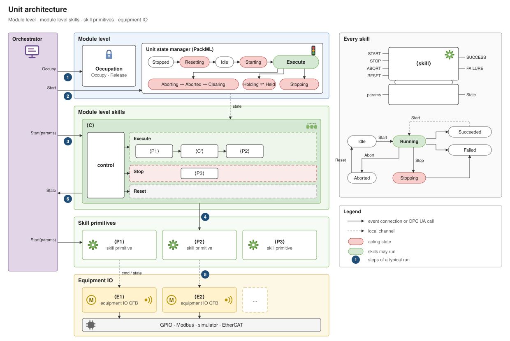

# Working notes: IEC 61499 modules, their AAS and their reconfiguration

State on 5 Oct 2026, branch `main`. What is built, how it is put together, what was learned on
the way and what comes next. The repository map and the commands are in the
[README](../README.md); the modules themselves (what was ported from the ESP32 stations) in
[modules.md](modules.md); the OPC UA interface of each module is described by its AAS
([aas-models.md](aas-models.md)); the plan this work started from in the [build and modelling plan](archive/build-and-modelling-plan.md).

## What exists

| Part | Where | State |
| --- | --- | --- |
| Management library (`iec61499_mgmt`): FORTE protocol client, typed commands, networks and plans, `.sys` flattening, boot files, type library, read-back | `iec61499-mgmt-py/` | Done, tested offline and live |
| Module generator (`modgen`) and module library (`ModLib`, package `modlib`): occupation, PackML module state manager, skill state machine, parameters, IO for simulator, GPIO, PWM and Modbus | `iec61499-skill-lib/` | Done |
| Filling and stoppering modules from their specs, simulator, OPC UA test client; a small test module (`filler`) with the generator's tests | `cell/`, `iec61499-skill-lib/tests` | Run on the PC and on the lab Pi's FORTE against the simulator; hardware not wired |
| FORTE builds for Windows and the Raspberry Pi (aarch64, static), FORTE patches (IO handle fix, sysfs PWM module) | `runtime/` | Done |
| Raspberry Pi: FORTE in Docker, install and deployment | `deploy/`, `runtime/install.sh` | Done on the filling Pi; the stoppering Pi has no address yet |
| `modsync`: read what runs on a module, compare it with its spec, push changes (online where possible) | `aas61499-tools/modsync` | Done |
| `modreg`: a module's AAS in the structure of the resource ontology, as a profile on the lab's shared model; ontology check; registration service | `aas61499-tools/modreg`, `aas-model/` (submodule), `ontology/` | Done; not yet used against the lab's AAS server |
| Product and process AAS, capability matching and binding, the model-driven change cycle, the experiment runner | – | Not started (see Next steps) |

The first filling cell (per-skill PackML machines, the BPMN compiler and its contract check, the
guarded changeover) was removed on 30 Sep 2026 once the generated modules replaced it; its ideas
that carry over are in the plan.

## A generated module

Everything is generated by `modgen` from one module specification (`cell/modules/*.yaml`),
validated by pydantic (unknown names in a contract, a command setting an undeclared output, a
default outside its range and a binding to an unknown parameter are errors). One application
per module and target:

```
Module (one FORTE resource)                       OPC UA below /Objects/<Module>
├─ Module level
│  ├─ Occupation   MOD_Occupation: Occupy/Release(Session)            /Occupation
│  └─ Module       MOD_StateManager: PackML Stopped -Reset-> Resetting {procedure} -> Idle
│                  -Start-> Execute (stays while the occupant runs skills); Stop -> Stopping
│                  (skills the occupant started stop, wait until none is active, Stopping
│                  procedure) -> Stopped; Abort -> Aborted (skills and equipment off)
│                  -Clear-> Stopped                                    /Module
├─ Equipment IO    EQ_<Item>: owns its IO points (simulated, GPIO, PWM or Modbus) and knows
│                  nothing about what they mean: writes what its one holder sends (break
│                  before make), reads its inputs every cycle, publishes changes, switches
│                  all off on release or module Abort                  /Equipment/<Item>
├─ Skill primitives  SK_<Skill> (the offered ones): SKILL_Core (state machine, Stop, Abort,
│                  Reset, State, ErrorID) + a parameter block per parameter + SL_<Skill> (the
│                  contract) + EC_<Item> (the equipment's command table with its timed phases:
│                  start boost, brake pulse)                           /Skills/<Skill>
├─ Module level skills  subapp <Skill> of library blocks only: Control (SKILL_Core), UaStart,
│                  parameter blocks, Execute and Stop subapps with private skill instances in
│                  sequence; holds its equipment until done            /Skills/<Skill>
└─ Procedures      subapps Resetting, Stopping: private skill instances in sequence
                                                                       /Procedures/<Proc>
```

A module level skill has no type of its own, so a new one is only instances and connections,
which FORTE creates online. Which instances and connections, and what else a module has to keep
to whoever built it, is written down as rules in [module-rules.md](module-rules.md). The shared types are generated into every project so the IDE opens
each on its own, and compiled once from the `ModLib` project; one FORTE binary serves every
module. Each network is laid out in named groups (`fbxml.arrange`).

The architecture as figures (drawn 29 and 30 Sep 2026; edit them in draw.io, the `.drawio.svg`
carries the diagram). They still say "unit" in their titles, show a Hold state that is not built,
and do not show the return from Succeeded to Idle or that the command tables moved from the
equipment into the skills:




### Skill interface (skill primitive and module level skill alike)

| | |
| --- | --- |
| OPC UA methods | `Start(Session, <parameters>)`, `Stop(Session)`, `Abort(Session)`, `Reset(Session)`, each answering `[Accepted, ErrorID]` at once |
| OPC UA variables | `State`, `ErrorID`, `Parameters/<p>` (values of the current or last run), `Results/<r>` |
| From a parent | events `START` (parameters as data inputs, latched on START), `HALT`, `ABORT`, `RESET`; to the parent `SUCCESS`, `FAILURE(ErrorID)` |
| States | Idle 0, Running 1, Stopping 2, Succeeded 3, Failed 4, Aborted 5 |
| Rules | Start from Idle, Succeeded or Failed (no Reset needed); Succeeded returns to Idle by itself after 1.5 s, Failed stays; Stop → Stopping (stop sequence) → Failed with `Interrupted` (7); Abort → outputs off at once → Aborted; Reset only from Aborted |
| Gate for OPC UA commands | the caller holds the occupation (5 NotPermitted), the module is in Execute (4 NotReady), the skill is not running (6 Busy), the parameters are in range (8 OutOfRange), the equipment is free (6 Busy). Commands from a parent are not gated again |

Only a skill started over OPC UA halts when the module enters Stopping; the steps of a procedure
do not. A skill that is aborted always releases its equipment.

### Decisions and why

| Decision | Why |
| --- | --- |
| **Equipment IO owns the pins; skills command it** | FORTE binds exactly one FB to an IO point. Skills share sensors, so pins are grouped by equipment, not by skill. Equipment is fixed; skills are the part that changes online |
| **Equipment IO is generic; the command table lives in the skill** | The IO block stays the same whatever the pins mean; it keeps only what needs to see every writer: one holder, break before make, all off on release or abort |
| **Skills are behaviour-tree nodes, not PackML machines** | PackML runs once, in the module. A skill needs Idle → Running → Succeeded or Failed. A skill already at its goal succeeds without driving |
| **One skill instance per call site** | Each step of a sequence is a private instance with its own parameters and OPC UA object, so a skill can be used several times |
| **Parameters travel in `Start`** | One call per run, checked and refused synchronously. An instance's parameter inputs are its defaults; the reconfiguration sets them (online), the orchestrator overrides them per run |
| **Not OPC UA variable writes for parameters** | A variable write carries no caller identity and FORTE cannot refuse it |
| **Occupation by session ID** | The client picks a UUID and occupies with it; every command carries it. `Occupied` is published, the session ID never. A cooperative lock, not security |
| **Equipment state, commands and the owner travel on FORTE local channels** | `loc[<Module>/<Equipment>/state]`, `.../cmd`, `.../release`, `loc[<Module>/owner]`: many publishers and subscribers per channel, so a skill added online needs no wiring to equipment or occupation. The price: these links are not drawn in the IDE |
| **One module per Raspberry Pi** | A Pi runs one module; a full deployment replaces the program (boot file and container restart) |
| **OPC UA methods and variables only** | The ESP32 stations spoke MQTT; the modules are orchestrated through OPC UA. MQTT may come back as a second interface |
| **PWM through a small FORTE IO module** | Servo angle and motor speed need PWM, which FORTE 3.3 lacks on Linux; the sysfs module works with the standard `QW` FB and is meant for upstream |

### Known gaps in the control

- The occupation has no lease: a client that loses its session ID leaves the module occupied
  until FORTE restarts.
- Release does not stop running skills (documented for the HMI; stop the module first).
- No equipment `Online` signal: before the first read, contracts see zeros.
- No dead time between break and make (an H-bridge may need one).
- No Hold and Unhold; no error classes (every failure is Failed with an ErrorID).
- The hardware emergency stop is outside FORTE; the software Abort is not a safety function.

## Running on the Raspberry Pi

A Pi needs a 64-bit Linux with Docker and a login in the `docker` group. FORTE runs in a
container (`deploy/pi/`): the static binary in Alpine, host networking (management 61499, OPC UA
4840), `/dev/gpiochip0` and the PWM folders passed in, the boot file in `~/forte/boot`.

```bash
# on the Pi: Docker if missing and FORTE in it (see the README)
curl -fsSL https://raw.githubusercontent.com/AAUSmartProductionLab/iec61499-mgmt-py/main/runtime/install.sh | bash
```

```powershell
# from the PC, over SSH (key login; host and user come from the spec's pi target)
python deploy/pi.py install                # copy FORTE to ~/forte, build and start the container
python deploy/pi.py module                 # deploy the module's Pi application
python deploy/pi.py blink [--line 17]      # on-board LED, or an LED on a pin
python deploy/pi.py status | log | stop | start
```

- The `curl` installer (`runtime/install.sh`) sets a fresh Pi up in one run: Docker if it is
  missing, FORTE from the repository (`runtime/bin/forte-aarch64`, stripped, 14 MB;
  `runtime/package-runtime.ps1` puts a new build there), the header's GPIO chip, the PWM overlay.
  Run on 8 Oct 2026 on a Raspberry Pi 5 with Ubuntu 26.04 (kernel 7.0): Docker 29 from Ubuntu's
  own packages; the header is `/dev/gpiochip0` there as on a Pi 4 (older Pi 5 kernels number it 4,
  which the installer looks up); after the reboot `pwmchip0` has four channels, GPIO18 being
  channel 2 and GPIO19 channel 3 (Pi 4: 0 and 1); FORTE came back by itself. The filling module ran
  on it with its IO on the simulator; no pin has been driven yet.
- The lab Pi (192.168.0.191, a Raspberry Pi 4) has `dtoverlay=pwm-2chan` (PWM0 on GPIO18, PWM1 on
  GPIO19) and time synchronisation repaired (chrony). Since 9 Oct it is `stoppering-module` (the
  name is kept across reboots: cloud-init is told to preserve it), set up by `runtime/install.sh`
  like the Pi 5, with the same FORTE (`runtime/bin/forte-aarch64`), Ubuntu 26.04.1 with its
  updates and Docker 29.9, and it runs the stoppering module: every GPIO line and the PWM channel
  acquired, the module Stopped, the program what its AAS describes. After a reboot all of that came
  back by itself within 45 s, the clock synchronised. Its program of July is kept as
  `~/forte/boot/forte.fboot.before-stoppering`. Nothing is known to be wired to its pins; no Reset
  was sent.
- On the Pi's real pins, with nothing wired, the stoppering module's homing and cycle ran with
  the right pulses and times. Wiring of motors, switches and servo is still to do.
- **The clock.** Neither Pi keeps time while it is off: a Pi 4 has no clock chip and the Pi 5's has
  no battery. Every start began on 27 Jul 2026 22:44 (the date built into Ubuntu's systemd) until a
  time server answered, and on a network without one the date stayed in July (files written then
  carry it). Since 9 Oct both have `fake-hwclock`, which saves the time every hour and at shutdown
  and starts from it; `runtime/install.sh` installs it. After a reboot the Pi 4 started 32 s
  behind instead of 73 days, and chrony corrected that from the internet pools within a minute.
  Not tested: a start with no time server at all (the clock then runs on from the last save, so
  it is behind by as long as the Pi was off), and the Pi 5 across a restart (it was not
  restarted, the filling module was in use). The router (192.168.0.1) does not answer NTP.
- The whole stack can be tested on a Pi without wiring: the PC application (Modbus IO) deployed
  to the Pi with its Modbus ids pointed at the simulator on the PC (`--pi-host`, `--sim-host`).
- Management port 61499 is open on the network without authentication: keep the Pi on the lab
  network.

## Module, spec and AAS in step (modsync)

The module spec is the one source. `modsync` checks it against what really runs on a module.

- **Read (pull).** Over the management port FORTE reports the whole running program: every
  instance under its dotted name, its type with the hash, every connection, and any value by
  READ. `pull` reads the module's name, takes that module's spec and the closest target, and
  compares instances, types, connections and values with the program modgen generates. Another
  program is reported as such.
- **Change (push)** picks the least disruptive way: parameter values are written online; new
  instances and their connections (a new module level skill) are created online, also while the
  module runs, and started through their INIT chain; anything else is a new boot file and a
  FORTE restart. Online changes are verified by read-back, then the boot file is saved.
  Parameter writes and restarts only while the module is Stopped, Idle or Aborted and not
  occupied, unless `--force`. Types missing in the FORTE build are refused.
- **Which direction wins.** The spec. A value changed online shows up as drift until it is
  pushed back or put into the spec. Taking running values into the spec is not built.
- On the module's own computer (`--host localhost`) push writes the boot file there and restarts
  the container; from elsewhere it does so over SSH.
- **Describe.** `modsync` writes the AASs of the module and of its components as `modreg` builds
  them (`aas/<idShort>.json`), and with `--register` sends their profiles to the registration
  service. Its own builder from before `modreg` was removed on 8 Oct.

## The AAS as the desired state (modsync verify, reconfigure)

Tried on 8 Oct 2026 (`modsync/desired.py`). A module is compared with its AAS and brought to it
without the module spec:

- **What the AAS describes** is read from the AASs of the module and of its components as plain
  JSON, from a folder of AAS files or from an AAS server: the components (Hierarchical Structures)
  are the equipment; a component's skills are the primitives with their parameters, limits and
  results; a skill of the module with steps is a module level skill (which primitive each step
  runs, what it is handed, which step gives a result); the steps of the module's Reset and Stop
  are the procedures. For every module spec this gives what the spec states (a test).
- **What runs** is read from FORTE by the module rules (`structure`, with the primitives the AAS
  describes instead of type files), plus the module's name and OPC UA root, which the program
  states itself.
- **Differences** are of three kinds: a described skill the program lacks (create it), a value
  that differs (a step's constant, a parameter's default or limits: write it), and anything else
  (another order of steps, a skill the AAS does not describe, other equipment: a restart, so it is
  refused). A description the module cannot carry out is refused before anything is sent: a step
  that runs a skill no component has, a constant outside the primitive's limits, a module level
  skill that offers more than the component it hands the value to can do.
- **Creating a skill** uses the generator's own pattern (`modgen.module.module_skill`) on what the
  AAS describes, appended to the end of the program's INIT chain. The program that results is the
  one the generator makes from a module spec with that skill (a test compares them).
- **The record.** The Skills submodel says what is wanted, the Control Configuration what was
  built: `record` adds the new instances with block type and the hash FORTE reports, sets when the
  module was read, and appends to the change log. Once hashes are recorded they are verified too.
  The change is added to the module's boot file, so a restart keeps it.
- On FORTE: DoubleDose (19 instances, 84 connections, 190 management commands) was created from
  its description while Dispensing ran, in 0.04 s on this PC including reading the program before
  and after; it ran, and a FORTE started from the amended boot file was what the AAS describes.
  A limit lowered and a constant raised in the AAS held at the next start. The same with the AAS
  read from the local AAS server.

- On the Raspberry Pi 5 (9 Oct, the filling module in Execute and occupied): verified against its
  AAS in 0.15 s over the network; DoubleDose created from its description, verified, added to the
  boot file on the Pi over SSH and recorded, 1.6 s in all (most of it the two SSH calls for the
  boot file). The type hashes the Pi's FORTE reports are those of the Windows build. No skill was
  started, so nothing moved. The Pi 4 with the stoppering module verifies against its AAS too.

Not built: an editor for the description (in the tests the AAS with the new skill is the one
`modreg` builds from a module spec that has it, with the Control Configuration of the delivered
module); the interface description and mapping of a new skill are therefore not derived here;
removing a skill or changing a sequence (a restart, and a boot file cannot be made from the AAS,
which does not hold the wiring).

## ARSO 0.8: steps as a flow, the module's commands as skills (9 Oct)

- A command's `Steps` are a flow in the elements of the planner's Production Sequence, with the
  same semantic ids (`.../ProductionSequence/<Name>/1/0`): `Step_0000, ...` with `NodeId` (the
  instance name in the program), `Kind`, `Name`, `Order`; of the kind `step`: `Skill`, `Bindings`
  (`Name`, and `Value` or `SourceElement`, `InputReference`) and `Outputs` (`OutputId`, `Name`,
  `DataType`, `Unit`, `ResultReference`). ARSO also declares `Branches` and `Condition` for
  parallel, decision and conditional steps; nothing writes or runs them yet, and `modsync`
  refuses a description that uses them.
- Every skill element has the semantic id `.../skill`; its kind (`Primitive`, `Composite`,
  `ModuleControl`) is a supplemental id.
- The Module submodel is gone. `Occupy`, `Release`, `Reset`, `Start`, `Stop`, `Abort` and `Clear`
  are skills of the kind ModuleControl, each called by its `Start`; the procedures are the steps of
  `Reset` and of `Stop`. A skill of the module cannot be called like one of them.
- The template generator names a class that holds its own kind once more without content (the
  steps of a branch of a step), as the planner's template does.
- The Skills submodel of the filling module has 176 elements. Both Pis' programs still verify
  against AASs built this way (the program did not change).

Followed the same day: `modlink` (HMI repository) reads 0.8 and still 0.7; the example line on the
local AAS server is published again in 0.8 (the four Module submodels of 0.7 were removed there).
Not followed yet: the HMI's own reader, and the generation project, whose ARSO copy and closed
validation are still 0.7 (the two copies of ARSO differ until that is done).

## The skill editor (9 Oct)

A plugin of the BaSyx web UI fork (`basyx-aas-web-ui`, branch `feat/process-sequence-pharma`,
`aas-web-ui/src/pages/modules/ProcessSequence/skills`, entry
`src/components/Plugins/Submodels/ArsoSkills_v1_0.vue`). It opens when a Skills submodel is
selected and shows a skill as a flow, with the planner's graph layout:

- the skills the module composes and its own Reset and Stop; per skill what Start and what Stop run;
- steps added, removed and reordered; per step the component's skill it runs, its name in the
  program, what each input is handed (a constant or a parameter of the skill) and which result it
  gives; the default and limits of the skill's parameters;
- a new skill described from an existing one (no action of the interface yet: described, not built);
- what the module could not carry out is said before saving, in the terms `modsync` refuses it by.

Saving writes the Skills submodel; steps that were not edited are left as they were. A skill
written by the editor's own test (DoubleDose: a second dispensing step, other limits) is test data
here (`aas61499-tools/tests/data/FillingSkills-edited.json.gz`): `modsync` reads it, builds it, and
the program is the one the generator makes from the same skill in a module spec. A described skill
that is not built yet counts as callable once built.

Checked by unit tests and a test that mounts the editor on the filling module's AAS (lint and
type-check clean). **Not looked at in a browser**, so layout and handling are unverified. Not in
it: parallel, decision and conditional steps (the control cannot run them), adding or removing a
skill's parameters, deleting a skill. The interface description of a new skill is still not
written by anything.

## Registration: the AAS of a module (modreg)

Decided on 2 Oct 2026: the resource ontology (ARSO, `ontology/ARSO`) says what a resource AAS
consists of, the lab's shared pydantic model (aas-model, a submodule) is what the AAS is built
with, and aas-model itself is changed as little as possible.

- **Classes.** aas-model has classes for the IDTA templates (Nameplate, Hierarchical Structures,
  Asset Interfaces Description, mapping configuration). ARSO's own submodels (Skills, Operational
  Data, Parameters, Control Configuration) have no template, so `modreg generate --ontology
  ontology/ARSO` writes one for each from ARSO's classes, annotations and restrictions
  (`modreg/templates/`) and runs aas-model's generator on them (`modreg/generated/`). Both are
  committed; a test fails when they no longer match the ontology. Hand-written subclasses remain
  only for what ARSO names but does not declare: the children of a Step, the item type of Uses
  and Occupies, a skill's references into the interface, and the module's state machine and
  procedures (`modreg/model.py`).
- **The AAS of a module** (`ModuleTypeAAS`): Skills instead of aas-model's Control Component
  Instance (per skill SemanticId, an Operation named like the skill, the reference to its Start
  action, kind, parameters, contract or Execute and Stop sequences, occupied equipment, state
  reference, implementing function block; each step of a sequence refers to the State it
  publishes); the Resetting and Stopping procedures as sequences of steps beside the skills (5 Oct,
  so that an HMI can be built from the AAS alone); Operational Data instead of Variables (decimal
  data points fed by the mapping configuration from the OPC UA properties, skill and step states
  alike); the primitives that are not offered as building blocks (7 Oct: block type, parameters,
  contract, equipment; with the skills of kind Primitive they are what a new skill can be built
  from); no Parameters submodel (6 Oct: a skill's parameters are with the skill, the submodel
  stays optional in ARSO); Control Configuration (the rule set the program is built by, spec,
  target, program digest, and from a module that was read the sync state, differences and type
  hashes); one
  OPC UA interface with every method as an action and every variable as a property, steps'
  variables included (State, ErrorID, the parameters and results of the step's skill), results
  and parameters with their units.
- **Who says what** (6 Oct). The Capability Description (IDTA 02020) holds the capabilities the
  module offers, with their values and ranges (the spec's `capabilities:` section), each realized
  by a skill: `CapabilityRealizedBy` is a model reference into the Skills submodel. The Skills
  submodel says which skills exist and how they are parameterized; each skill refers to the
  interface: `Methods` to the action of each command (Start, Stop, Abort, Reset),
  `StateReference`, `ErrorReference` and `Results` to the properties publishing them, every step
  to its State. `Skills/Module` does the same for the module's PackML commands, its state and its
  occupation. The interface description holds only how to reach things (endpoint, browse paths).
  The AIMC maps the interface onto the rest: every property feeds its Operational Data point,
  every action is invoked by
  one delegated Operation of the Skills submodel (`<Skill>` for Start, `<Skill>_Stop` ...,
  `Occupy`, `Release`, `Module_Reset` ...). A client follows these references from a capability to
  the browse paths it calls (`modlink.aas` in the HMI repository); the end to end test runs the
  filling module's Filling capability on FORTE that way.
- **Profile.** The dump of that model without what its type and its elements' classes say anyway
  (about 180 to 230 KB per module); writing one checks that reading it back gives the same model.
- **Check.** `modreg check` recognises every element of the built AAS as a member of an ARSO
  class (by semanticId, by idShort below a parent, as the item of a list) and tests the OWL
  restrictions of each. Both modules break none.
- **Service.** `modreg serve` reads a profile into the model, builds the AAS, checks it and
  publishes it to an AAS server; a broken restriction refuses the registration. `modsync
  describe|pull|push|watch --register <url>` sends a module's profile.
- **Tested** offline, by hand against a throwaway BaSyx 2.0 container (create, replace, delete)
  and with a simulated module read live. On 5 Oct the whole flow ran on Linux, automated in the
  HMI repository (`tests/test_end_to_end.py`): FORTE 3.3.0 built natively with every module (its
  `tools/forte/build.sh`: the 4diac IDE exports headlessly under Xvfb, no FBE), the filling module
  on its Modbus simulator (`cell/sim/run_module.py`, target pc), `modsync pull --register` into
  `modreg serve`, the BaSyx AAS environment 2.0.0-milestone-15 as a plain jar, and the HMI built
  from BaSyx alone running Dispensing on FORTE. The address space FORTE serves is exactly the one
  the AAS describes (35 variables, 31 methods). Not run against the lab's AAS server, and the lab's
  data mapping service has not been tried with the OPC UA mappings.

**Since 8 Oct 2026 (ARSO 0.7)** the AAS is built differently from what the rest of this section
says: a skill is its commands, each with its interface reference, its Operation and its steps;
the module's own commands are the Module submodel; a primitive is in the AAS of its component
(`modreg profile <module>` writes the module's profile and one per component); block type and
instance are in the Control Configuration. [aas-models.md](aas-models.md) section 2 describes it.
What follows is how it was until then.

Consequences of following ARSO strictly:

- A primitive that is not offered is not listed as a skill, because ARSO asks every
  skill for an Operation and an interface action. It is a building block
  (`Skills/BuildingBlocks`), which steps and `Uses` refer to. Since 8 Oct no module has one:
  Dwell (a plain wait no skill used) was removed and Dispense is offered like every other primitive.
- Booleans are 0 or 1 and states their number in data points (ARSO's data point is a decimal).
- About 500 (filling) and 650 (stoppering) elements are reported as not described: the Web of
  Things terms aas-model writes into the interface description (key, type, title, op, input,
  output, browse path), and the step references and procedures `modreg` adds.

Findings about aas-model, to raise with its author:

- Its generator as checked in names fields in snake_case, while the classes it ships (and so the
  idShorts) keep the idShort; `modreg` runs it with exact names, which reproduces the shipped
  style (a one-function difference, `field_name`).
- `pip install git+...` fails on Windows (a submodule with over-long paths); the archive works,
  and the submodule here must not be initialised recursively.
- Importing it loads the MQTT schemas from GitHub pages unless `MQTT_SCHEMAS_DIR` is set or its
  `MQTTSchemas` submodule is checked out. Behind a proxy that blocks GitHub archives and pages,
  `git submodule update --init` inside `aas-model` and `pip install -e ./aas-model` work.
- Dumping is slow because type hints are resolved for every element (minutes for a module);
  `modreg` caches them.
- Validation fills the dictionaries it is given, so a profile must be copied before it is read.
- The asset id is always the shell's id (`modreg` sets it after building).
- The built AAS is large (about 1.9 MB per module: class and attribute names as embedded data
  specifications on every element) and differs on every build (random ids).
- Items of lists lose their semanticId and get a `temp_id_short_attribute_*` property.
- Element classes are registered by class name only, so two classes of the same name in
  different templates (`Skill`, `Parameters`) shadow each other when a dump names its class.
- Qualifier values are handed to BaSyx uncast, so an `xs:boolean` qualifier ("true") fails to
  build; the capability role qualifiers are kept as strings and typed when the AAS is written.
- No IEC 61360 unit on elements (its own data specifications carry class names); `modreg` adds a
  unit data specification first wherever a `Unit` qualifier is, which is where planners read it.
- IDTA 02020's `CapabilityRealizedBy.second` is an external reference in its classes; ARSO wants
  the skill of the same AAS, so `modreg` declares it a model reference.
- OPC UA: `uav_componentOf` wants a NodeId; FORTE's change at every start, so the browse path of
  the owning object is written there.
- A container that holds its own kind (the steps inside a step of a plan) is named by the generator
  before its class is written, so the generated module does not import; `modreg` moves such names
  behind the classes. `modreg generate` imports the generated classes, so when they are broken
  call `modreg.templates.generate` directly.
- A Property with an empty string is written without a value.
- Reading an AAS back into its type turns an `xs:duration` into the text of a Python object
  (`relativedelta(seconds=+5)`), which then cannot be written. Building is not affected.

### A product and its plan (7 Oct)

The same path as a module: `ProductTypeAAS` (`modreg/product.py`) on aas-model, a profile that is
its dump, `modreg build` for the AAS. It replaces a YAML description of our own and a builder that
wrote AAS JSON by hand, which had been the first form of the example line's vial.

- Nameplate, Hierarchical Structures and Capability Description are aas-model's classes. Process
  Parameters and Production Sequence have none, so each got a submodel template in
  `modreg/templates` (IDTA 02031-1 as published plus the lab's extension; the planner's 2.0, written
  from the plans it saves) and classes from aas-model's generator.
- A profile refers to its own AAS as `{aas_id}`; aas-model fills it in, so a reference inside the
  product needs no identifier written out. A reference to a resource names it in full.
- The plan's identifier is the planner's (`.../sm/process-plan/<the AAS id, base64url>`), set by the
  type when the profile gives none.
- A product is of asset kind Type; aas-model writes Instance, so a type states its own kind.
- The vial's profile is 30 kB and readable; a module's is about 300 kB.
- Checked by reading the planner's own data into the classes: all 31 Production Sequences on the
  local server, and the Process Parameters submodels in the planner's current form.

## Checklist: a generated 4diac project the IDE can open

Confirmed in the IDE (the headless check alone is not enough,
because with a wrong `.buildpath` it silently skips the system):

1. **No `.buildpath`**. With one naming only `Type Library`, the root `.sys` gets no type entry
   and the editor shows "Could not load system" (NPE on `getTypeEntry()` in
   `<workspace>/.metadata/.log`).
2. **Untyped subapps** use `SubAppInterfaceList` → `SubAppEventInputs`/`SubAppEventOutputs` →
   `SubAppEvent`, plus `InputVars`/`OutputVars`. Exact tag names: `LibraryElementTags` in
   `plugins/org.eclipse.fordiac.ide.model_*.jar` (`javap -constants`).
3. **Event types match across connections**: a subapp `INIT` wired to FB `INIT` pins is `EInit`.
4. **Device** has `Profile` and `Color` attributes and an `MGR_ID` parameter.
5. **Mapping**: the resource `FBNetwork` holds only resource-local FBs; each mapped element is
   `<Mapping From="<App>.<FB or SubApp>" To="<Device>.<Resource>"/>`. Never copy mapped FBs into
   the resource network.
6. **Layout**: no overlapping blocks in an application or a composite, and keep clear of the
   resource's built-in `START` block at the origin.
7. **Names**: IEC names are case-insensitive (event `OWNER` clashes with variable `Owner`),
   and function names such as `SUB` are reserved.
8. **Regenerate with the project closed, or press F5 afterwards**; the generator overwrites
   in place so an open IDE keeps its index.
   Block positions and connection routing arranged in the IDE are kept on regeneration.
9. **Verify** with `validate.ps1` (it must print `BUILD SUCCESSFUL` with no `ERROR`/`WARNING`
   lines from `checkTypeLibrary`/`checkSystem`) and `iec61499-skill-lib/tests/test_modgen.py`
   (`test_project_follows_the_ide_conventions`), then open the system in the IDE once.

## Learnings

- **Creating a program part online** (FORTE 3.3, 1 Oct 2026): CREATE takes dotted names and makes
  the subapp containers; instances created in a running resource stay idle until a management
  START each; `WRITE` with `Source="$e"` fires an event input (`MonitoringTriggerEvent`, as the
  IDE's "trigger event"), which runs the new part's INIT chain; generic comm FBs of a new arity
  (`SERVER_2_3`) are made on demand, so QUERY of their type is no test of availability. A re-sent
  INIT to an initialised `SKILL_Control` is ignored, so an INIT chain running on into existing
  skills stops there.
- **`MIN` and `MAX` are reserved** in the IDE's type check (standard functions), like `SUB`:
  a variable may not be called `Min`/`Max` (`Lower`/`Upper` instead).
- **A driven input has no expected value**: a skill parameter bound to the parent's holds the
  last passed value, so modsync no longer compares it with the type default (it reported drift
  after every run of a composite with a bound parameter).
- **One FB per IO point.** `IOMapper::registerObserver` refuses a second observer for the same
  handle ("Duplicated observer entry"; `core/src/io/mapper/io_mapper.cpp`, FORTE 3.2 source).
  Different FBs owning different pins is fine, on a Pi as elsewhere.
- **One connection per data input, many per event input.** This is what forced one call site per
  skill in the old design; local channels and event fan-in avoid it.
- **Local channels (`loc[name]`)** are device-wide (so names are prefixed with the module), allow
  many publishers and subscribers, require identical data types on all members, and a late
  subscriber gets nothing until the next publish. Hence the `owner/query` channel: every block
  asks for the current owner at INIT.
- **FORTE does have OPC UA events** (`ua_ev` layer) and an `ua_ac` layer. Earlier notes said it
  had none; not used yet.
- **OPC UA method arguments** map `STRING`/`WSTRING` to UA String, so a session ID is a String.
- **IEC names are case-insensitive**: an event `OWNER` and a variable `Owner` in one FB clash;
  `Sub` is reserved (the SUB function). The IDE's type check also fails on overlapping blocks
  in a composite, so the generator lays every network out itself (in groups, see below).
- **The IDE export module is `forte-<SymbolicName>`** from `MANIFEST.MF`.
- **A generic comm FB's `ANY` pin is typed only by a connection to a typed FB pin.** A
  `SUBSCRIBE_1` whose `RD_1` went straight to a composite's interface output stayed untyped,
  so joining the local channel failed at INIT with `INVALID_ID`. Route such pins through a
  typed block (`MOD_OwnerLatch`). Diagnosed by reading `...OwnerSub.STATUS` over the
  management protocol, which also reads pins inside composites (`Execute.MoveNeedleDown.Owner.Owner`).
- **A FORTE `CLIENT` emits `CNF` only when data comes back** (`CCommFB::sendData`), so a
  write-only Modbus `CLIENT_1_0` never confirms. The old design never waited for it; the
  equipment's write chain does, so `IO_RouteDO` now confirms a Modbus write once it is sent.
- **FORTE's Modbus client silently drops a write sent before it is connected**
  (`CModbusComLayer::sendData` writes only when `e_Connected`), and connecting takes a moment
  after INIT. The equipment therefore rewrites its output image every cycle, like a PLC scan.
  Reads before the connection return stale zeros; an equipment `Online` signal is still missing.
- **The IDE rewrites generated XML when it imports a project** (tabs, CDATA, attribute order and
  empty elements). The committed project is compared with the generator in canonical XML, and the
  generator writes ST as element text like the IDE does.
- **Regenerating while the IDE has the project open broke the IDE's index** ("Could not load
  system", `AutomationSystem.getTypeEntry()` null in the workspace `.metadata/.log`) because the
  generator deleted and recreated `Type Library`. It now overwrites files in place and deletes
  only stale ones; after a regeneration press F5 on the project in the IDE.
- **The generated system never really loaded in the IDE, and the headless check hid it.** Root
  cause: a `.buildpath` naming only `Type Library` as source folder, so the root `.sys` had no
  type library entry ("Could not load system", NPE on `getTypeEntry()` in the workspace log),
  and `checkSystem` quietly checked nothing. Without `.buildpath` the IDE's loader then reported
  what the old and new generators got wrong (tag names in `LibraryElementTags` of the model
  plugin):
  - an untyped subapp's interface is `SubAppInterfaceList` with `SubAppEventInputs`/
    `SubAppEventOutputs` of `SubAppEvent`, not an FB's `InterfaceList`;
  - subapp INIT pins connected to `EInit` pins must be `EInit` themselves;
  - a device needs a `Color` attribute;
  - the resource network holds only resource-local FBs, a mapping is `To="FORTE_PC.RES"` and the
    IDE rebuilds the mapped copies (copies plus `FORTE_PC.RES.<FB>` mappings fail);
  - blocks must not overlap, including the resource's own `START` block at the origin.
  `modgen` does all of this (guarded by `test_project_follows_the_ide_conventions`).
- **FORTE's Modbus client reads in a background poll and REQ returns the cache.** The poll
  period is the number after the Modbus unit ID in `modbus[host:port:unit:<poll ms>:...]`. At 50 ms the
  needle stopped about 1.3 mm late at 25 mm/s (35 → 36.3 mm); at 10 ms (`modbus.poll_ms` in the
  spec, default 10) it stops 0.15–0.5 mm late, and the simulator's 20 ms physics step is then
  the larger part. Every poll also emits a `CNF`, so the sample rate follows the poll, not
  `CycleTime`. For precise positioning on real hardware the stop belongs in the drive (a
  target position command), not in a sampled loop over Modbus.
- **The IDE writes `.<Type>.fbt.assets/type.adoc`** into the project when a type is opened; they
  are ignored by git, by the generator's cleanup and by the consistency test.
- **Versions:** FORTE 3.3.0 is the newest release tag and is what `build-runtime.ps1` builds.
  `C:\4diac-fbe` is at 3.2.0 (3.3.0 exists); it only provides toolchain and dependency recipes.
  The IDE plugins are 3.2.x builds from 8 Jul 2026; their export matches the runtime (type
  hashes accepted on CREATE).
- **Manual testing:** `python cell/sim/run_module.py --opcua-port 4841` starts the simulator,
  FORTE and the deployed module. UaExpert itself listens on 4840 on this machine, so FORTE's
  OPC UA server must use another port.
- **A tolerance in Ensures changes the meaning of a default.** With `Position >= Distance - 0.5`
  the default 50 mm stopped at 49.6 mm, before the end switch: "all the way down" failed one run
  in six. Contract tolerances belong to the parameter's meaning, not to the check.
- **`GPIOChip` (FORTE 3.3.0) is one FB per GPIO line**: `VALUE` is the handle name the `IX`/`QX`
  `PARAMS` refers to, plus `ChipNumber`, `LineNumber`, `ReadWriteMode` (0 input, 1 push-pull,
  2 open drain, 3 open source), `BiasMode` and `ActiveLow`. **`BiasMode` is off by one** in
  `modules/gpiochip/gpiochip_controller.cpp`: the array is {none, disable, pull-up, pull-down}
  but the enum is {None, PullUp, PullDown}, so a pull-up needs `BiasMode = 2` (1 only disables
  the bias). It uses the v1 GPIO character-device ioctls (`GPIO_GET_LINEEVENT_IOCTL`); check
  that the Pi kernel still has them (`CONFIG_GPIO_CDEV_V1`). Inputs are event-driven: `IX.IND`
  fires on each edge. The module builds only for Linux, so `GPIOChip` FBs can exist only in the
  Pi's system, never inside a type the Windows build uses.
- **A local channel keeps only the latest value.** `CLocalComLayer::sendData` writes the
  publisher's data straight into each subscriber's RD pins and queues an external event; two
  messages before the subscriber runs leave only the second. And a Basic FB drops an event its
  current ECC state has no transition for. Together this lost equipment commands (a child's stop
  and the next child's start in the same instant) and module states (Aborting followed at once by
  Aborted, Clearing by Stopped). Rules adopted: (1) a message carries the whole intent (the final
  command and the release in one message, `LastUse`); (2) the equipment marks commands and aborts
  that arrive while it writes outputs and handles them when settled, and the latest command wins;
  (3) receivers treat a state and the state it passes into at once alike (Aborting or Aborted =
  abort; Clearing or Stopped = reset); (4) a step that finds another holder waits up to 0.5 s for
  the equipment's next state before failing Busy (a release in flight).
- **FORTE's external event queue holds 16 events by default** (`FORTE_EventChainExternalEventListSize`);
  one module state change reaches every skill and equipment item (20+ subscribers) and overflowed
  it ("External event queue is full, external event dropped!"). The module builds set 256 (and
  `FORTE_CommunicationInterruptQueueSize` 64), and equipment publishes its state only on change
  plus a heartbeat every 20 samples (review R4), not on every Modbus poll.
- **Unwired switches read as pressed** (pull-ups): the filling module's skills then succeed without driving. A skill's Invariant is only checked while it runs; put a sensor plausibility condition such as `NOT (AtTop AND AtBottom)` into `requires` as well, so a wiring fault is refused at the start (PreconditionViolated).
- **Testing the modules on the Pi without wiring**: the PC application (Modbus IO) deployed to the Pi, with its Modbus IDs pointed at `module_sim.py` on the laptop (`--pi-host`/`--sim-host`), runs the whole generated stack on the Pi's FORTE; the Windows firewall let the Pi reach the simulator.
- **Groups, hidden connections and folded subapps in the IDE's files** (read from the IDE 3.2
  model with `javap`): a group is `<Group Name Comment x y width height locked>` in the network;
  each member carries `<Attribute Name="GroupName" Type="STRING" Value="<group>"/>` and its x/y
  are **relative to the group**. A hidden connection has `<Attribute Name="Visible" Value="false"/>`
  (a system attribute: no `Type`, or the IDE warns and converts it). An expanded subapp would
  be `Unfolded` (with `width`/`height`); not used. Groups have no colour in IDE 3.2. The mapped
  copies in the resource view are drawn at the members' relative positions, so they overlap
  there (the check warns, the build passes); the application view is the one to read.
  The generator lays each application out as five groups (module level, equipment IO, a
  catalogue of skill primitives, module level skills, procedures) and hides every INIT chain and
  start-up connection.
- **The IDE's `checkTypeLibrary` fails on warnings too** ("has N errors or warnings"). Every
  declared variable must be used: a subscriber's data must still end on typed pins (else
  `INVALID_ID`), so a skill that reads only some equipment inputs gets them through a typed view
  block (`EV_<Item>`) instead of declaring all of them; outputs that would be written but never
  read are published instead (`ActiveCommand`, `ActiveArg` of the equipment).
- **More reserved or clashing names**: `EQ` (and `Sub`) are reserved; an instance `Start` clashes
  with an event `START` of the same CFB (names are case-insensitive), hence `UaStart` etc.
- **YAML 1.1 reads `Off`, `On`, `Yes`, `No` as booleans** (PyYAML), also as keys: a command named
  `Off` became `False`. Use other names (`Detach`).
- **One FORTE for several modules**: the FBE's `FBE_EXTERNAL_MODULES_DIR` adds every subfolder
  with a `CMakeLists.txt`. Each module project exports only its own package; the shared types
  (`modlib`) are declared in every project (so the IDE opens it alone) but exported once from the
  `ModLib` project, and each module's CMake target links `forte-modlib` (`validate.ps1 -Link`).
  `build-modules.ps1` does it all; one binary serves both Pis.
- **FORTE's IO mapper checks types**: a handle's data type must equal the IO FB's
  (`IOHandle` type `e_WORD` for a `QW`), or `onHandle` refuses it.
- **Writing sysfs from Docker**: the container's `/sys` is read-only and AppArmor's
  `docker-default` profile denies writes below `/sys`, even through a bind mount there. The PWM
  folders are therefore mounted at `/hostsys` (the class entries link relatively into
  `../../devices`, so `/sys/devices/platform` is mounted next to them) and `PWMChip.SysfsRoot`
  points there (`pwm_root` of the Pi target).
- **The Pi build (aarch64-linux-musl, static) needs an 8 MiB thread stack.** musl gives
  threads 128 KiB unless the binary's `PT_GNU_STACK` says more, and FORTE creates its threads
  with the default. open62541 in FORTE's OPC UA thread overflowed that: segfault as soon as any
  OPC UA FB initialised (a local channel alone ran). Found under arm64 emulation, confirmed by
  patching `p_memsz` of `PT_GNU_STACK` to 8 MiB in the binary, fixed with
  `CMAKE_EXE_LINKER_FLAGS_MINSIZEREL:STRING=-Wl,-z,stack-size=8388608` in the Pi configs (the
  toolchain file sets `CMAKE_EXE_LINKER_FLAGS_INIT`, so the base flags stay). Check with
  `aarch64-linux-musl-readelf -lW forte | grep GNU_STACK` (memsz 0x800000). The FBE did not
  reconfigure FORTE after the config change: delete `build/<config>/forte` to force it.
- **FORTE 3.3.0 bug: every `GPIOChip` crashed the Pi build at INIT.**
  `IODeviceController::HandleDescriptor` stored its id as `std::string const &`, and
  `GPIOChip::onStartup` passes a temporary (`var_VALUE.getValue()`), so `IOMapper::registerHandle`
  copied a dangling string (SIGSEGV in `memcpy`, length ~12.9 million). On Windows the stale
  memory happened to hold the name. Fixed by `runtime/forte-patches/0001-io-handle-descriptor-owns-its-id.patch`
  (the id is owned), which `build-runtime.ps1` applies to the FORTE checkout (already applied
  patches are skipped). Worth reporting upstream.
- **Debugging FORTE on the Pi**: the Pi build is RelWithDebInfo (as Windows) so the binary in
  `runtime/fbe/build/modules-pi/forte/build/forte/forte` has symbols; the installed copy is stripped by the
  FBE. The Pi has Docker, so gdb runs in a container without installing anything on the host:
  `docker run --rm --cap-add SYS_PTRACE --security-opt seccomp=unconfined --device /dev/gpiochip0 -v ~/forte/dbg:/forte -w /forte forte-gdb gdb -batch -ex run -ex bt --args /forte/forte`
  (image `forte-gdb` = debian:trixie-slim + gdb, built on the Pi). The Pi binary logs only
  errors, so a crash without output needs this.
- **The FBE's default configuration builds OpenPOWERLINK**, whose libpcap fails in the Windows
  cross build (`flex.exe: pipe failed`); the Pi configs drop it with `DEPS=-openpowerlink`
  (POWERLINK is off in FORTE 3.x anyway).
- **Testing the Pi binary without a Pi**: Docker Desktop runs arm64 Linux under QEMU
  (`docker run --platform linux/arm64 -v <bin dir>:/forte alpine /forte/forte -c 0.0.0.0:61499`).
  Everything but GPIO can be tested there (its WSL kernel has no `gpio-sim`). The Docker port
  proxy accepts connections before FORTE listens: wait a few seconds after start.
- **FORTE boot files must have LF line ends.** The loader ends a command only at `/>\n` or
  `</Request>\n`, so a CRLF file merges all lines into one request (`INVALID_OBJECT` on line 1).
  Windows FORTE reads in text mode and never showed it; Python text writes on Windows produce
  CRLF (`write_text` and text-mode pipes). `iec61499_mgmt boot --out` and `pi.py` now write LF.
- **FORTE 3.3.0 shuts itself down on a KILL of a resource that does not exist** (the device
  kills itself), and **it segfaulted deleting a resource with a `GPIOChip`** whose controller
  was retrying (seen under emulation without a GPIO chip). `pi.py` therefore never kills or
  deletes over the network: it writes the boot file and restarts the service.
- **A `GPIOChip` that cannot get its line retries 5 times (1+2+3+4 s) before it sends INITO with
  QO = FALSE**, so each bad line delays the module's INIT chain by 10 s; `pi.py` prints QO and
  STATUS of every line after a deployment.
- **FORTE 3.3 reports the running program completely** over the management protocol: QUERY
  `FB *` lists every instance with its dotted path (subapp contents included) and type, QUERY
  `Connection *` every event and data connection, QUERY `FBType` the type hash, and READ works
  on any port, also inside a composite (`Module.Logic.State`). Strings read back unquoted, TIME
  as `T#8s`. The resource's own `START` block is listed too. FORTE's built-in standard types
  (`E_RESTART`) report no hash; exported types report `v2:SHA3-512:...`.
- **Only some inputs can change online.** A skill parameter is sampled at the skill's START, so
  writing it takes effect at the next run; inputs read at INIT (OPC UA paths, IO names, Modbus
  ids) change nothing until a re-init, so modsync treats them as needing a restart.
- **An OPC UA object path through a method's name nests the object under the method node**:
  the stop sequence at `/Skills/Dispensing/Stop/...` appeared as children of the `Stop` method.
  Stop sequences now publish below `/Skills/<name>/Stopping`.
- **OPC UA node ids of FORTE's nodes are numeric and differ at every start**; anything that
  describes the interface (AID) has to use browse paths.
- **The lab's first AAS Registration Service (AP2030-UNS) only generates MQTT interfaces**: its
  AID, Skills and Parameters builders read `InterfaceMQTT` and the MQTT JSON schemas. The lab's
  newer shared model (aas-model) has OPC UA interface classes; `modreg` builds on it (see
  Registration).
- **Windows PowerShell 5.1** (no PowerShell 7 on this machine) broke the build scripts in three
  ways, now fixed: native stderr aborts a script under `$ErrorActionPreference = 'Stop'`;
  variable names are case-insensitive, so a `$Project` parameter and a `$project` local are one
  (type-constrained) variable; `Get-ChildItem -LiteralPath` ignores `-Include`.
 
- **READ answers with a doubled leaf name**: READ of `PROC.Parameter.PV` returns
  `Source="PROC.Parameter.PV.PV"`; `Response.read_value()` accepts the requested name or exactly
  this form. A standard FB reports `Name="qualified::Type#"` with an empty hash; plans for such
  types need the runtime binary's SHA-256 instead (`iec61499 types`).
- **A group shares the name space of the blocks** in a type or subapp (a group `Logic`, `Control`
  or `Release` clashes with a block of that name); `Interface` and `Then` are reserved words; the
  type check counts an unused input as a failure.
- **A skill that shows Succeeded only briefly** (1.5 s, then Idle) cannot be checked for
  Succeeded after the fact: tests and clients follow `State` with a subscription and take Idle
  with `ErrorID` 0 after Running as success.

## Improvements to contribute to Eclipse 4diac

Bugs found and features built while doing this, collected so they can go to the community
(issues or pull requests at github.com/eclipse-4diac). Each has the evidence and the fix or
workaround used here. Versions: FORTE 3.3.0, 4diac FBE 3.2.0 with the release-2025-11
toolchains, 4diac IDE 3.2.x.

**FORTE bugs**

| # | Problem | Evidence | Fix or workaround here |
| --- | --- | --- | --- |
| F1 | `IODeviceController::HandleDescriptor` stores its id as `std::string const &`; `GPIOChip::onStartup` passes a temporary, so `IOMapper::registerHandle` copies a dangling string | SIGSEGV in `memcpy` at the first GPIOChip INIT on aarch64/musl (gdb backtrace); worked on Windows by chance | `forte-patches/0001-io-handle-descriptor-owns-its-id.patch`: the id is owned. Ready as a PR |
| F2 | `GPIOChip` `BiasMode` off by one: array {as is, disable, pull-up, pull-down} indexed with enum {None, PullUp, PullDown} | `modules/gpiochip/gpiochip_controller.cpp` | Generator writes 2 for pull-up, 3 for pull-down. Fix: align the enum or the array |
| F3 | A management `KILL` of a resource that does not exist shuts the whole runtime down | Reproduced on the arm64 build | `pi.py` never kills over the network. Fix: answer `NO_SUCH_OBJECT` |
| F4 | Deleting a resource with a `GPIOChip` whose controller is retrying crashes FORTE | Reproduced under emulation without a GPIO chip | Deploy by boot file + restart |
| F5 | The boot-file loader only ends a command at `/>\n` or `</Request>\n`, so a CRLF file merges all lines | `ForteBootFileLoader::hasCommandEnded` | Write LF. Fix: strip `\r` |
| F6 | A `CLIENT` emits `CNF` only when data comes back, so a write-only Modbus `CLIENT_1_0` never confirms | `CCommFB::sendData` | `IO_RouteDO` confirms on send. Fix: confirm writes in the Modbus layer |
| F7 | The Modbus client silently drops a write sent before the connection is up | `CModbusComLayer::sendData` | Cyclic output image. Fix: queue or report an error |
| F8 | A failing `GPIOChip` retries 5 times (1+2+3+4 s) before INITO, blocking the INIT chain | `IOConfigFBController::onError` | Reported by `pi.py`. Improvement: INITO with QO=FALSE at once, retry in the background |
| F11 | The default external event queue (16) overflows as soon as a local channel has more subscribers than that | "External event queue is full" with 20+ skill instances | `FORTE_EventChainExternalEventListSize=256`. Improvement: a larger default, or a warning when a channel has more subscribers than the queue holds |
| F12 | A local channel overwrites a subscriber's data when two messages arrive before it runs (only the latest is seen) | Lost equipment commands and module states | Messages carry the whole intent; receivers tolerate skipped states. Improvement: document it, or queue per subscriber |
| F10 | `func_LIMIT.h` calls `func_MIN`/`func_MAX` without including their headers, so an ST algorithm using `LIMIT` does not compile unless something else pulled them in (`'func_MAX' was not declared in this scope`) | Exported `IO_RouteAO` | Clamp with IF. Fix: include `func_MIN.h`/`func_MAX.h` in `func_LIMIT.h` |
| F13 | A local OPC UA object path that passes through a method node (`/Skills/X/Stop/Y` next to method `/Skills/X/Stop`) is created below the method node without an error | Browsing the filling module | Stop sequences publish below `.../Stopping`. Fix: refuse (or report) an object below a method |
| F9 | FORTE's threads use the libc default stack; musl's 128 KiB is too small for open62541 | SIGSEGV on the first OPC UA FB on aarch64-linux-musl | `-Wl,-z,stack-size=8388608`. Fix: give `CThread` a sane default size, or set it in the FBE musl toolchains |

**FORTE features**

| # | Feature | Status |
| --- | --- | --- |
| N1 | Linux sysfs PWM IO module (`PWMChip` config FB + `QW`), for the Pi's hardware PWM and PCA9685 boards | Built: `forte-patches/0002-pwmsysfs-module.patch`; runs on the lab Pi |
| N2 | Linux IIO analog input module (`IW`), for ADCs such as ADS1115 or MCP3008 | Idea |
| N3 | `IX` has an `IND` event on change; worth documenting for event-driven inputs | Documentation |

**4diac FBE**

| # | Problem | Fix or workaround here |
| --- | --- | --- |
| B1 | The default configuration builds OpenPOWERLINK, whose libpcap fails in the Windows cross build (`flex.exe: pipe failed`), although POWERLINK is off in FORTE 3.x | `DEPS=-openpowerlink`. Fix: drop it from `default.txt` |
| B2 | After a configuration change FORTE is not reconfigured (the CMake cache keeps old values) | Delete `build/<config>/forte`. Fix: reconfigure when the config file is newer |
| B3 | The musl cross toolchains leave the thread stack at 128 KiB (see F9) | Linker flag in our configs |

**4diac IDE**

| # | Problem | Fix or workaround here |
| --- | --- | --- |
| I1 | With a `.buildpath` naming only `Type Library`, the root `.sys` has no type entry: "Could not load system", and the headless `checkSystem` silently checks nothing | No `.buildpath`. Fix: fail loudly |
| I2 | The file format for untyped subapps (`SubAppInterfaceList`, `SubAppEvent`, EInit pins), device `Color` and mappings is only discoverable from `LibraryElementTags` | Our checklist. Improvement: a documented schema |
| I3 | The exporter includes `forte/eclipse4diac/io/IX_fbt.h` (process-interface variant) while modular IO provides `forte/io/IX_fbt.h` | Alias headers in `runtime/forte-compat` |
| I4 | The headless IDE does not resolve library dependencies | Vendored standard type declarations |
| I5 | A generic comm FB's `ANY` pin is typed only by a connection to a typed FB pin, not by a composite interface pin | `MOD_OwnerLatch`. At least a clearer error than `INVALID_ID` |

## Status against the plan's work packages (5 Oct 2026)

| WP | Plan deliverable | Status |
| --- | --- | --- |
| 1 Repos and runtime | FORTE with custom FBs, type hashes, runtime | **Done**, incl. the Pi (aarch64 static build in Docker, sysfs PWM module and the handle fix as FORTE patches, one FORTE with every module, install scripts). No CI |
| 2 Skill library | Skill base, patterns, facades | **Done**: `modlib` (skill state machine and core, parameters, occupation, PackML module state manager, IO primitives) |
| 3 Cell control | Skills, IO, module, procedures, online change | **Done in simulation**: filling and stoppering from their specs, on the PC and on the lab Pi's FORTE; a module level skill created online while another runs. Hardware not wired |
| 4 Models | AAS templates, AAS server, interface and mapping | **Resource side done**: module AAS in ARSO's structure through aas-model, checked against ARSO, registration service. **Missing**: capability description, product and process AAS, time series, registration with the lab's server |
| 5 Translator and diff | Process description, translation, diff | Drift between spec and running program (`modsync`: online or restart). The process side (a process map instead of BPMN) is designed in `ontology/`, not implemented |
| 6 Contracts | Forward check, derived contract | Skills carry requires, ensures and invariant, checked in the controller. Not yet checked against a process |
| 7 Manager | Guarded change cycle, record, boot file | `modsync push` (guarded, verified, boot file). **Missing**: the AAS-driven cycle (product → process → binding → push), active procedure and change log |
| 8 Experiments | Scenario runner, timing, baseline | Not started |

## Next steps

The plan is in [next-steps.md](next-steps.md) (rewritten 8 Oct): what the paper delivers, which
part of the model each tool uses, the steps to reconfigure a module from its AAS, the evaluation,
and what the agents need after the paper. Done so far towards it:
a module level skill created online (1 Oct), registration through `modreg` (2 to 4 Oct),
capabilities, skill links and mappings in the AAS (6 Oct), the closed validation of the generation
project repaired and both module AAS passing it, building blocks and the module rules (7 Oct).

Smaller open items that are in no phase of that plan:

- Publish the FORTE binary as a release asset so the `curl` installer works; test the installers
  and the time synchronisation on the real Pi; install the rebuilt FORTE (Succeeded → Idle) there.
- Wire both modules; give the stoppering Pi its address.
- Split the work into repositories once one product runs end to end on two modules: six
  repositories, the ontologies first ([repositories.md](repositories.md)). Until then keep the
  folders independent. CI.
