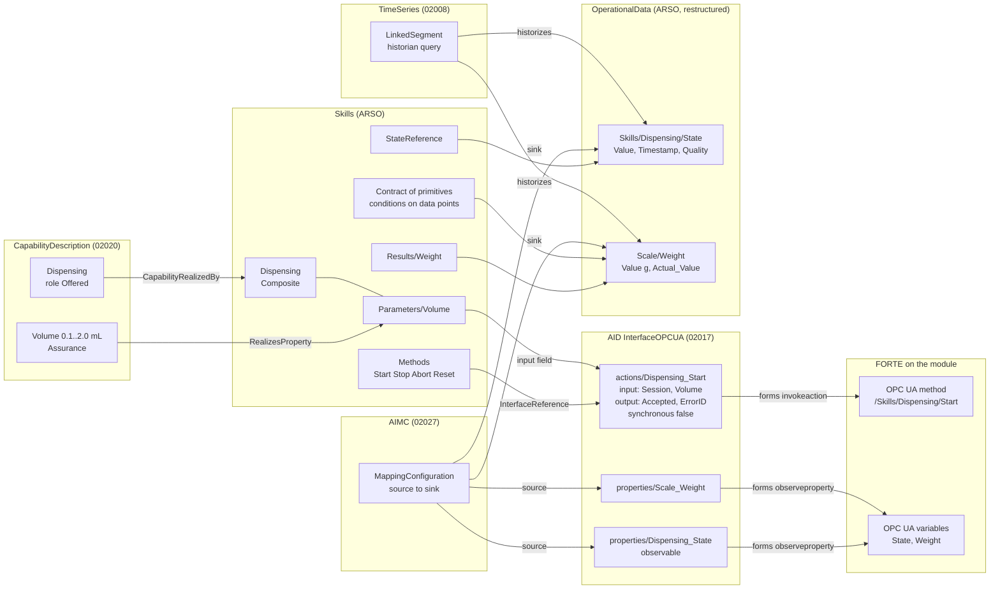

# AAS models: implementation plan and example structures

How the [conceptual model](conceptual-model.md) is carried in the product, process and resource
AAS, shown on the filling line (the Filling module, the HGH vial), and the plan to get there.
Drafted 30 Sep 2026.

The models serve three uses, and every element below is there for at least one of them:

1. **Plug and produce:** a module that is connected describes itself (modsync pull), its offered
   capabilities are matched against the required ones of the current products, and it can be
   used without engineering.
2. **Reconfiguration:** a change of product, process or resource is classified (parameter,
   flow, composition, hardware) and applied to the IEC 61499 control online where it can be.
3. **Agents (later):** a module's agent bids in an I4.0 language negotiation (VDI/VDE 2193): a
   call for proposals carries required capabilities with Requirement values, a proposal offered
   ones with Assurance values.

**The ontologies are the design guide, not a validation layer** (decided 30 Sep 2026): they
say which components the product, process and resource models have, why, and what each is wired
to. Nothing in the pipeline validates models against them; SHACL and reasoning checks come
much later, if there is time. The checks in `ontology/checks` only keep the design guide itself
consistent.

## How one skill is wired across the submodels



The rules behind it:

- **The AID says how to reach the asset; the other submodels say what things mean.** Every
  method is an AID *action*, every published variable an AID *property*; nothing else holds an
  endpoint or node id.
- **Live values live in OperationalData only**, filled by the AIMC from AID properties, and
  historised by a TimeSeries submodel. Skills, contracts and results *refer* to data points;
  they hold no values of their own (except parameter defaults).
- **Actions follow the W3C WoT TD ActionAffordance** as properties follow the
  PropertyAffordance. IDTA 02017 does not yet specify action contents; we use the TD terms with
  their TD semantic ids so a later template version can take them over.
- **Everything a matcher or checker reads is a reference, not text:** capability to skill,
  capability property to skill parameter, contract condition to data point, skill to AID action,
  AIMC source to AID property, sink to data point.

## Example structures (Filling module)

`[new]` marks what ARSO does not have yet, `[changed]` what the plan changes. Semantic ids are
abbreviated: `td:` = `https://www.w3.org/2019/wot/td#`, `js:` = `https://www.w3.org/2019/wot/json-schema#`,
`hctl:` = `https://www.w3.org/2019/wot/hypermedia#`, `uav:` = `http://opcfoundation.org/UA/WoT-Binding/`,
`61360:` = `http://www.w3id.org/hsu-aut/DINEN61360#`, `lab:` = `https://smartproductionlab.aau.dk/`.

### Resource AAS of the module

```
FillingModuleAAS  (arso:ResourceAAS; derivedFrom lab:aas/templates/resource)
├─ DigitalNameplate (02006)                ManufacturerName, ManufacturerProductDesignation, SerialNumber, ...
├─ HierarchicalStructures (02011)
│    ├─ ArcheType = OneDown
│    └─ EntryNode FillingModule            SelfManagedEntity; semanticId VDI2206:Module          [changed: VDI 2206 class]
│         ├─ Node NeedleAxis               CoManagedEntity; semanticId VDI2206:Component
│         ├─ Node Scale                    CoManagedEntity; semanticId VDI2206:Component
│         └─ HasPart (x2)
├─ CapabilityDescription (02020)
│    └─ CapabilitySet
│         └─ Dispensing (CapabilityContainer)
│              ├─ Capability               semanticId lab:Capability/Dispensing (⊑ DIN 8580 Füllen); qualifier CapabilityRole = Offered
│              ├─ PropertySet
│              │    └─ Volume (PropertyContainer)
│              │         └─ Volume          Range 0.1..2.0, unit mL; semanticId lab:Property/Volume
│              │                            qualifiers 61360:Expression_Goal = Assurance,
│              │                                       61360:Logic_Interpretation = between              [new]
│              └─ CapabilityRelations
│                   └─ CapabilityRealizedBy [ first: Capability, second: Skills/Skills/Dispensing ]
├─ Skills (ARSO control-component)
│    ├─ Interfaces                          (empty, as in ARSO)
│    ├─ Skills
│    │    └─ Dispensing
│    │         ├─ SemanticId               lab:skills/Dispensing
│    │         ├─ Dispensing (Operation)   in: Session, Volume   out: Accepted, ErrorID
│    │         ├─ InterfaceReference       → AID …/actions/Dispensing_Start
│    │         ├─ Methods                  [new] Start, Stop, Abort, Reset: ReferenceElements → AID actions
│    │         │                             (each a cask:SkillMethod invoking a transition)
│    │         ├─ StateMachine             value lab:StateMachine/Skill/1 (the type, defined once) [changed: type, not live value]
│    │         ├─ StateReference           → OperationalData/Skills/Dispensing/State            [changed: to a data point]
│    │         ├─ Kind = Composite
│    │         ├─ Parameters
│    │         │    └─ Volume              1.0 (running value); Unit mL, Minimum 0.1, Maximum 2.0, Default 1.0
│    │         │                            InputOf → AID …/actions/Dispensing_Start/input/properties/RD_2   [new]
│    │         ├─ RealizesProperty         [ first: Parameters/Volume, second: CapabilityDescription/…/Volume ]
│    │         ├─ Uses                     → MoveNeedleDown, Dwell, MoveNeedleUp, Weigh
│    │         ├─ Execute
│    │         │    ├─ Step { Skill → MoveNeedleDown }
│    │         │    ├─ Step { Skill → Dwell, Bindings { Duration = Volume / FlowRate } }
│    │         │    ├─ Step { Skill → MoveNeedleUp }
│    │         │    └─ Step { Skill → Weigh }
│    │         ├─ Stop                      Step { Skill → MoveNeedleUp }
│    │         ├─ Occupies                 → HierarchicalStructures/…/NeedleAxis, …/Scale
│    │         ├─ Results                  [new] Weight → OperationalData/Scale/Weight
│    │         └─ Implementation           FBType filling::SC_Dispensing, TypeHash v2:SHA3-512:…, InstancePath Dispensing.Control
│    │    └─ MoveNeedleDown                 (primitive: as above without Uses/Execute, plus)
│    │         └─ Contract
│    │              ├─ Requires             Condition { Variable → OperationalData/NeedleAxis/AtBottom, Operator "=", Value false }   [changed: references]
│    │              ├─ Ensures              Condition { Variable → …/NeedleAxis/AtBottom, Operator "=", Value true }
│    │              ├─ Invariant            Condition { NOT (AtTop AND AtBottom) }
│    │              └─ Timeout              PT8S
│    └─ Errors                              ErrorCode 1 PreconditionViolated … 8 OutOfRange
├─ AssetInterfacesDescription (02017)
│    └─ InterfaceOPCUA
│         ├─ title                          "Filling module"
│         ├─ EndpointMetadata
│         │    ├─ base                      opc.tcp://192.168.0.191:4840
│         │    ├─ contentType               application/octet-stream
│         │    ├─ security                  [ nosec_sc ]                                              [new in modsync]
│         │    └─ securityDefinitions       nosec_sc { scheme "nosec" }
│         └─ InteractionMetadata
│              ├─ actions                   (td:ActionAffordance)
│              │    └─ Dispensing_Start     [new content, following the TD]
│              │         ├─ key              "Start"
│              │         ├─ title            "Start Dispensing"
│              │         ├─ description      "Starts the skill; completion is reported by Dispensing_State"
│              │         ├─ synchronous      false   (td:isSynchronous: the result is not in the response)
│              │         ├─ safe             false   (td:isSafe)
│              │         ├─ idempotent       false   (td:isIdempotent)
│              │         ├─ input            (td:hasInputSchema)  type object
│              │         │    └─ properties
│              │         │         ├─ RD_1   { type string, title "Session" }
│              │         │         └─ RD_2   { type number, title "Volume", unit mL, min_max 0.1..2.0 }
│              │         ├─ output           (td:hasOutputSchema) type object
│              │         │    └─ properties
│              │         │         ├─ SD_1   { type boolean, title "Accepted" }
│              │         │         └─ SD_2   { type integer, title "ErrorID", min_max 0..8 }
│              │         └─ forms
│              │              ├─ href              /0:Objects/1:Filling/1:Skills/1:Dispensing/1:Start
│              │              ├─ op                invokeaction                           (hctl:hasOperationType)
│              │              └─ uav_browsePath    same as href                            (uav:browsePath)
│              ├─ properties                (td:PropertyAffordance)
│              │    ├─ Dispensing_State     { key "State", type integer, min_max 0..5, observable true,
│              │    │                          forms { href …/1:Dispensing/1:State, op [readproperty, observeproperty] } }
│              │    ├─ Scale_Weight         { key "Weight", type number, unit g, observable true, forms … }
│              │    ├─ NeedleAxis_AtBottom  { type boolean, observable true, forms … }
│              │    └─ Module_State, Occupation_Occupied, …
│              └─ events                    (later: OPC UA events for alarms, FORTE's ua_ev layer)
├─ AIMC (02027)
│    └─ MappingConfigurations
│         └─ OpcUaToOperationalData
│              ├─ InterfaceReference         → AID/InterfaceOPCUA
│              ├─ DefaultPollingInterval     0.5 (s; or an OPC UA subscription)
│              ├─ Sources  [ { Source → …/properties/Dispensing_State, SourceId "Dispensing_State" },
│              │             { Source → …/properties/Scale_Weight,     SourceId "Scale_Weight" }, … ]
│              └─ Sinks    [ { Sink → OperationalData/Skills/Dispensing/State/Value, SinkId "Dispensing_State" },
│                            { Sink → OperationalData/Scale/Weight/Value,             SinkId "Scale_Weight" }, … ]
│                          (identity mapping by id; Transformation only where a value is converted)
├─ OperationalData (ARSO, restructured)                                                            [changed]
│    ├─ Module                               DataPointGroup; RefersTo → HierarchicalStructures/EntryNode
│    │    ├─ State                           DataPoint { Value 2 (PackML Stopped), Timestamp, Quality Good }
│    │    └─ Occupied                        DataPoint { Value false, … }
│    ├─ NeedleAxis                           DataPointGroup; RefersTo → …/NeedleAxis
│    │    ├─ AtTop                           DataPoint { Value true, … }; semanticId lab:variables/NeedleAxis/AtTop
│    │    └─ AtBottom                        DataPoint { Value false, … }
│    ├─ Scale
│    │    └─ Weight                          DataPoint { Value 2.01, Unit g, … }
│    └─ Skills                               DataPointGroup
│         └─ Dispensing
│              ├─ State                      DataPoint { Value 0 (Idle), … }; semanticId lab:StateMachine/Skill/1
│              └─ ErrorID                    DataPoint { Value 0, … }
│    DataPoint = SMC {
│         Value      Property, typed; semanticId the variable's IRI; qualifier 61360:Expression_Goal = Actual_Value
│         Timestamp  Property xs:dateTime (source time)
│         Quality    Property Good | Uncertain | Bad (the OPC UA status code class)
│         Unit       optional
│         History    optional ReferenceElement → TimeSeries record variable }
├─ TimeSeries (02008)                                                                               [new]
│    ├─ Metadata
│    │    ├─ Name, Description
│    │    └─ Record                          { Time (UtcTime), Module_State, NeedleAxis_AtTop, …, Scale_Weight }
│    └─ Segments
│         └─ LinkedSegment                   { Endpoint → the lab historian, Query "…module = Filling…",
│                                              StartTime, State "InProgress" }
└─ ControlConfiguration (ARSO v0.5)          Runtime, ModuleSpec, Target, SyncState, Differences, Types,
                                             ActiveProcedure, ChangeLog  (modsync writes it as ControlSoftware today)
```

### Product AAS (APSO v0.2)

```
HGHVialAAS  (apso:ProductAAS)
├─ BatchInformation                         ProductName "HGH 1 mL", Quantity 1000, Status "released"
├─ BoM                                      EntryNode HGHVial; entities EmptyVial, HGHSolution, Stopper; ArcheType OneDown
├─ Requirements                             (product-level, e.g. aseptic class)
└─ BillOfProcess
     ├─ RecipeId
     └─ Processes
          ├─ ProduceHGH (ProcessStructure)
          │    └─ subProcesses
          │         ├─ Fill (Process)
          │         │    ├─ parameters
          │         │    │    └─ FillVolume      { value 1.0, unit mL, semanticId lab:Property/FillVolume }
          │         │    ├─ RequiredCapability   (02020 CapabilityContainer)
          │         │    │    ├─ Capability      semanticId lab:Capability/Dispensing; CapabilityRole = Required
          │         │    │    └─ PropertySet/Volume
          │         │    │         ├─ Volume      1.0 mL; 61360:Expression_Goal = Requirement, Logic_Interpretation "="
          │         │    │         └─ SameProperty → parameters/FillVolume
          │         │    ├─ Consumes → BoM/EmptyVial, BoM/HGHSolution
          │         │    └─ Produces → BoM/FilledVial
          │         ├─ Close (Process)          RequiredCapability Stoppering; Consumes FilledVial, Stopper; Produces HGHVial
          │         └─ ProcessOrder             { first Fill, second Close }
          └─ …
```

### Process AAS (AProSO v0.1)

```
HGH_on_InnoLabLine_v3  (aproso:ProcessAAS; the asset is the plan)
├─ ProcessInformation                       ProcessName, Status Approved, ProductReference HGHVialAAS,
│                                           ResourceReference InnoLabLineAAS, ApprovedBy, ApprovedAt
├─ ProcessStructure
│    └─ EntryNode ProduceHGH                Refines → HGHVialAAS/BillOfProcess/…/ProduceHGH
│         ├─ Node Dispense                  Refines → …/Fill
│         ├─ Node Transfer                  RequiredCapability MoveToPosition (added for the line)
│         ├─ Node Close                     Refines → …/Close
│         ├─ Node Inspect                   OnlyIf { Parameter → …/InspectionRequired, Equals true }
│         ├─ Precedes { Dispense, Transfer }, Precedes { Transfer, Close }, Precedes { Close, Inspect }
├─ CapabilityBindings
│    └─ Binding Dispense
│         ├─ Step → ProcessStructure/…/Dispense
│         ├─ RequiredCapability → HGHVialAAS/…/Fill/RequiredCapability
│         ├─ Candidates [ → FillingModuleAAS/CapabilityDescription/…/Dispensing ]
│         ├─ OfferedCapability → FillingModuleAAS/…/Dispensing
│         ├─ Skill → FillingModuleAAS/Skills/Skills/Dispensing
│         ├─ Resource FillingModuleAAS
│         └─ ParameterMappings [ { SkillParameter → …/Dispensing/Parameters/Volume, Source → HGHVialAAS/…/FillVolume } ]
├─ Validation                               Status Passed, CheckedAt, CheckedAgainst [skill type hashes], Violations []
└─ Policy                                   File behaviour tree XML (generated from structure and bindings)
```

## Manifest: the AAS profile on the module

A module has to describe itself when it is connected. Neither half alone does it: the running
program proves what runs (skills, parameters, type hashes, the OPC UA structure) but not what
the asset is or can do (identity, capabilities, units, ranges, physical structure); a stored AAS
says all of that but nothing ties it to the program. So three layers:

1. **Identity on the module.** The generated application publishes a read-only
   `/Objects/<Module>/Identification` (GlobalAssetId as an IEC 61406 identification link, AasId,
   ProfileDigest, ProgramDigest), like the OPC UA DI nameplate. The identity belongs to the
   station, not the Pi: a config file on the Pi for now; later the station's wiring board as a
   HAT with an ID EEPROM (`/proc/device-tree/hat`), so the identity travels with the hardware.
2. **The manifest is the lab's AAS profile** (JSON, `AAS_Builder` in the lab repository): the
   AAS without the boilerplate, which the lab's `AASGenerator` expands into the full AAS and
   `aas_to_profile` inverts. It replaces the deprecated YAML the ESP32 stations sent. modgen
   generates it from the module spec together with the program, `pi.py` deploys it next to the
   boot file, and it is pushed to the registration (or fetched by modsync) when the module
   comes online. One path for every kind of module: an ESP32 or a PLC carries only the profile,
   the full AAS is built centrally; on a Pi size does not matter, but the same path keeps one
   registration mechanism.
3. **Verification against the program.** modsync reads the running program and compares its
   digest with the manifest's ProgramDigest (instances, types with hashes, connections,
   parameters), then adds the live parts (running parameter values, sync state) and registers.

Checked on 30 Sep 2026 with [examples/FillingModule.profile.json](examples/FillingModule.profile.json)
against the lab's builder: the profile (about 2.6 KB) builds a 25 KB AAS with seven submodels
(DigitalNameplate, HierarchicalStructures, AID with the OPC UA endpoint and actions, Skills,
Capabilities, OperationalData, AIMC) and converts back to the same profile. Two quirks:
`synchronous` comes back as a string (the builder writes it as `xs:string`), and
HierarchicalStructures `HasPart` expects separate assets with their own globalAssetId, so an
equipment item without its own AAS (a co-managed entity) cannot be expressed yet.

**What the profile has to gain** (the `x-extensions` in the example, ignored by the builder
today); each needs a builder, the inverse parser and the ARSO module, as the lab's
`submodel_registry.py` requires:

| Section | Extension |
| --- | --- |
| AID actions | TD fields `safe`, `idempotent`; `input` / `output` as an inline data schema (object with typed, titled, ranged fields) beside today's schema URL; forms `uav_browsePath` |
| AID properties | data schema: `type`, `unit`, `minimum` / `maximum`, `observable` |
| HierarchicalStructures | components as co-managed entities (VDI 2206 `Component`) |
| Capabilities | `role` (Offered / Required), `properties` with unit, range, 61360 expression goal and logic interpretation, `realizedByParameter` |
| Skills | `kind`, `methods` (Start/Stop/Abort/Reset → actions), `stateMachine`, `state` (data point), `parameters` (with `input` field of the Start action), `uses`, `execute`, `stop`, `occupies`, `results`, `implementation` |
| OperationalData | per data point `unit`, `expressionGoal`, `group`, `history` (TimeSeries) |
| ControlConfiguration (new section) | runtime, management endpoint, module spec, ProfileDigest, ProgramDigest, type hashes |

**Consequence for this repository:** modsync stops building AAS itself (`modsync/aas.py`
becomes a profile emitter); the lab's builder is the one AAS generator. The profile is the
contract between the two repositories; tests here run the lab's builder on the emitted profiles
when a copy is available and skip otherwise.

## Backlog: manifest and AAS builder

Items to pick up one at a time; each ends with its check. MF = this repository, AB = the lab's
AAS_Builder (each AB item: builder, inverse parser in `aas_to_profile.py`, ARSO module, entry in
`submodel_registry.py`, round-trip test, as that registry requires).

**Manifest (MF)**

| # | Item | Check |
| --- | --- | --- |
| MF1 | modgen writes `<Module>.profile.json` in today's profile sections from the module spec: DigitalNameplate (the spec's `aas:` section extended with manufacturer, designation, serial number), HierarchicalStructures (IsPartOf the line), AID (per target: OPC UA endpoint; an action per OPC UA method, a property per published variable, forms with browse paths), Skills (per offered skill, interface = its Start action), Capabilities (a new `capabilities:` section in the spec), OperationalData (per published variable), AIMC (identity mappings) | the lab's builder builds it and `aas_to_profile` returns it unchanged (test skipped when `AAS_Builder` is absent) |
| MF2 | Digests: ProfileDigest (SHA-256 of the canonical profile without the digest fields) and ProgramDigest (SHA-256 of the generated program for the target: instances with types, connections, parameter values), computed the same way from a running program by modsync | the digest of a deployed program equals the manifest's |
| MF3 | Identification in the generated application: a ModLib type publishing GlobalAssetId, AasId, ProfileDigest, ProgramDigest read-only at `/Objects/<Module>/Identification` (needs a FORTE rebuild once) | live: the values read over OPC UA equal the manifest's |
| MF4 | `pi.py` deploys the profile to `~/forte/manifest/` together with the boot file; `pi.py manifest` shows it | deploy and read back |
| MF5 | `modsync pull` reads Identification, fetches the profile (SSH now, HTTP later), compares the digests, reports a mismatch, then registers (full AAS from the lab's builder when available, else from `modsync/aas.py`) | live: a manifest that does not match the program is reported |
| MF6 | Identity storage: `~/forte/identity.json` on the Pi now; later a HAT ID EEPROM on each station's wiring board (`/proc/device-tree/hat`) | the identity follows the station when the Pi is swapped |
| MF7 | Transport on connect: push the profile to the lab's registration (if it accepts JSON profiles; decision 5) or register the built AAS with BaSyx | the module appears in BaSyx when it comes online |
| MF8 | Retire the AAS builder in `modsync/aas.py` once the lab's builder covers AB1–AB8 | modsync emits profiles only |

**AAS builder extensions (AB)**

| # | Item | Check |
| --- | --- | --- |
| AB1 | AID actions after the W3C WoT TD ActionAffordance: `safe`, `idempotent`, `synchronous` as booleans (today a string), `input` / `output` as an inline data schema (object with typed, titled, ranged, unit fields; enums) beside today's schema URL; forms `op` and `uav_browsePath` | round trip; the Skills Operation is built from an inline schema as from a URL |
| AB2 | AID properties with a data schema: `type`, `unit`, `minimum` / `maximum`, `observable`, `readOnly` | round trip |
| AB3 | HierarchicalStructures components as co-managed entities (no own AAS), semanticId VDI 2206 `Component`; HasPart without a separate asset | round trip |
| AB4 | Capabilities: role (Offered / Required), PropertySet with properties or ranges and IEC 61360 qualifiers (expression goal, logic interpretation), GeneralizedBy, `realizedByParameter` | round trip; the matcher reads ranges and goals |
| AB5 | Skills: `kind`, `methods`, `stateMachine` (type IRI), `state` (→ OperationalData), `parameters` (with the Start action's input field), `uses`, `execute` / `stop` steps, `occupies`, `results`, `implementation` | round trip; every method reference resolves to an AID action (a plain test of the builder) |
| AB6 | OperationalData data points: groups per hierarchy node and per skill; DataPoint with Value, Timestamp, Quality, Unit, History; AIMC sinks on the Value | round trip; every AIMC sink is a data point Value |
| AB7 | TimeSeries submodel (IDTA 02008): metadata record and a LinkedSegment to the historian | round trip; the historian answers the segment's query |
| AB8 | ControlConfiguration submodel: runtime, management endpoint, module spec, digests, type hashes, later active procedure and change log | round trip |
| AB9 | Product and process profiles: APSO (BoM, Bill of Process with required capabilities) and AProSO (process structure, bindings, validation, policy) sections | the HGH example builds and round-trips |
| AB10 | Deferred (validation comes later, if time): `aas_to_rdf` projection and ARSO/APSO/AProSO SHACL covering AB1–AB9 | the worked filling-line example as AAS validates |

## Ontology changes this implies

| Ontology | Change |
| --- | --- |
| PPRL 0.2 | Import the small MIT-licensed standard patterns (VDI 2206, IEC 61360; VDI 3682 and PackML if needed), vendored under `ontology/ODP/` with their licence; `OfferedCapability ≡ cask:ProvidedCapability`, `RequiredCapability ≡ cask:RequiredCapability`; VDI 2206 System/Module/Component under `css:Resource`; `hasSubProcess` aligned with VDI 3682 decomposition; `actsFor`, `representsProcessPlan`, `exposedAs`, `inputOf`, `publishedBy`, `records`, `historizes`; expression goals on properties; the skill state machine type defined once |
| ARSO 0.6 | `aid.ttl`: ActionDefinition content per the TD (`input`, `output`, `safe`, `idempotent`, `synchronous`, data schema classes shared with PropertyDefinition), forms `op`, `uav_browsePath` beside `opc_node_id`; `control-component.ttl`: `Methods`, `Results`, StateMachine as type, StateReference to a data point; `operational-data.ttl`: DataPointGroup / DataPoint (Value, Timestamp, Quality, Unit, History) replacing the decimal-only Datapoint; new `timeseries.ttl` (02008); later, if time: SHACL rules (every skill method resolves to an AID action, every AIMC source to an AID property and sink to a data point Value) |
| APSO 0.3 | Expression goal and logic interpretation on required capability properties |
| AProSO 0.2 | Asset = plan; binding ParameterMappings reference skill parameters |

## Implementation plan

Baby steps; each ends with tests and a note in `docs/work.md`. Estimates are working days.

| Phase | What | Checks | Days |
| --- | --- | --- | --- |
| 0 | CSS 2.0.2 (done); conceptual model second iteration (done) | ontology tests | – |
| 1 | Ontologies: PPRL 0.2, ARSO 0.6, APSO 0.3, AProSO 0.2 as above; the worked example extended with a skill's methods, AID action and property, AIMC mapping and data points | the design guide stays consistent (`ontology/checks`, local) | 1 |
| 2a | Manifest: modgen emits the module's profile (today's sections) with ProfileDigest and ProgramDigest; the generated application publishes `Identification`; `pi.py` deploys the profile next to the boot file; modsync pull fetches it and checks the digests | the lab's builder builds and round-trips the profile; live: a manifest that does not match the program is reported | 1 |
| 2b | Profile extensions in the lab's AAS_Builder (the table above), each with builder, inverse parser and ARSO module; modgen fills them from the module spec (`aas:` section extended, a new `capabilities:` section) | round trip with extensions | 2.5 |
| 3 | Stable OPC UA node ids: check whether FORTE's OPC UA layer takes a node id with the browse path in the FB's ID (e.g. `browsePath,nodeId` pairs); if so, give every node a string id (`ns=1;s=Filling.Skills.Dispensing.Start`) so forms carry both | live test: ids survive a restart | 0.5 |
| 4 | Live data: an AIMC executor (the lab's DataBridge, generated from our AIMC, or a small `modsync bridge`: OPC UA subscription → BaSyx value update) and the historian behind the TimeSeries LinkedSegment | live test against FORTE and a local BaSyx | 1.5 |
| 5 | Product and process: product spec → APSO AAS; process map → AProSO AAS; the matcher (required vs offered: class or generalisation, 61360 goals and ranges) writes Candidates; binding and parameter mapping; validation with the contract check (skill_compiler.contracts on data point conditions); policy (behaviour tree) generation for the lab's orchestrator | the HGH example end to end offline; A–D changeovers as change classes | 4 |
| 6 | Plug and produce loop: `modsync watch` sees a module come online → its AAS registered → matcher recomputes candidates → rebinding → push (parameter change online, composition change as a new composite deployed) | live on the two Pis | 2 |
| 7 (journal) | Agents: CSS service layer; VDI/VDE 2193 call for proposals / proposal carrying Requirement / Assurance properties; module agents bidding for leaf steps; look at RoboCaSk | simulation with both modules | – |

For the CIRP paper (full paper 18 Nov 2026) phases 1, 2a/2b and 5 carry the argument (the AAS drive a
checked reconfiguration); 3, 4 and 6 make the demonstration live; 7 is journal material.

## Decisions needed

1. **Where the live skill state lives:** OperationalData data point referenced by the skill
   (proposed), or ARSO's per-skill `StateMachine` property as today. The proposal keeps one place
   for live values, one AIMC, one time series.
2. **AIMC form:** ARSO models 02027 with Sources, Sinks, ids and a Transformation; check it
   against the published template, which (as far as recalled here) relates sources and sinks
   with `MappingSourceSinkRelation` RelationshipElements.
3. **Historian** behind the TimeSeries LinkedSegment (what the lab runs: InfluxDB,
   TimescaleDB, the UNS broker's store?).
4. **OPC UA forms:** browse path (works now, since FORTE's numeric node ids change at every
   start) and node id once phase 3 makes them stable.
5. **Registration:** the lab's newer AAS_Builder already builds OPC UA interfaces from a
   profile. Does its registration path accept a JSON profile pushed by a module (as the ESP32s
   pushed YAML to `Registration/Config`), or do OPC UA modules register their built AAS directly
   with BaSyx (as `modsync --basyx` does)?
6. **Where the profile extensions are made:** in the lab's AAS_Builder (proposed, one generator)
   or first in this repository and upstreamed later.
7. **Identity storage:** a config file on the Pi now; a HAT ID EEPROM per station later?
