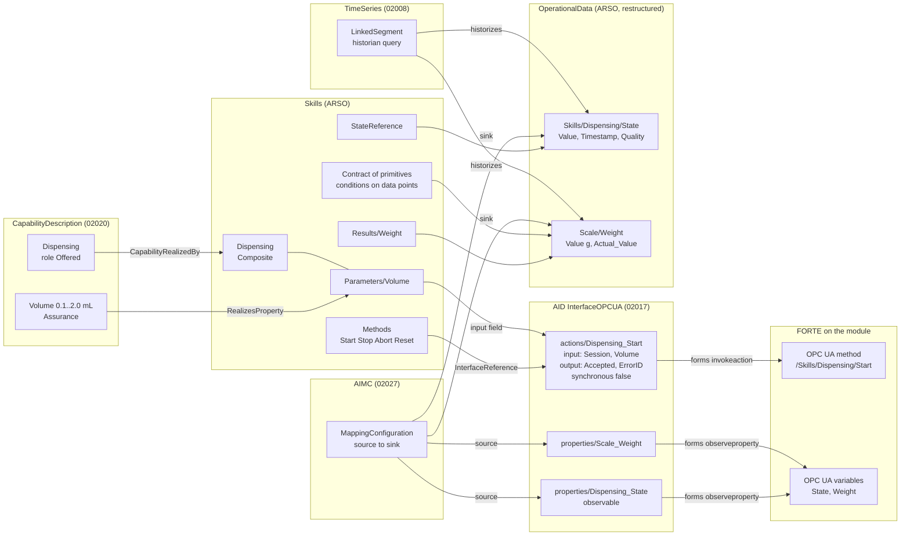

# AAS models: implementation plan and example structures

How the [conceptual model](conceptual-model.md) is carried in the product, process and resource
AAS, shown on the filling line (the Filling module, the HGH vial), and the plan to get there.
Drafted 30 Sep 2026; the manifest, backlog and plan sections brought up to date on 5 Oct 2026
with what `modreg` built (see `docs/work.md`, Registration). The example structures are the
target of the design: the resource AAS `modreg` builds today has the Skills, Operational Data,
Parameters and Control Configuration of ARSO 0.5 and not yet what is marked `[new]` below.

The models serve three uses, and every element below is there for at least one of them:

1. **Plug and produce:** a module that is connected describes itself (its profile), its offered
   capabilities are matched against the required ones of the current products, and it can be
   used without engineering.
2. **Reconfiguration:** a change of product, process or resource is classified (parameter,
   flow, composition, hardware) and applied to the IEC 61499 control online where it can be.
3. **Agents (later):** a module's agent bids in an I4.0 language negotiation (VDI/VDE 2193): a
   call for proposals carries required capabilities with Requirement values, a proposal offered
   ones with Assurance values.

**The ontologies are the design guide, and ARSO is also the blueprint** (since 2 Oct 2026):
they say which components the product, process and resource models have, why, and what each is
wired to. For the resource AAS, `modreg` generates the classes of ARSO's own submodels from the
ontology and checks every built AAS against ARSO's restrictions before it is registered. The
product and process ontologies are not used for validation yet; SHACL and reasoning over the
links come later, if there is time. The checks in `ontology/checks` keep the ontologies
themselves consistent.

## How one skill is wired across the submodels



The rules behind it:

- **The AID says how to reach the asset; the other submodels say what things mean.** Every
  method is an AID *action*, every published variable an AID *property*; nothing else holds an
  endpoint or node id.
- **Live values live in OperationalData only**, filled by the AIMC from AID properties, and
  historised by a TimeSeries submodel. Skills, contracts and results *refer* to data points;
  they hold no values of their own (except parameter defaults).
- **Actions follow the W3C WoT TD ActionAffordance** as properties follow the
  PropertyAffordance. IDTA 02017 does not yet specify action contents; we use the TD terms with
  their TD semantic ids so a later template version can take them over.
- **Everything a matcher or checker reads is a reference, not text:** capability to skill,
  capability property to skill parameter, contract condition to data point, skill to AID action,
  AIMC source to AID property, sink to data point.

## Example structures (Filling module)

`[new]` marks what ARSO does not have yet, `[changed]` what the plan changes. Semantic ids are
abbreviated: `td:` = `https://www.w3.org/2019/wot/td#`, `js:` = `https://www.w3.org/2019/wot/json-schema#`,
`hctl:` = `https://www.w3.org/2019/wot/hypermedia#`, `uav:` = `http://opcfoundation.org/UA/WoT-Binding/`,
`61360:` = `http://www.w3id.org/hsu-aut/DINEN61360#`, `lab:` = `https://smartproductionlab.aau.dk/`.

### Resource AAS of the module

```
FillingModuleAAS  (arso:ResourceAAS; derivedFrom lab:aas/templates/resource)
├─ DigitalNameplate (02006)                ManufacturerName, ManufacturerProductDesignation, SerialNumber, ...
├─ HierarchicalStructures (02011)
│    ├─ ArcheType = OneDown
│    └─ EntryNode FillingModule            SelfManagedEntity; semanticId VDI2206:Module          [changed: VDI 2206 class]
│         ├─ Node NeedleAxis               CoManagedEntity; semanticId VDI2206:Component
│         ├─ Node Scale                    CoManagedEntity; semanticId VDI2206:Component
│         └─ HasPart (x2)
├─ CapabilityDescription (02020)
│    └─ CapabilitySet
│         └─ Dispensing (CapabilityContainer)
│              ├─ Capability               semanticId lab:Capability/Dispensing (⊑ DIN 8580 Füllen); qualifier CapabilityRole = Offered
│              ├─ PropertySet
│              │    └─ Volume (PropertyContainer)
│              │         └─ Volume          Range 0.1..2.0, unit mL; semanticId lab:Property/Volume
│              │                            qualifiers 61360:Expression_Goal = Assurance,
│              │                                       61360:Logic_Interpretation = between              [new]
│              └─ CapabilityRelations
│                   └─ CapabilityRealizedBy [ first: Capability, second: Skills/Skills/Dispensing ]
├─ Skills (ARSO control-component)
│    ├─ Interfaces                          (empty, as in ARSO)
│    ├─ Skills
│    │    └─ Dispensing
│    │         ├─ SemanticId               lab:skills/Dispensing
│    │         ├─ Dispensing (Operation)   in: Session, Volume   out: Accepted, ErrorID
│    │         ├─ InterfaceReference       → AID …/actions/Dispensing_Start
│    │         ├─ Methods                  [new] Start, Stop, Abort, Reset: ReferenceElements → AID actions
│    │         │                             (each a cask:SkillMethod invoking a transition)
│    │         ├─ StateMachine             value lab:StateMachine/Skill/1 (the type, defined once) [changed: type, not live value]
│    │         ├─ StateReference           → OperationalData/Skills/Dispensing/State            [changed: to a data point]
│    │         ├─ Kind = Composite
│    │         ├─ Parameters
│    │         │    └─ Volume              1.0 (running value); Unit mL, Minimum 0.1, Maximum 2.0, Default 1.0
│    │         │                            InputOf → AID …/actions/Dispensing_Start/input/properties/RD_2   [new]
│    │         ├─ RealizesProperty         [ first: Parameters/Volume, second: CapabilityDescription/…/Volume ]
│    │         ├─ Uses                     → MoveNeedleDown, Dwell, MoveNeedleUp, Weigh
│    │         ├─ Execute
│    │         │    ├─ Step { Skill → MoveNeedleDown }
│    │         │    ├─ Step { Skill → Dwell, Bindings { Duration = Volume / FlowRate } }
│    │         │    ├─ Step { Skill → MoveNeedleUp }
│    │         │    └─ Step { Skill → Weigh }
│    │         ├─ Stop                      Step { Skill → MoveNeedleUp }
│    │         ├─ Occupies                 → HierarchicalStructures/…/NeedleAxis, …/Scale
│    │         ├─ Results                  [new] Weight → OperationalData/Scale/Weight
│    │         └─ Implementation           FBType filling::SC_Dispensing, TypeHash v2:SHA3-512:…, InstancePath Dispensing.Control
│    │    └─ MoveNeedleDown                 (primitive: as above without Uses/Execute, plus)
│    │         └─ Contract
│    │              ├─ Requires             Condition { Variable → OperationalData/NeedleAxis/AtBottom, Operator "=", Value false }   [changed: references]
│    │              ├─ Ensures              Condition { Variable → …/NeedleAxis/AtBottom, Operator "=", Value true }
│    │              ├─ Invariant            Condition { NOT (AtTop AND AtBottom) }
│    │              └─ Timeout              PT8S
│    └─ Errors                              ErrorCode 1 PreconditionViolated … 8 OutOfRange
├─ AssetInterfacesDescription (02017)
│    └─ InterfaceOPCUA
│         ├─ title                          "Filling module"
│         ├─ EndpointMetadata
│         │    ├─ base                      opc.tcp://192.168.0.191:4840
│         │    ├─ contentType               application/octet-stream
│         │    ├─ security                  [ nosec_sc ]                                              [new in modsync]
│         │    └─ securityDefinitions       nosec_sc { scheme "nosec" }
│         └─ InteractionMetadata
│              ├─ actions                   (td:ActionAffordance)
│              │    └─ Dispensing_Start     [new content, following the TD]
│              │         ├─ key              "Start"
│              │         ├─ title            "Start Dispensing"
│              │         ├─ description      "Starts the skill; completion is reported by Dispensing_State"
│              │         ├─ synchronous      false   (td:isSynchronous: the result is not in the response)
│              │         ├─ safe             false   (td:isSafe)
│              │         ├─ idempotent       false   (td:isIdempotent)
│              │         ├─ input            (td:hasInputSchema)  type object
│              │         │    └─ properties
│              │         │         ├─ RD_1   { type string, title "Session" }
│              │         │         └─ RD_2   { type number, title "Volume", unit mL, min_max 0.1..2.0 }
│              │         ├─ output           (td:hasOutputSchema) type object
│              │         │    └─ properties
│              │         │         ├─ SD_1   { type boolean, title "Accepted" }
│              │         │         └─ SD_2   { type integer, title "ErrorID", min_max 0..8 }
│              │         └─ forms
│              │              ├─ href              /0:Objects/1:Filling/1:Skills/1:Dispensing/1:Start
│              │              ├─ op                invokeaction                           (hctl:hasOperationType)
│              │              └─ uav_browsePath    same as href                            (uav:browsePath)
│              ├─ properties                (td:PropertyAffordance)
│              │    ├─ Dispensing_State     { key "State", type integer, min_max 0..5, observable true,
│              │    │                          forms { href …/1:Dispensing/1:State, op [readproperty, observeproperty] } }
│              │    ├─ Scale_Weight         { key "Weight", type number, unit g, observable true, forms … }
│              │    ├─ NeedleAxis_AtBottom  { type boolean, observable true, forms … }
│              │    └─ Module_State, Occupation_Occupied, …
│              └─ events                    (later: OPC UA events for alarms, FORTE's ua_ev layer)
├─ AIMC (02027)
│    └─ MappingConfigurations
│         └─ OpcUaToOperationalData
│              ├─ InterfaceReference         → AID/InterfaceOPCUA
│              ├─ DefaultPollingInterval     0.5 (s; or an OPC UA subscription)
│              ├─ Sources  [ { Source → …/properties/Dispensing_State, SourceId "Dispensing_State" },
│              │             { Source → …/properties/Scale_Weight,     SourceId "Scale_Weight" }, … ]
│              └─ Sinks    [ { Sink → OperationalData/Skills/Dispensing/State/Value, SinkId "Dispensing_State" },
│                            { Sink → OperationalData/Scale/Weight/Value,             SinkId "Scale_Weight" }, … ]
│                          (identity mapping by id; Transformation only where a value is converted)
├─ OperationalData (ARSO, restructured)                                                            [changed]
│    ├─ Module                               DataPointGroup; RefersTo → HierarchicalStructures/EntryNode
│    │    ├─ State                           DataPoint { Value 2 (PackML Stopped), Timestamp, Quality Good }
│    │    └─ Occupied                        DataPoint { Value false, … }
│    ├─ NeedleAxis                           DataPointGroup; RefersTo → …/NeedleAxis
│    │    ├─ AtTop                           DataPoint { Value true, … }; semanticId lab:variables/NeedleAxis/AtTop
│    │    └─ AtBottom                        DataPoint { Value false, … }
│    ├─ Scale
│    │    └─ Weight                          DataPoint { Value 2.01, Unit g, … }
│    └─ Skills                               DataPointGroup
│         └─ Dispensing
│              ├─ State                      DataPoint { Value 0 (Idle), … }; semanticId lab:StateMachine/Skill/1
│              └─ ErrorID                    DataPoint { Value 0, … }
│    DataPoint = SMC {
│         Value      Property, typed; semanticId the variable's IRI; qualifier 61360:Expression_Goal = Actual_Value
│         Timestamp  Property xs:dateTime (source time)
│         Quality    Property Good | Uncertain | Bad (the OPC UA status code class)
│         Unit       optional
│         History    optional ReferenceElement → TimeSeries record variable }
├─ TimeSeries (02008)                                                                               [new]
│    ├─ Metadata
│    │    ├─ Name, Description
│    │    └─ Record                          { Time (UtcTime), Module_State, NeedleAxis_AtTop, …, Scale_Weight }
│    └─ Segments
│         └─ LinkedSegment                   { Endpoint → the lab historian, Query "…module = Filling…",
│                                              StartTime, State "InProgress" }
└─ ControlConfiguration (ARSO v0.5)          Runtime, ModuleSpec, Target, SyncState, Differences, Types,
                                             ActiveProcedure, ChangeLog  (modreg writes all but the last two)
```

### Product AAS (APSO v0.2)

```
HGHVialAAS  (apso:ProductAAS)
├─ BatchInformation                         ProductName "HGH 1 mL", Quantity 1000, Status "released"
├─ BoM                                      EntryNode HGHVial; entities EmptyVial, HGHSolution, Stopper; ArcheType OneDown
├─ Requirements                             (product-level, e.g. aseptic class)
└─ BillOfProcess
     ├─ RecipeId
     └─ Processes
          ├─ ProduceHGH (ProcessStructure)
          │    └─ subProcesses
          │         ├─ Fill (Process)
          │         │    ├─ parameters
          │         │    │    └─ FillVolume      { value 1.0, unit mL, semanticId lab:Property/FillVolume }
          │         │    ├─ RequiredCapability   (02020 CapabilityContainer)
          │         │    │    ├─ Capability      semanticId lab:Capability/Dispensing; CapabilityRole = Required
          │         │    │    └─ PropertySet/Volume
          │         │    │         ├─ Volume      1.0 mL; 61360:Expression_Goal = Requirement, Logic_Interpretation "="
          │         │    │         └─ SameProperty → parameters/FillVolume
          │         │    ├─ Consumes → BoM/EmptyVial, BoM/HGHSolution
          │         │    └─ Produces → BoM/FilledVial
          │         ├─ Close (Process)          RequiredCapability Stoppering; Consumes FilledVial, Stopper; Produces HGHVial
          │         └─ ProcessOrder             { first Fill, second Close }
          └─ …
```

### Process AAS (AProSO v0.1)

```
HGH_on_InnoLabLine_v3  (aproso:ProcessAAS; the asset is the plan)
├─ ProcessInformation                       ProcessName, Status Approved, ProductReference HGHVialAAS,
│                                           ResourceReference InnoLabLineAAS, ApprovedBy, ApprovedAt
├─ ProcessStructure
│    └─ EntryNode ProduceHGH                Refines → HGHVialAAS/BillOfProcess/…/ProduceHGH
│         ├─ Node Dispense                  Refines → …/Fill
│         ├─ Node Transfer                  RequiredCapability MoveToPosition (added for the line)
│         ├─ Node Close                     Refines → …/Close
│         ├─ Node Inspect                   OnlyIf { Parameter → …/InspectionRequired, Equals true }
│         ├─ Precedes { Dispense, Transfer }, Precedes { Transfer, Close }, Precedes { Close, Inspect }
├─ CapabilityBindings
│    └─ Binding Dispense
│         ├─ Step → ProcessStructure/…/Dispense
│         ├─ RequiredCapability → HGHVialAAS/…/Fill/RequiredCapability
│         ├─ Candidates [ → FillingModuleAAS/CapabilityDescription/…/Dispensing ]
│         ├─ OfferedCapability → FillingModuleAAS/…/Dispensing
│         ├─ Skill → FillingModuleAAS/Skills/Skills/Dispensing
│         ├─ Resource FillingModuleAAS
│         └─ ParameterMappings [ { SkillParameter → …/Dispensing/Parameters/Volume, Source → HGHVialAAS/…/FillVolume } ]
├─ Validation                               Status Passed, CheckedAt, CheckedAgainst [skill type hashes], Violations []
└─ Policy                                   File behaviour tree XML (generated from structure and bindings)
```

## Manifest: the AAS profile on the module

A module has to describe itself when it is connected. Neither half alone does it: the running
program proves what runs (skills, parameters, type hashes, the OPC UA structure) but not what
the asset is or can do (identity, capabilities, units, ranges, physical structure); a stored AAS
says all of that but nothing ties it to the program. So three layers:

1. **Identity on the module.** The generated application publishes a read-only
   `/Objects/<Module>/Identification` (GlobalAssetId as an IEC 61406 identification link, AasId,
   ProfileDigest, ProgramDigest), like the OPC UA DI nameplate. The identity belongs to the
   station, not the Pi: a config file on the Pi for now; later the station's wiring board as a
   HAT with an ID EEPROM (`/proc/device-tree/hat`), so the identity travels with the hardware.
   *Not built.*
2. **The manifest is the module's profile**: its AAS on the lab's shared pydantic model
   (aas-model) without what the type and the element classes say anyway. `modreg profile` writes
   it from the module spec, or from the spec and the running program; the registration service
   (`modreg serve`) reads it into the model, builds the AAS, checks it against ARSO and
   publishes it to the AAS server. One path for every kind of resource: the lab's MQTT stations
   send profiles of aas-model's own resource type through the same service. *Built*; deploying
   the profile next to the boot file is not.
3. **Verification against the program.** `modsync` reads the running program and compares it
   with the program the spec generates (instances, types with hashes, connections, values); the
   profile carries the result (SyncState, Differences, type hashes) and the digest of the
   generated program (ProgramDigest). *Built*; comparing a digest published by the module itself
   waits for layer 1.

The first design (30 Sep) used the profile format of the lab's earlier AAS builder; it was
replaced on 2 Oct by aas-model, which the lab's registration and management node share.

## Backlog: manifest and models

**Manifest (MF)**

| # | Item | State |
| --- | --- | --- |
| MF1 | The module's profile from the module spec: nameplate, hierarchical structures (equipment), interface description (per target: OPC UA endpoint, an action per method, a property per published variable, steps' variables included), skills (steps referring to their State), the Resetting and Stopping procedures, operational data, parameters, control configuration | Done (`modreg profile`); steps, procedures and result units added 5 Oct so an HMI can be built from the AAS; 6 Oct the capability description, the skills' references to every action and property (Methods, ErrorReference, Results, the module's commands) and an AIMC mapping every action and property |
| MF2 | ProgramDigest: SHA-256 of the generated program for the target (instances with types, connections, values) | Done, in Control Configuration. A ProfileDigest and the same digest computed from a running program are open |
| MF3 | Identification in the generated application: a ModLib type publishing GlobalAssetId, AasId, ProfileDigest, ProgramDigest read-only at `/Objects/<Module>/Identification` (needs a FORTE rebuild once) | Open |
| MF4 | The profile deployed to the Pi together with the boot file | Open |
| MF5 | On pull: read Identification, fetch the profile, compare the digests, report a mismatch, then register | Partly: `modsync pull --register` builds the profile from spec and running program and registers it |
| MF6 | Identity storage: a file on the Pi now; later a HAT ID EEPROM on each station's wiring board | Open |
| MF7 | Transport on connect: `modsync watch --register` sends the profile when a module comes online or changes | Done over HTTP to `modreg serve`; the lab's registration (MQTT) is not addressed |
| MF8 | Retire the AAS builder in `modsync/aas.py` | Open, once the profile path is accepted |

**Models (what the resource AAS still lacks against the example structures above)**

| # | Item | Where |
| --- | --- | --- |
| M1 | Capability description: offered capabilities with property ranges, realised by a skill and its parameters (RealizesProperty) | Done 6 Oct from the spec's `capabilities:` section (CapabilityRealizedBy a model reference to the skill, units as IEC 61360); RealizesProperty when a property names a skill parameter. The values of the two modules are illustrative until measured |
| M2 | Declare in ARSO what a module's skill carries beyond ARSO 0.5: the terms of a Contract, the children of a Step and of Implementation, the item types of Uses and Occupies | ARSO `control-component.ttl`; today hand-written classes in `modreg/model.py` |
| M3 | The Web of Things terms of the interface description that aas-model writes (key, type, title, observable, unit, op, input and output schemas, `uav_browsePath`, `uav_componentOf`) | ARSO `aid.ttl`; today reported as not described |
| M4 | Operational data: unit, groups per equipment and per skill, history (TimeSeries, IDTA 02008, with a segment linked to the historian) | ARSO `operational-data.ttl` is a placeholder |
| M5 | Control configuration: active procedure and change log | ARSO has the classes; nothing writes them |
| M6 | Product and process profiles: APSO (bill of material, bill of process with required capabilities) and AProSO (process structure, bindings, validation, policy) | Not started |
| M7 | A projection of the built AAS to RDF and SHACL rules across submodels (references that resolve, uses only downwards) | Deferred; `modreg check` covers the structure inside each submodel and the shell |

## Ontology changes this implies

| Ontology | Change |
| --- | --- |
| PPRL 0.2 | Import the small MIT-licensed standard patterns (VDI 2206, IEC 61360; VDI 3682 and PackML if needed), vendored under `ontology/ODP/` with their licence; `OfferedCapability ≡ cask:ProvidedCapability`, `RequiredCapability ≡ cask:RequiredCapability`; VDI 2206 System/Module/Component under `css:Resource`; `hasSubProcess` aligned with VDI 3682 decomposition; `actsFor`, `representsProcessPlan`, `exposedAs`, `inputOf`, `publishedBy`, `records`, `historizes`; expression goals on properties; the skill state machine type defined once |
| ARSO 0.6 | `aid.ttl`: ActionDefinition content per the TD (`input`, `output`, `safe`, `idempotent`, `synchronous`, data schema classes shared with PropertyDefinition), forms `op`, `uav_browsePath` beside `opc_node_id`; `control-component.ttl`: `Methods`, `Results`, StateMachine as type, StateReference to a data point; `operational-data.ttl`: DataPointGroup / DataPoint (Value, Timestamp, Quality, Unit, History) replacing the decimal-only Datapoint; new `timeseries.ttl` (02008); later, if time: SHACL rules (every skill method resolves to an AID action, every AIMC source to an AID property and sink to a data point Value) |
| APSO 0.3 | Expression goal and logic interpretation on required capability properties |
| AProSO 0.2 | Asset = plan; binding ParameterMappings reference skill parameters |

## Implementation plan

Baby steps; each ends with tests and a note in `docs/work.md`. Estimates are working days.

| Phase | What | Checks | Days |
| --- | --- | --- | --- |
| 0 | CSS 2.0.2 (done); conceptual model second iteration (done) | ontology tests | – |
| 1 | Ontologies: PPRL 0.2, ARSO 0.6, APSO 0.3, AProSO 0.2 as above; the worked example extended with a skill's methods, AID action and property, AIMC mapping and data points | the design guide stays consistent (`ontology/checks`, local) | 1 |
| 2a | Manifest. **Done 2 to 4 Oct:** the module's profile on aas-model, the classes of ARSO's own submodels generated from the ontology, the ARSO check, the registration service, `modsync --register`. **Open:** the generated application publishes `Identification`; the profile is deployed next to the boot file; pull checks the digests | the lab's builder builds and round-trips the profile; live: a manifest that does not match the program is reported | 1 |
| 2b | The model items M1 to M4 above: declared in ARSO, classes regenerated (`modreg generate`), filled from the module spec (`aas:` section extended, a new `capabilities:` section) | round trip with extensions | 2.5 |
| 3 | Stable OPC UA node ids: check whether FORTE's OPC UA layer takes a node id with the browse path in the FB's ID (e.g. `browsePath,nodeId` pairs); if so, give every node a string id (`ns=1;s=Filling.Skills.Dispensing.Start`) so forms carry both | live test: ids survive a restart | 0.5 |
| 4 | Live data: an AIMC executor (the lab's DataBridge, generated from our AIMC, or a small `modsync bridge`: OPC UA subscription → BaSyx value update) and the historian behind the TimeSeries LinkedSegment | live test against FORTE and a local BaSyx | 1.5 |
| 5 | Product and process: product spec → APSO AAS; process map → AProSO AAS; the matcher (required vs offered: class or generalisation, 61360 goals and ranges) writes Candidates; binding and parameter mapping; validation with a contract check (the skills' requires, ensures and invariant against data point conditions; the first cell's checker was removed with it); policy (behaviour tree) generation for the lab's orchestrator | the HGH example end to end offline; A–D changeovers as change classes | 4 |
| 6 | Plug and produce loop: `modsync watch` sees a module come online → its AAS registered → matcher recomputes candidates → rebinding → push (parameter change online, composition change as a new composite deployed) | live on the two Pis | 2 |
| 7 (journal) | Agents: CSS service layer; VDI/VDE 2193 call for proposals / proposal carrying Requirement / Assurance properties; module agents bidding for leaf steps; look at RoboCaSk | simulation with both modules | – |

For the CIRP paper (full paper 18 Nov 2026) phases 1, 2a/2b and 5 carry the argument (the AAS drive a
checked reconfiguration); 3, 4 and 6 make the demonstration live; 7 is journal material.

## Decisions needed

1. **Where the live skill state lives:** OperationalData data point referenced by the skill
   (proposed), or ARSO's per-skill `StateMachine` property as today. The proposal keeps one place
   for live values, one AIMC, one time series.
2. **AIMC form:** ARSO models 02027 with Sources, Sinks, ids and a Transformation; check it
   against the published template, which (as far as recalled here) relates sources and sinks
   with `MappingSourceSinkRelation` RelationshipElements.
3. **Historian** behind the TimeSeries LinkedSegment (what the lab runs: InfluxDB,
   TimescaleDB, the UNS broker's store?).
4. **OPC UA forms:** browse path (works now, since FORTE's numeric node ids change at every
   start) and node id once phase 3 makes them stable.
5. **Registration** (settled 2 Oct): a module's profile goes to the registration service
   (`modreg serve`, HTTP), which builds and publishes the AAS. Open: whether that service runs
   beside the lab's own registration or becomes part of it, and publishing to the lab's server.
6. **Where the model is defined** (settled 2 and 4 Oct): ARSO says what a resource AAS consists
   of; classes come from aas-model, for ARSO's own submodels generated from the ontology through
   aas-model's generator; aas-model itself is changed as little as possible.
7. **Identity storage:** a config file on the Pi now; a HAT ID EEPROM per station later?
