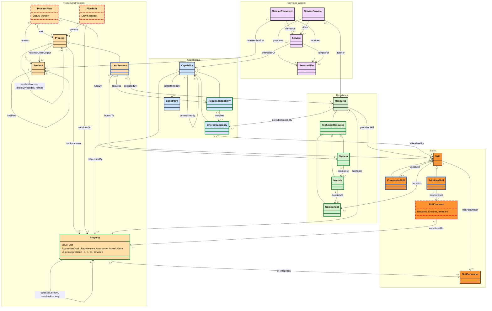

# Conceptual model

The concepts behind the product, process and resource AAS and how they relate, drawn in the
manner of the CSS reference model figure: one area per layer, associations named by a verb with
multiplicities at both ends. Iterated here in mermaid; once it settles it is redrawn in draw.io
as the formal figure. Drafted 30 Sep 2026; second iteration the same day after reviewing
CaSk/CaSkMan (below). How the concepts are carried in AAS, with example structures and the
implementation plan (30 Sep, archived): [aas-implementation-plan.md](../docs/archive/aas-implementation-plan.md).

**Legend.** Fill = layer: services / agents (pink) and product and process (yellow),
capabilities (blue) and skills (orange) as in the CSS figure; resources (green), interface
(light pink), data (light blue), control / IEC 61499 (grey), reconfiguration (lilac).
Border = where the concept comes from:

| Border | Meaning |
| --- | --- |
| black | CSS 2.0.2 |
| blue | PPRL, ours, formalised (`ontology/PPRL`) |
| green | reused standard pattern: VDI 2206, VDI 3682, IEC 61360, PackML (via CaSk), CaSk, W3C WoT TD, IDTA templates |
| red dashed | ours, not formalised in any ontology yet |

Two figures (decision 7 below): **A**, the core (what is made, how, by whom, with which
capabilities and skills; the agents' service layer), and **B**, how a skill is reached and
observed (methods, state machine, WoT affordances in the AID, data points and time series, the
IEC 61499 control layer, reconfiguration). They share `Skill`, `SkillParameter`, `Property`,
`Module` and `ProcessPlan`. Multiplicities are proposals.

## Figure A: product, process, capability, skill, resource, services

## Figure B: skill interface, data, control, reconfiguration

```mermaid
classDiagram
    direction TB
    namespace Skills {
        class Skill
        class SkillParameter
        class SkillInterface
        class SkillMethod {
            Start, Stop, Abort, Reset
        }
        class StateMachine
        class Transition
        class State
    }
    namespace Interface_AID_WoT {
        class InterfaceDescription {
            base, security
        }
        class ActionAffordance {
            input, output
            safe, idempotent, synchronous
        }
        class PropertyAffordance {
            type, unit, observable
        }
        class EventAffordance
        class Form {
            href, op, uav_browsePath
        }
    }
    namespace Data_OperationalData_TimeSeries {
        class Property {
            ExpressionGoal Actual_Value
        }
        class DataPoint {
            Value, Timestamp, Quality
        }
        class Mapping {
            Source, Sink, Transformation
        }
        class TimeSeries {
            Segments
        }
    }
    namespace Control_IEC61499 {
        class Module
        class ControlDevice
        class ControlProgram {
            SyncState
        }
        class FBInstance
        class FBType {
            TypeHash
        }
    }
    namespace Reconfiguration {
        class ProcessPlan
        class Validation
        class Change {
            Trigger, Result
        }
        class ChangeClass
    }

    Skill "1" --> "1..*" SkillInterface : accessibleThrough
    Skill "1" --> "0..*" SkillParameter : hasParameter
    Skill "1" --> "1" StateMachine : behaviorConformsTo
    Skill "1" --> "1" State : hasCurrentState
    Skill "1" --> "1..*" SkillMethod : hasSkillMethod
    StateMachine "1" --> "1..*" State : consistsOfState
    StateMachine "1" --> "1..*" Transition : consistsOfTransition
    Transition "0..*" --> "1" SkillMethod : isInvokedBy
    SkillInterface "1" --> "1..*" SkillMethod : exposes
    SkillInterface "0..*" --> "1" InterfaceDescription : describedBy

    InterfaceDescription "1" --> "0..*" ActionAffordance : actions
    InterfaceDescription "1" --> "0..*" PropertyAffordance : properties
    InterfaceDescription "1" --> "0..*" EventAffordance : events
    ActionAffordance "1" --> "1..*" Form : forms
    PropertyAffordance "1" --> "1..*" Form : forms
    SkillMethod "1" --> "1" ActionAffordance : exposedAs
    SkillParameter "0..*" --> "1" ActionAffordance : inputOf
    State "0..*" --> "1" PropertyAffordance : publishedBy
    Property "0..1" --> "0..1" PropertyAffordance : exposedAs

    Mapping "0..*" --> "1" PropertyAffordance : source
    Mapping "0..*" --> "1" DataPoint : sink
    DataPoint "1" --> "1" Property : records
    TimeSeries "0..1" --> "0..*" DataPoint : historizes

    Module "1" --> "1" ControlDevice : controlledBy
    ControlProgram "0..*" --> "1" ControlDevice : runsOn
    ControlProgram "1" --> "1..*" FBInstance : contains
    FBInstance "0..*" --> "1" FBType : instanceOf
    Skill "1" --> "1" FBInstance : implementedBy
    ControlDevice "1" --> "1" InterfaceDescription : serves

    Validation "0..*" --> "1" ProcessPlan : checks
    Change "0..*" --> "0..1" ProcessPlan : from, to
    Change "0..*" --> "1" ChangeClass : classifiedAs
    Change "0..*" --> "1" ControlProgram : modifies

    style Skill fill:#fc9432,stroke:#000
    style SkillParameter fill:#fc9432,stroke:#000
    style SkillInterface fill:#fc9432,stroke:#000
    style StateMachine fill:#fc9432,stroke:#000
    style Transition fill:#fc9432,stroke:#000
    style State fill:#fc9432,stroke:#000
    style SkillMethod fill:#fc9432,stroke:#1b8a3a,stroke-width:3px
    style InterfaceDescription fill:#fbf0ff,stroke:#1b8a3a,stroke-width:3px
    style ActionAffordance fill:#fbf0ff,stroke:#1b8a3a,stroke-width:3px
    style PropertyAffordance fill:#fbf0ff,stroke:#1b8a3a,stroke-width:3px
    style EventAffordance fill:#fbf0ff,stroke:#1b8a3a,stroke-width:3px
    style Form fill:#fbf0ff,stroke:#1b8a3a,stroke-width:3px
    style Property fill:#ffdda6,stroke:#1b8a3a,stroke-width:3px
    style DataPoint fill:#e8f4f8,stroke:#e81313,stroke-width:3px,stroke-dasharray:6 4
    style Mapping fill:#e8f4f8,stroke:#1b8a3a,stroke-width:3px
    style TimeSeries fill:#e8f4f8,stroke:#1b8a3a,stroke-width:3px
    style Module fill:#d8f0d0,stroke:#1b8a3a,stroke-width:3px
    style ControlDevice fill:#e0e0e0,stroke:#e81313,stroke-width:3px,stroke-dasharray:6 4
    style ControlProgram fill:#e0e0e0,stroke:#e81313,stroke-width:3px,stroke-dasharray:6 4
    style FBInstance fill:#e0e0e0,stroke:#e81313,stroke-width:3px,stroke-dasharray:6 4
    style FBType fill:#e0e0e0,stroke:#e81313,stroke-width:3px,stroke-dasharray:6 4
    style ProcessPlan fill:#ffdda6,stroke:#e81313,stroke-width:3px,stroke-dasharray:6 4
    style Validation fill:#e6d9ff,stroke:#e81313,stroke-width:3px,stroke-dasharray:6 4
    style Change fill:#e6d9ff,stroke:#e81313,stroke-width:3px,stroke-dasharray:6 4
    style ChangeClass fill:#e6d9ff,stroke:#1f5fbf,stroke-width:3px
```

## Relations, where they are formalised, and what carries them in the AAS

| Relation | From → To | Formalised in | Carried in the AAS by |
| --- | --- | --- | --- |
| demands, requiresProduct, receives | ServiceRequester → Service, Product, ServiceOffer | CSS | an order (APSO BatchInformation) and the bidding messages (VDI/VDE 2193) |
| offers, proposes, offersUseOf, isInputFor | ServiceProvider, Service → Service, ServiceOffer, Capability | CSS | a module's agent; its offer refers to offered capabilities |
| actsFor | ServiceProvider → Resource | proposed | the agent's registration (to define) |
| hasPart | Product → Product | proposed | APSO BoM (entities, JointConnection) |
| makes, runsOn, root | ProcessPlan → Product, System, Process | proposed | AProSO ProcessInformation, ProcessStructure EntryNode |
| hasSubProcess, directlyPrecedes, refines | Process → Process | PPRL (hasSubProcess aligned to VDI 3682 decomposition) | APSO subProcesses, ProcessOrder; AProSO nesting, Precedes, Refines |
| hasInput, hasOutput | Process → Product | CSS | APSO Consumes, Produces |
| hasParameter | Process → Property | proposed | APSO BoP process `parameters` |
| governs, conditionOn | FlowRule → Process, Property | proposed | AProSO OnlyIf, Repeat |
| requires | LeafProcess → RequiredCapability | CSS `requiresCapability`; PPRL rule: exactly one | APSO RequiredCapability; AProSO node |
| boundTo, executedBy | LeafProcess → Skill, Resource | PPRL | AProSO Binding |
| isSpecifiedBy, isRestrictedBy, generalizedBy | Capability → Property, Constraint, Capability | CSS; generalizedBy IDTA 02020 | 02020 PropertySet, ConstraintSet, GeneralizedBySet |
| ExpressionGoal, LogicInterpretation | attributes of Property | IEC 61360 (reused) | qualifiers on the property (Requirement in a product's required capability, Assurance in a resource's offered one, Actual_Value in OperationalData) |
| matches, matchesProperty, takesValueFrom | RequiredCapability → OfferedCapability; Property → Property | PPRL (Required/Offered ≡ CaSk Required/Provided) | AProSO Binding Candidates; 02020 SameProperty |
| isRealizedBy | OfferedCapability → Skill; Property → SkillParameter | CSS | 02020 CapabilityRealizedBy; ARSO RealizesProperty |
| usesSkill, hasContract, conditionsOn | Skill → Skill, SkillContract, Property | PPRL; contract proposed | ARSO Uses, Execute/Stop; Contract conditions referring to OperationalData data points |
| occupies | Skill → Component | PPRL | ARSO Occupies → Hierarchical Structures node |
| consistsOf | System → Module → Component | VDI 2206 (reused), PPRL hasPart | IDTA 02011 Hierarchical Structures |
| providesCapability, providesSkill | Resource → OfferedCapability, Skill | CSS | the resource AAS's CapabilityDescription and Skills |
| hasState | Resource → Property (Actual_Value) | proposed | OperationalData data points |
| accessibleThrough, hasParameter, behaviorConformsTo, hasCurrentState | Skill → SkillInterface, SkillParameter, StateMachine, State | CSS (hasCurrentState refined in CaSk) | ARSO Skill (Operation, Parameters, StateMachine type, StateReference) |
| hasSkillMethod, isInvokedBy, exposes | Skill, Transition, SkillInterface → SkillMethod | CaSk (reused), CSS | ARSO Skill Methods → AID actions |
| consistsOfState, consistsOfTransition | StateMachine → State, Transition | CSS; PackML (reused) for the module | defined once per state machine type, referenced by IRI |
| describedBy, serves | SkillInterface, ControlDevice → InterfaceDescription | proposed | AID Interface (one per OPC UA server) |
| actions, properties, events, forms | InterfaceDescription → affordances → Form | W3C WoT TD, IDTA 02017 (reused) | AID InteractionMetadata; actions follow TD ActionAffordance |
| exposedAs, inputOf, publishedBy | SkillMethod, SkillParameter, State, Property → ActionAffordance, PropertyAffordance | proposed | Skill Methods → action; parameter ↔ action input field; state data point ← AID property via AIMC |
| source, sink | Mapping → PropertyAffordance, DataPoint | IDTA 02027 (reused) | AIMC MappingConfiguration |
| records, historizes | DataPoint → Property; TimeSeries → DataPoint | proposed; IDTA 02008 (reused) | OperationalData data point; TimeSeries submodel |
| controlledBy, runsOn, contains, instanceOf, implementedBy | Module, ControlProgram, FBInstance, Skill → ControlDevice, FBInstance, FBType | proposed | ARSO ControlConfiguration; Skill Implementation |
| checks, from, to, classifiedAs, modifies | Validation, Change → ProcessPlan, ChangeClass, ControlProgram | proposed (ChangeClass in PPRL) | AProSO Validation; ControlConfiguration ChangeLog |

## Decisions of the second iteration

1. **Order and bidding:** CSS's service layer, no `Order` class. An order is a
   `ServiceRequester` demanding a `Service`; a module's agent is a `ServiceProvider` proposing a
   `ServiceOffer` (`actsFor` its resource). The requirement and assurance values in a call for
   proposals and a proposal are IEC 61360 properties.
2. **ProcessPlan versus Process:** the process AAS's asset is the plan (one product, one line,
   versioned, approved) with a root `css:Process`; `pprl:representsProcess` becomes
   `representsProcessPlan`.
3. **Contracts:** kept on primitive skills as conditions (data point, operator, value), operators
   from IEC 61360 `Logic_Interpretation`; capability constraints (`css:Constraint`) remain for
   matching. No OpenMath.
4. **State variables:** no class of their own: a `css:Property` of a resource with expression
   goal `Actual_Value`, recorded by an OperationalData data point.
5. **Module and equipment:** VDI 2206 `System` (line), `Module`, `Component` (equipment item).
6. **Control layer:** ours (no IEC 61499 ontology found that covers deployment and change); skill
   kind for IEC 61499 beside CaSkMan's PLC/MTP/Java skills.
7. **Figures:** two, as above.

## What CaSk and CaSkMan offer (reviewed 30 Sep 2026; adopted as in the decisions above)

The CaSkade ontologies (github.com/CaSkade-Automation: CSS, CaSk, CaSkMan) form three levels:
CSS (the reference model), CaSk (domain-independent detail by aligning standard ontology design
patterns: VDI 3682 processes, VDI 2206 system structure, ISA 88/PackML state machine, IEC 61360
properties, OpenMath formulas) and CaSkMan (manufacturing: DIN 8580 and VDI 2860 process
taxonomies, OPC UA and WADL skill interfaces, skill kinds Java/PLC/MTP/Python). Their focus is
describing one machine's capabilities and executable skills in detail; ours is the chain from
product through process to bound, composed, reconfigurable skills, carried in AAS. So they fill
vocabulary gaps at the edges of our model, not its middle.

| Our open item | What they have | Recommendation |
| --- | --- | --- |
| CSS version | CSS 2.0.2 fixes `behaviorConformsTo`: 2.0.1 gave it two domains (Resource *and* Skill, which are disjoint), so any module with a state machine was inconsistent | **Done:** `ontology/CSS` updated to 2.0.2 (verified: 2.0.1 inconsistent, 2.0.2 consistent) |
| Required / offered capability | `cask:RequiredCapability`, `cask:ProvidedCapability` (the same split as `pprl:RequiredCapability`, `pprl:OfferedCapability`) | Align (`owl:equivalentClass`) instead of keeping a second pair; keep one name |
| Q5 Module and equipment | VDI 2206 `System`, `Module`, `Component` under VDI 3682 `TechnicalResource` ⊑ `css:Resource` | **Adopt**: line = System, module = Module, equipment item = Component. Small, standard, answers the question |
| Q4 State variable | IEC 61360 `Data_Element` ⊑ `css:Property` with an expression goal | A state variable is a `css:Property` of a resource with goal `Actual_Value`; no class of our own |
| Required versus offered properties, matching | IEC 61360 `Expression_Goal` (Requirement, Assurance, Actual_Value, Variable) and `Logic_Interpretation` (=, <, <=, ...) per property instance | **Adopt**: a required capability's properties are Requirements, an offered capability's are Assurances, a state variable's value is an Actual_Value. This is what `pprl:matchesProperty` compares, and exactly what a call for proposals (requirement) and a proposal (assurance) carry in an I4.0 language bidding (VDI/VDE 2193) |
| Q3 Contracts | OpenMath formulas (about 1,500 individuals) for constraints on capabilities; no skill pre- and postconditions | Do not adopt OpenMath (heavy, no tooling in our chain). Keep skill contracts as small conditions (variable, operator, value) and use the 61360 `Logic_Interpretation` operators for them |
| Q2 Process plan, process order | VDI 3682 `Process` ≡ `css:Process`, `consistsOf` `ProcessOperator` (decomposition), order implicit through the products and information flowing between operators | Align `pprl:hasSubProcess` with VDI 3682 decomposition. Keep `directlyPrecedes`: order derived from Consumes/Produces alone misses orders without a material flow. The versioned, approved plan bound to one line is ours; nothing similar there |
| Capability types | DIN 8580 manufacturing processes (Fügen, Füllen, An- und Einpressen, ...) and VDI 2860 handling (Handhaben, Bewegen, ...) as process classes | Worth it for plug and produce: let the lab's capability IRIs (Dispensing, Stoppering, MoveToPosition) be subclasses of the matching DIN 8580 / VDI 2860 classes, so capabilities of different vendors match by class (02020 GeneralizedBy). German labels only |
| Skill interface, state machine, trigger (not yet tied to the AAS) | `cask:SkillMethod` (stateful, stateless) and `SkillCommand` as `css:SkillTrigger`, `isInvokedBySkillMethod` (a transition invoked by a method), `hasCurrentState`, input/output parameters with default values; PackML states and transitions | Reuse the vocabulary: a Start/Stop/Abort/Reset method is a `cask:SkillMethod` invoking a transition; the module state manager conforms to PackML (a subset). Model each state machine once as a type, not per skill: CaSkMan's example spells out all 17 PackML states and every transition for each skill (about 36 KB per skill), and our skill state machine is a reduced one (Idle, Running, Stopping, Succeeded, Failed, Aborted) |
| Skill interface details | OPC UA ODP (server, node set, method, node id, browse name), WADL; skill kinds by implementation technology | Not needed: the AAS AID already describes the interface, which is where plug and produce reads it. At most a skill kind for IEC 61499 beside their PLC/MTP/Java skills |
| Order, bidding (Q1) | Nothing in CaSk/CaSkMan; CSS's own service layer (ServiceRequester, Service, ServiceOffer, ServiceProvider) | **Use the CSS service layer** for the agents: an order is a ServiceRequester demanding a Service; a module's agent is a ServiceProvider proposing a ServiceOffer. No `Order` class of our own |
| Control layer, reconfiguration, sequencing, composition, AAS | Nothing (CaSkMan's PLC2Skill maps IEC 61131 code into the ontology; no IEC 61499, no deployment or change concepts, no skill composition, no process-to-skill binding) | Stays ours (PPRL, AProSO, ARSO) |

**How to reuse without the weight.** Importing CaSk pulls in about 43,000 triples (mostly
OpenMath) and CaSkMan about as much again, and the repositories are not fully in step (CaSkMan
imports CaSk 3.0.1 while CaSk is at 3.0.2; its examples and SHACL rules still use the old
`hsu-ifa.de` namespaces). Rather than importing them, PPRL can import only the small standard
patterns it uses (VDI 2206, IEC 61360, and perhaps VDI 3682 and PackML) and state the alignments
(`owl:equivalentClass` / `rdfs:subClassOf`) to the CaSk IRIs, so a CaSk-based tool still
understands our models.
